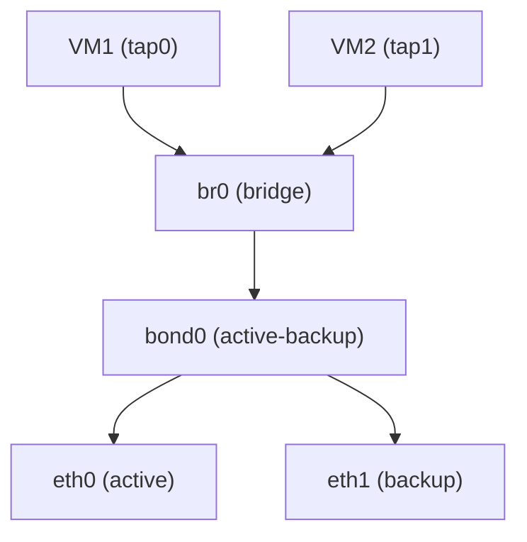

# How to Configure a Bridge on Top of a Bond Interface

Author: [nawazdhandala](https://www.github.com/nawazdhandala)

Tags: Linux, Network Bridge, Network Bonding, KVM, Networking, Virtualization, High Availability

Description: Create a Linux bridge on top of a bond interface to provide both link redundancy and L2 bridging for virtual machines or containers.

## Introduction

Combining a bond with a bridge is a common pattern for KVM hypervisors: the bond provides link redundancy, and the bridge connects virtual machines to the physical network. Virtual machine tap interfaces are added to the bridge, giving VMs access to the physical network through the redundant bond.

## Architecture



## Step 1: Create the Bond

```bash
modprobe bonding
ip link add bond0 type bond mode active-backup
ip link set bond0 type bond miimon 100
ip link set eth0 down && ip link set eth0 master bond0
ip link set eth1 down && ip link set eth1 master bond0
ip link set bond0 up
```

## Step 2: Create the Bridge on the Bond

```bash
# Create a bridge

ip link add br0 type bridge

# Add the bond as the bridge's uplink
ip link set bond0 master br0

# Bring up both
ip link set bond0 up
ip link set br0 up

# Assign IP to the bridge (for host management)
ip addr add 192.168.1.100/24 dev br0
ip route add default via 192.168.1.1
```

## Persistent Configuration: Netplan

```yaml
# /etc/netplan/01-bond-bridge.yaml
network:
  version: 2
  renderer: networkd

  ethernets:
    eth0: {dhcp4: false}
    eth1: {dhcp4: false}

  bonds:
    bond0:
      interfaces: [eth0, eth1]
      parameters:
        mode: active-backup
        mii-monitor-interval: 100
      dhcp4: false

  bridges:
    br0:
      interfaces: [bond0]
      addresses: [192.168.1.100/24]
      routes:
        - to: default
          via: 192.168.1.1
      nameservers:
        addresses: [8.8.8.8]
      parameters:
        stp: false
        forward-delay: 0
```

## Add Virtual Machine Interfaces to the Bridge

When creating KVM VMs, configure the VM's network interface to use `br0`:

```xml
<!-- libvirt VM XML network section -->
<interface type='bridge'>
  <source bridge='br0'/>
  <model type='virtio'/>
</interface>
```

```bash
# Or manually add a tap interface to the bridge
ip tuntap add tap0 mode tap
ip link set tap0 master br0
ip link set tap0 up
```

## Verify the Stack

```bash
# Check bond is up
cat /proc/net/bonding/bond0 | grep "Currently Active Slave"

# Check bridge has bond0 as a port
bridge link show br0

# Check bridge has an IP
ip addr show br0

# Test connectivity from host
ping 192.168.1.1

# Check VM connectivity through bridge
bridge fdb show br br0
```

## Conclusion

Combining a bridge with a bond gives virtual machines both L2 connectivity to the physical network and link redundancy. The bridge aggregates VM tap interfaces with the bond uplink. If the active bond slave fails, the bond switches to the backup slave transparently - the bridge and all VM connections remain unaffected.
