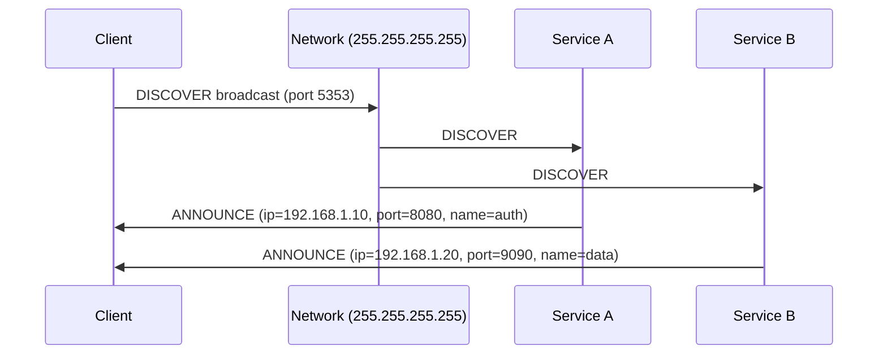

# How to Implement IPv4 Broadcast for Service Discovery

Author: [nawazdhandala](https://www.github.com/nawazdhandala)

Tags: IPv4, Broadcast, Service Discovery, Python, UDP, Networking

Description: Learn how to implement IPv4 UDP broadcast for local network service discovery in Python, enabling services to announce themselves and clients to find them without a central registry.

## How Broadcast Discovery Works



## Service Announcer

```python
import socket
import json
import time
import threading
import os

DISCOVERY_PORT = 5353
ANNOUNCE_PORT  = 5354

def announce(service_name: str, service_port: int,
             interval: float = 5.0) -> threading.Thread:
    """Periodically broadcast service presence on the local network."""
    payload = json.dumps({
        "type":    "ANNOUNCE",
        "name":    service_name,
        "port":    service_port,
        "host":    socket.gethostname(),
    }).encode()

    sock = socket.socket(socket.AF_INET, socket.SOCK_DGRAM)
    sock.setsockopt(socket.SOL_SOCKET, socket.SO_BROADCAST, 1)

    def _run():
        print(f"Announcing '{service_name}' on port {service_port}")
        while True:
            sock.sendto(payload, ("255.255.255.255", DISCOVERY_PORT))
            time.sleep(interval)

    t = threading.Thread(target=_run, daemon=True)
    t.start()
    return t

# Start announcing this service

announce("my-api", int(os.environ.get("PORT", 8080)))
```

## Discovery Client

```python
import socket
import json
import threading
import time

DISCOVERY_PORT = 5353
ANNOUNCE_PORT  = 5354

class ServiceRegistry:
    def __init__(self):
        self._services: dict[str, dict] = {}
        self._lock = threading.Lock()

    def add(self, announcement: dict) -> None:
        key = announcement["name"]
        with self._lock:
            self._services[key] = {
                **announcement,
                "last_seen": time.monotonic(),
            }
        print(f"[+] Discovered: {key} → {announcement}")

    def get(self, name: str) -> dict | None:
        with self._lock:
            return self._services.get(name)

    def all(self) -> list[dict]:
        now = time.monotonic()
        with self._lock:
            # Expire services not seen for 30 seconds
            return [v for v in self._services.values()
                    if now - v["last_seen"] < 30]

registry = ServiceRegistry()

def listen_for_announcements() -> None:
    sock = socket.socket(socket.AF_INET, socket.SOCK_DGRAM)
    sock.setsockopt(socket.SOL_SOCKET, socket.SO_REUSEADDR, 1)
    sock.setsockopt(socket.SOL_SOCKET, socket.SO_BROADCAST, 1)
    sock.bind(("0.0.0.0", DISCOVERY_PORT))
    sock.settimeout(1.0)
    print(f"Listening for service announcements on :{DISCOVERY_PORT}")

    while True:
        try:
            data, addr = sock.recvfrom(4096)
            msg = json.loads(data)
            if msg.get("type") == "ANNOUNCE":
                msg["ip"] = addr[0]  # actual sender IP
                registry.add(msg)
        except socket.timeout:
            continue

t = threading.Thread(target=listen_for_announcements, daemon=True)
t.start()

# Query discovered services
import time
time.sleep(6)  # wait for announcements
print("Discovered services:", registry.all())
```

## Active Discovery (Request → Reply)

```python
def discover_services(timeout: float = 3.0) -> list[dict]:
    """Actively probe the network and collect replies."""
    sock = socket.socket(socket.AF_INET, socket.SOCK_DGRAM)
    sock.setsockopt(socket.SOL_SOCKET, socket.SO_BROADCAST, 1)
    sock.setsockopt(socket.SOL_SOCKET, socket.SO_REUSEADDR, 1)
    sock.bind(("0.0.0.0", ANNOUNCE_PORT))
    sock.settimeout(timeout)

    # Send discovery request
    sock.sendto(json.dumps({"type": "DISCOVER"}).encode(),
                ("255.255.255.255", DISCOVERY_PORT))

    services = []
    deadline = time.monotonic() + timeout
    while time.monotonic() < deadline:
        try:
            data, addr = sock.recvfrom(4096)
            msg = json.loads(data)
            if msg.get("type") == "ANNOUNCE":
                msg["ip"] = addr[0]
                services.append(msg)
        except socket.timeout:
            break

    sock.close()
    return services
```

## Conclusion

UDP broadcast sends one packet to all hosts on the local subnet without requiring a central registry. Services announce their name, port, and host at regular intervals. Discovery clients listen passively or send an active discovery request. Implement TTL/expiry in the registry to remove services that stop announcing. On multi-homed hosts, send broadcasts on the specific interface subnet broadcast address (e.g., `192.168.1.255`) rather than `255.255.255.255` to target the right network. For cross-subnet discovery, use multicast or a dedicated service registry.
