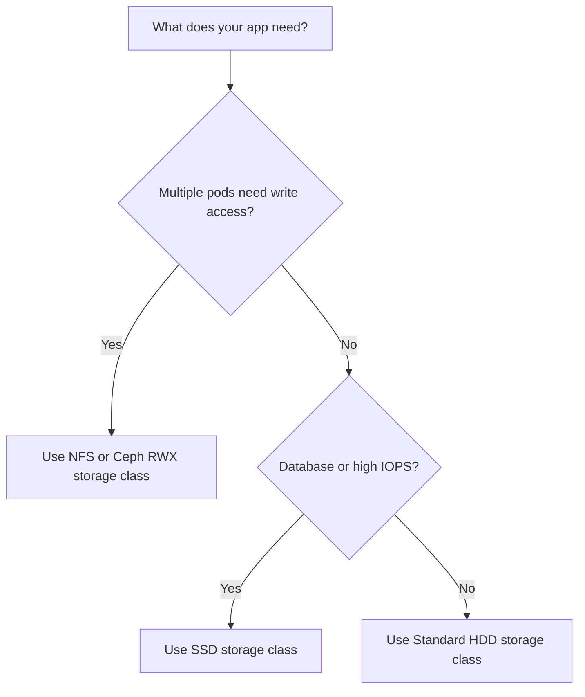

# How to Browse Storage Classes in Portainer

Author: [nawazdhandala](https://www.github.com/nawazdhandala)

Tags: Portainer, Kubernetes, Storage Class, Persistent Storage, DevOps

Description: Learn how to view and understand Kubernetes Storage Classes in Portainer to choose the right storage for your workloads.

## What Are Storage Classes?

A StorageClass defines how Kubernetes should provision persistent storage. When a PVC requests storage with a specific `storageClassName`, the StorageClass's provisioner automatically creates a matching Persistent Volume.

Different storage classes offer different performance characteristics:
- **Standard**: General-purpose HDD-backed storage.
- **SSD**: High-performance NVMe/SSD storage.
- **NFS**: Network-shared storage for ReadWriteMany workloads.

## Viewing Storage Classes in Portainer

1. Select your Kubernetes environment.
2. In the sidebar, go to **Storage** or **Volumes**.
3. Click **Storage Classes**.

Portainer lists all available StorageClasses with their provisioner, reclaim policy, and binding mode.

## Storage Class Details Explained

| Field | Description |
|-------|-------------|
| **Provisioner** | The plugin that creates volumes (e.g., `kubernetes.io/aws-ebs`) |
| **Reclaim Policy** | What happens when PVCs are deleted (`Retain` or `Delete`) |
| **Volume Binding Mode** | `Immediate` (bind immediately) or `WaitForFirstConsumer` (bind when pod is scheduled) |
| **Allow Volume Expansion** | Whether PVCs using this class can be resized |

## Viewing Storage Classes via CLI

```bash
# List all storage classes

kubectl get storageclasses

# Get detailed information about a storage class
kubectl describe storageclass standard

# Get storage class YAML
kubectl get storageclass standard -o yaml
```

## Cloud Provider Storage Classes

Each cloud provider offers different storage class options:

```yaml
# AWS EBS Storage Class (SSD gp3)
apiVersion: storage.k8s.io/v1
kind: StorageClass
metadata:
  name: gp3-ssd
provisioner: ebs.csi.aws.com
parameters:
  type: gp3              # AWS gp3 SSD volume
  encrypted: "true"      # Encrypt volumes at rest
reclaimPolicy: Delete
allowVolumeExpansion: true
volumeBindingMode: WaitForFirstConsumer  # Avoid cross-AZ issues
```

```yaml
# GKE Standard Storage Class
apiVersion: storage.k8s.io/v1
kind: StorageClass
metadata:
  name: fast-ssd
provisioner: pd.csi.storage.gke.io
parameters:
  type: pd-ssd           # GCP SSD persistent disk
reclaimPolicy: Delete
allowVolumeExpansion: true
```

## Setting a Default Storage Class

```bash
# Mark a storage class as the default
kubectl patch storageclass standard \
  -p '{"metadata": {"annotations":{"storageclass.kubernetes.io/is-default-class":"true"}}}'

# Remove default annotation from the previous default
kubectl patch storageclass old-default \
  -p '{"metadata": {"annotations":{"storageclass.kubernetes.io/is-default-class":"false"}}}'
```

## Choosing the Right Storage Class



## Conclusion

Storage classes are the foundation of dynamic storage provisioning in Kubernetes. Portainer's storage class browser gives you a clear view of available options, helping you choose the right class when creating PVCs for your applications.
