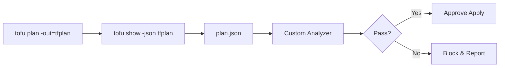

# How to Build Custom Plan Analysis Tools for OpenTofu

Author: [nawazdhandala](https://www.github.com/nawazdhandala)

Tags: OpenTofu, Plan Analysis, Automation, Policy Enforcement, Infrastructure as Code

Description: Build custom tools that analyze OpenTofu plan JSON output to enforce policies, generate reports, and automate approval workflows.

The `tofu show -json` command gives you a structured representation of every planned change. Building custom analysis tools on top of this output lets you enforce organization-specific policies, generate change reports, and integrate with approval systems in ways that generic tools cannot.

## The Analysis Framework

A custom plan analyzer typically follows this pattern:



## Building a Python Analyzer Class

```python
#!/usr/bin/env python3
# plan_analyzer.py - reusable OpenTofu plan analysis framework

import json
from dataclasses import dataclass, field
from typing import List, Dict, Any

@dataclass
class PlanViolation:
    rule: str
    resource: str
    message: str
    severity: str = "error"  # "error" blocks apply, "warning" is informational

class PlanAnalyzer:
    def __init__(self, plan_path: str):
        with open(plan_path) as f:
            self.plan = json.load(f)
        self.violations: List[PlanViolation] = []
        self.changes = self.plan.get("resource_changes", [])

    def get_changes_by_action(self, action: str) -> List[Dict[str, Any]]:
        """Return all resource changes with the specified action."""
        return [
            c for c in self.changes
            if action in c["change"]["actions"]
        ]

    def check_no_database_deletes(self):
        """Block accidental deletion of RDS instances."""
        for change in self.get_changes_by_action("delete"):
            if change["type"].startswith("aws_db_instance"):
                self.violations.append(PlanViolation(
                    rule="no-database-deletes",
                    resource=change["address"],
                    message="Database deletion requires manual approval.",
                    severity="error"
                ))

    def check_instance_type_allowlist(self):
        """Ensure only approved EC2 instance types are used."""
        allowed = {"t3.micro", "t3.small", "t3.medium", "m5.large"}
        for change in self.get_changes_by_action("create"):
            if change["type"] == "aws_instance":
                after = change["change"].get("after", {})
                itype = after.get("instance_type", "")
                if itype not in allowed:
                    self.violations.append(PlanViolation(
                        rule="instance-type-allowlist",
                        resource=change["address"],
                        message=f"Instance type '{itype}' is not in the approved list.",
                        severity="error"
                    ))

    def check_tags_required(self):
        """Warn if resources are missing required tags."""
        required_tags = {"Environment", "Owner", "CostCenter"}
        for change in self.changes:
            if change["change"]["actions"] == ["no-op"]:
                continue
            after = change["change"].get("after") or {}
            tags = after.get("tags") or {}
            missing = required_tags - set(tags.keys())
            if missing:
                self.violations.append(PlanViolation(
                    rule="required-tags",
                    resource=change["address"],
                    message=f"Missing required tags: {', '.join(missing)}",
                    severity="warning"
                ))

    def run_all_checks(self):
        """Execute all policy checks."""
        self.check_no_database_deletes()
        self.check_instance_type_allowlist()
        self.check_tags_required()

    def report(self) -> bool:
        """Print a report and return True if there are no blocking errors."""
        errors = [v for v in self.violations if v.severity == "error"]
        warnings = [v for v in self.violations if v.severity == "warning"]

        for v in warnings:
            print(f"WARNING [{v.rule}] {v.resource}: {v.message}")
        for v in errors:
            print(f"ERROR   [{v.rule}] {v.resource}: {v.message}")

        if errors:
            print(f"\n{len(errors)} blocking error(s) found. Apply blocked.")
            return False

        print(f"\nAll checks passed ({len(warnings)} warning(s)).")
        return True


if __name__ == "__main__":
    import sys
    analyzer = PlanAnalyzer(sys.argv[1])
    analyzer.run_all_checks()
    success = analyzer.report()
    sys.exit(0 if success else 1)
```

## Integrating in CI

```yaml
# .github/workflows/plan-analysis.yml

- name: Generate Plan JSON
  run: |
    tofu init
    tofu plan -out=tfplan
    tofu show -json tfplan > plan.json

- name: Run Custom Policy Checks
  run: python3 scripts/plan_analyzer.py plan.json
```

The job will fail (`exit 1`) if any blocking violations are found, preventing `tofu apply` from running.

## Conclusion

Custom plan analysis tools give you precise control over what changes are allowed in your infrastructure. By building a reusable analyzer class, you can add new policy checks incrementally and integrate them naturally into any CI/CD pipeline.
