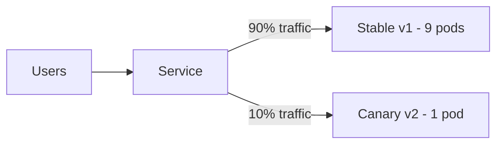

# How to Implement Canary Deployments in Rancher

Author: [nawazdhandala](https://www.github.com/nawazdhandala)

Tags: Canary Deployments, Rancher, Kubernetes, Progressive Delivery, DevOps, Traffic Splitting, Deployment

Description: Learn how to implement canary deployments in Rancher-managed Kubernetes to gradually shift traffic to a new version and catch issues before a full rollout.

---

A canary deployment sends a small percentage of traffic to a new version while most users continue using the stable version. If the canary is healthy, you gradually increase traffic until it handles 100%.

---

## Canary Strategy Overview



Kubernetes distributes traffic proportionally based on replica count, making pod-count-based canaries simple and effective.

---

## Step 1: Deploy the Stable Version

```yaml
# stable-deployment.yaml

apiVersion: apps/v1
kind: Deployment
metadata:
  name: my-app-stable
  namespace: my-app
spec:
  replicas: 9
  selector:
    matchLabels:
      app: my-app
      track: stable
  template:
    metadata:
      labels:
        app: my-app
        track: stable
    spec:
      containers:
        - name: app
          image: my-org/my-app:v1
          ports:
            - containerPort: 8080
```

Create a Service that selects all pods by the `app` label regardless of `track`:

```yaml
# service.yaml
apiVersion: v1
kind: Service
metadata:
  name: my-app
  namespace: my-app
spec:
  selector:
    app: my-app   # matches both stable and canary pods
  ports:
    - port: 80
      targetPort: 8080
```

---

## Step 2: Deploy the Canary

Deploy one pod running the new version. With 9 stable pods and 1 canary pod, approximately 10% of requests go to the canary:

```yaml
# canary-deployment.yaml
apiVersion: apps/v1
kind: Deployment
metadata:
  name: my-app-canary
  namespace: my-app
  annotations:
    # Document the canary weight for visibility
    deployment.kubernetes.io/canary-weight: "10"
spec:
  replicas: 1
  selector:
    matchLabels:
      app: my-app
      track: canary
  template:
    metadata:
      labels:
        app: my-app
        track: canary
    spec:
      containers:
        - name: app
          image: my-org/my-app:v2
          ports:
            - containerPort: 8080
```

---

## Step 3: Monitor Canary Health

Use `kubectl top` and your observability stack to compare error rates:

```bash
# Watch pod restarts on both tracks
kubectl get pods -n my-app \
  -l app=my-app \
  -o wide \
  --watch

# Check canary pod logs for errors
kubectl logs -n my-app \
  -l track=canary \
  --tail=100
```

---

## Step 4: Gradually Increase Canary Traffic

If the canary looks healthy after 15–30 minutes, shift more traffic by adjusting replica counts:

```bash
# Increase canary to ~25% (3 canary, 9 stable)
kubectl scale deployment my-app-canary --replicas=3 -n my-app

# Increase canary to ~50% (9 canary, 9 stable)
kubectl scale deployment my-app-canary --replicas=9 -n my-app

# Full cutover: scale up canary to full capacity, then remove stable
kubectl scale deployment my-app-canary --replicas=9 -n my-app
kubectl scale deployment my-app-stable --replicas=0 -n my-app
```

---

## Step 5: Rollback if Issues Are Detected

Instantly remove the canary by scaling it to zero:

```bash
kubectl scale deployment my-app-canary --replicas=0 -n my-app
```

---

## Advanced: Nginx Ingress Header-Based Canary

For header-based canary routing (useful for internal testing), annotate the canary ingress:

```yaml
# canary-ingress.yaml
apiVersion: networking.k8s.io/v1
kind: Ingress
metadata:
  name: my-app-canary
  namespace: my-app
  annotations:
    nginx.ingress.kubernetes.io/canary: "true"
    # Route requests with this header to the canary
    nginx.ingress.kubernetes.io/canary-by-header: "X-Canary"
    nginx.ingress.kubernetes.io/canary-by-header-value: "always"
spec:
  rules:
    - host: my-app.example.com
      http:
        paths:
          - path: /
            pathType: Prefix
            backend:
              service:
                name: my-app-canary
                port:
                  number: 80
```

---

## Best Practices

- Define **success metrics** (error rate, p99 latency) before starting a canary.
- Automate promotion/rollback using tools like Argo Rollouts or Flagger.
- Ensure your logging pipeline captures the `track` label so you can filter canary logs separately.
