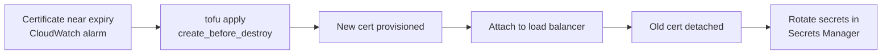

# How to Rotate TLS Certificates with OpenTofu

Author: [nawazdhandala](https://www.github.com/nawazdhandala)

Tags: OpenTofu, TLS, Certificates, Rotation, ACM, Key Vault, Security, Infrastructure as Code

Description: Learn how to implement zero-downtime TLS certificate rotation using OpenTofu with create_before_destroy lifecycle, automated rotation workflows, and expiry monitoring for ACM, Key Vault, and self-managed certificates.

---

Certificate rotation is a security requirement — certificates expire, keys may be compromised, and compliance frameworks mandate regular rotation. OpenTofu manages rotation using `create_before_destroy` lifecycle rules to ensure zero-downtime transitions.

## Certificate Rotation Workflow



## ACM Certificate Rotation

```hcl
# acm.tf
# ACM auto-renews DNS-validated certificates — this pattern handles
# certificates that need explicit replacement (key algorithm changes, SAN changes)

resource "aws_acm_certificate" "main" {
  domain_name               = var.domain_name
  subject_alternative_names = var.subject_alternative_names
  validation_method         = "DNS"

  # Critical: ensures new cert exists before old one is destroyed
  lifecycle {
    create_before_destroy = true
  }

  tags = {
    Environment = var.environment
    RotatedAt   = timestamp()
    ManagedBy   = "opentofu"
  }
}

resource "aws_route53_record" "cert_validation" {
  for_each = {
    for dvo in aws_acm_certificate.main.domain_validation_options : dvo.domain_name => {
      name   = dvo.resource_record_name
      record = dvo.resource_record_value
      type   = dvo.resource_record_type
    }
  }

  allow_overwrite = true
  name            = each.value.name
  records         = [each.value.record]
  ttl             = 60
  type            = each.value.type
  zone_id         = aws_route53_zone.main.zone_id
}

resource "aws_acm_certificate_validation" "main" {
  certificate_arn         = aws_acm_certificate.main.arn
  validation_record_fqdns = [for record in aws_route53_record.cert_validation : record.fqdn]
}
```

## Self-Managed Certificate Rotation

```hcl
# Use a version variable to force certificate rotation
variable "cert_version" {
  type        = string
  description = "Increment to trigger certificate rotation: v1, v2, v3..."
  default     = "v1"
}

# Certificate is recreated when cert_version changes
resource "tls_private_key" "server" {
  algorithm = "RSA"
  rsa_bits  = 4096

  # Changing any argument triggers resource replacement
  # Use cert_version in a keepers-style pattern via local
}

locals {
  cert_name = "${var.service_name}-cert-${var.cert_version}"
}

resource "tls_self_signed_cert" "server" {
  private_key_pem = tls_private_key.server.private_key_pem

  subject {
    common_name  = var.domain_name
    organization = var.organization
  }

  dns_names             = var.dns_names
  validity_period_hours = 8760

  allowed_uses = ["key_encipherment", "digital_signature", "server_auth"]

  lifecycle {
    create_before_destroy = true
  }
}

# Store with version in secret name for audit trail
resource "aws_secretsmanager_secret" "cert" {
  name = "${var.environment}/certs/${var.service_name}/${var.cert_version}"
}

resource "aws_secretsmanager_secret_version" "cert" {
  secret_id = aws_secretsmanager_secret.cert.id
  secret_string = jsonencode({
    certificate = tls_self_signed_cert.server.cert_pem
    private_key = tls_private_key.server.private_key_pem
    rotated_at  = timestamp()
    version     = var.cert_version
  })
}
```

## Kubernetes Certificate Rotation

```hcl
# kubernetes_secret rotation with zero downtime
resource "kubernetes_secret" "tls" {
  metadata {
    name      = "${var.service_name}-tls"
    namespace = var.namespace

    # Annotation helps track rotation history
    annotations = {
      "cert-rotation/version"    = var.cert_version
      "cert-rotation/rotated-at" = timestamp()
    }
  }

  type = "kubernetes.io/tls"

  data = {
    "tls.crt" = tls_self_signed_cert.server.cert_pem
    "tls.key" = tls_private_key.server.private_key_pem
  }

  lifecycle {
    create_before_destroy = true
  }
}
```

## Expiry Monitoring and Rotation Alerts

```hcl
# CloudWatch alarm for ACM certificate expiry
resource "aws_cloudwatch_metric_alarm" "cert_expiry_critical" {
  alarm_name          = "${var.domain_name}-cert-expiry-critical"
  comparison_operator = "LessThanThreshold"
  evaluation_periods  = 1
  metric_name         = "DaysToExpiry"
  namespace           = "AWS/CertificateManager"
  period              = 86400
  statistic           = "Minimum"
  threshold           = 14  # Critical: 14 days

  dimensions = {
    CertificateArn = aws_acm_certificate.main.arn
  }

  alarm_actions = [aws_sns_topic.critical_alerts.arn]
  alarm_description = "CRITICAL: Certificate expires in less than 14 days — rotate immediately"
}

resource "aws_cloudwatch_metric_alarm" "cert_expiry_warning" {
  alarm_name          = "${var.domain_name}-cert-expiry-warning"
  comparison_operator = "LessThanThreshold"
  evaluation_periods  = 1
  metric_name         = "DaysToExpiry"
  namespace           = "AWS/CertificateManager"
  period              = 86400
  statistic           = "Minimum"
  threshold           = 30  # Warning: 30 days

  dimensions = {
    CertificateArn = aws_acm_certificate.main.arn
  }

  alarm_actions = [aws_sns_topic.warnings.arn]
}
```

## CI/CD Rotation Workflow

```hcl
# outputs.tf — expose expiry for CI/CD rotation checks
output "certificate_arn" {
  value = aws_acm_certificate_validation.main.certificate_arn
}

output "certificate_expiry" {
  description = "Certificate expiry — schedule rotation before this date"
  value       = aws_acm_certificate.main.not_after
}
```

## Best Practices

- Always use `create_before_destroy = true` on certificate resources — without it, OpenTofu will destroy the old certificate before the new one is attached, causing downtime.
- Use `allow_overwrite = true` on Route 53 validation records so rotation doesn't fail when the validation record already exists from the previous certificate.
- Track certificate versions in secret names or annotations — this creates an audit trail of when rotations occurred.
- Set two alarms: a 30-day warning and a 14-day critical alert — 30 days gives time for planned rotation, 14 days triggers emergency procedures.
- For ACM certificates, rotation is usually automatic via DNS validation — but monitor anyway because validation can silently fail if DNS records are misconfigured.
