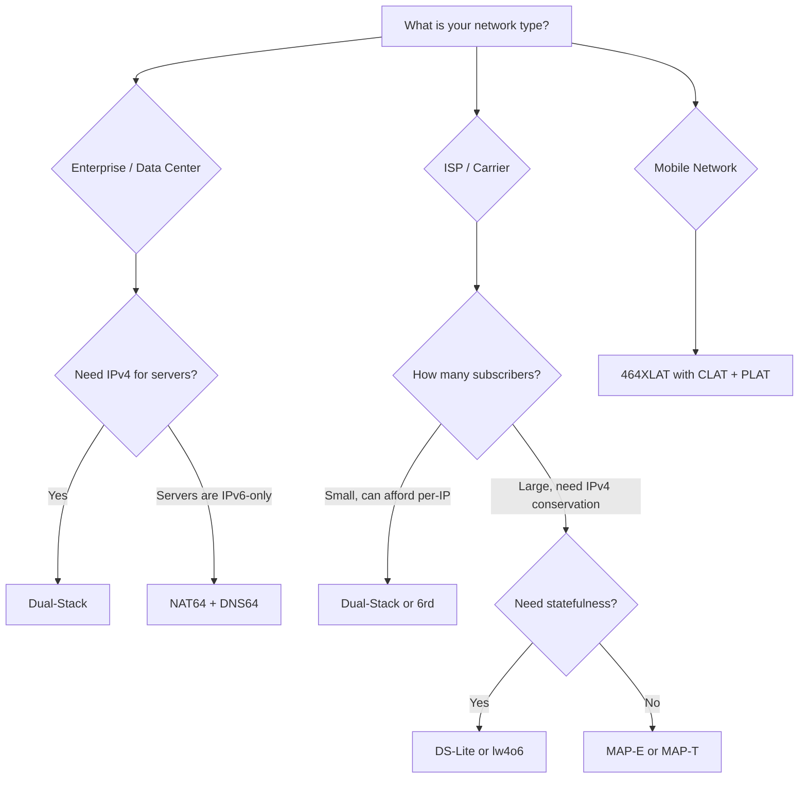

# How to Choose the Right IPv6 Transition Mechanism for Your Network

Author: [nawazdhandala](https://www.github.com/nawazdhandala)

Tags: IPv6, IPv6 Transition, Network Planning, NAT64, DS-Lite, MAP-T

Description: A decision framework for selecting the appropriate IPv6 transition technology based on your network type, scale, and operational requirements.

## The IPv6 Transition Landscape

There are many IPv6 transition technologies, each designed for specific scenarios. Choosing the wrong one leads to wasted effort, poor performance, or incomplete IPv4 compatibility. This guide helps you match your situation to the right technology.

## Decision Framework

## Enterprise / Data Center Networks

**Recommended: Dual-Stack (transitional) → Native IPv6**

Most enterprises should run dual-stack during transition and progressively move workloads to native IPv6:

- New services: IPv6-native from day one
- Existing IPv4 services: Add AAAA records, keep A records
- Client access: Dual-stack clients use IPv6 when available (Happy Eyeballs)

**When to use NAT64+DNS64**: When you want an IPv6-only segment (e.g., new data center pods) that still needs to reach legacy IPv4 external services.

## ISP / Broadband Provider

Choose based on subscriber scale and operational preferences:

| Technology | Best When | Drawback |
|---|---|---|
| Dual-Stack | IPv4 pool is sufficient | Requires two addresses per sub |
| DS-Lite | IPv4 pool is limited; prefer simpler CPE | AFTR state at scale |
| lw4o6 | Large scale; can afford complex CPE | CPE must do NAT |
| MAP-E | Very large scale; stateless preferred | Complex provisioning |
| MAP-T | Like MAP-E but prefer no tunnel overhead | Fewer CPE implementations |

## Mobile Networks

**Recommended: 464XLAT**

Mobile networks are almost universally IPv6-only at the radio level. 464XLAT is the industry standard because:

- Devices get an IPv6 address only (saves IPv4 address space)
- CLAT on device handles IPv4-only apps transparently
- PLAT (NAT64) at the carrier handles translation
- Supported natively on Android 5+, iOS 8+, modern Linux

## Cloud / Kubernetes Environments

**Recommended: Native IPv6 + NAT64+DNS64 for legacy access**

For Kubernetes and cloud environments:

- Assign IPv6 addresses to pods and services natively
- Use CoreDNS with DNS64 plugin for pods that need IPv4 connectivity
- Configure NAT64 (Jool) on an egress gateway for IPv4 translation

## Technology Comparison Matrix

| Technology | IPv6-only clients | IPv4 apps | Stateful? | Complexity | Best for |
|---|---|---|---|---|---|
| Dual-Stack | Partial | Yes | No | Low | Enterprise |
| 6in4/SIT | Yes | No | No | Low | Home users |
| NAT64+DNS64 | Yes | Partial | Yes | Medium | Enterprise, cloud |
| 464XLAT | Yes | Yes | Yes (PLAT) | Medium | Mobile carriers |
| DS-Lite | No | Yes | Yes (AFTR) | Medium | Broadband ISP |
| lw4o6 | No | Yes | Partial | High | Large ISP |
| MAP-E | No | Yes | No | High | Very large ISP |
| MAP-T | No | Yes | No | High | Very large ISP |

## Key Decision Criteria

**1. Do your clients have IPv4 addresses?**
- Yes → Dual-Stack or ISP technologies (DS-Lite, MAP)
- No → NAT64+DNS64 or 464XLAT

**2. Do you need IPv4-literal app support?**
- Yes → 464XLAT (adds CLAT) or Dual-Stack
- No → NAT64+DNS64 may be sufficient

**3. What is your scale?**
- Small (<10,000 users) → DS-Lite or NAT64+DNS64
- Large (>100,000 users) → lw4o6, MAP-E, or MAP-T

**4. Do you prefer stateless or stateful?**
- Stateless → MAP-E, MAP-T, SIIT
- Stateful acceptable → DS-Lite, NAT64

## Summary

No single IPv6 transition technology fits every use case. Enterprise networks benefit from dual-stack with eventual migration to native IPv6. Mobile carriers almost exclusively use 464XLAT. ISPs choose between DS-Lite, lw4o6, MAP-E, or MAP-T based on scale and operational complexity tolerance. Start with your client types, scale, and IPv4 dependency requirements to narrow down the right choice.
