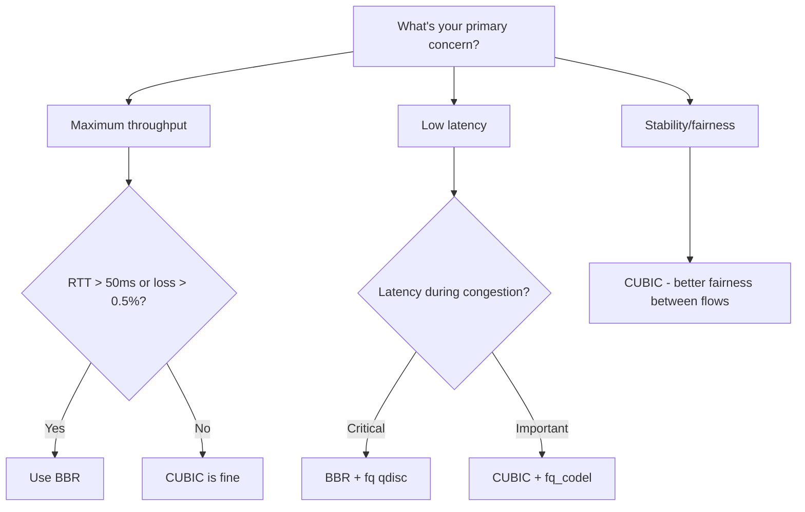

# How to Choose the Right TCP Congestion Control for Your Workload

Author: [nawazdhandala](https://www.github.com/nawazdhandala)

Tags: TCP, Congestion Control, BBR, CUBIC, Linux, Performance

Description: Select the optimal TCP congestion control algorithm for your specific workload by analyzing network characteristics, latency requirements, and traffic patterns.

## Introduction

There is no single best TCP congestion control algorithm for all workloads. The right choice depends on your network's RTT, loss rate, bandwidth, and whether you need fairness between flows or maximum single-flow throughput. This guide provides a decision framework based on workload characteristics.

## Decision Framework



## By Network Type

```bash
# Check your network characteristics first
ping -c 20 target-host
iperf3 -c target-host -t 10

# === Datacenter / LAN ===
# RTT: < 5ms, Loss: near 0%, Bandwidth: 10-100 Gbps
# Best: CUBIC (works well, BBR brings marginal benefit)
# Config:
sysctl -w net.ipv4.tcp_congestion_control=cubic

# === Internet / WAN ===
# RTT: 20-100ms, Loss: 0-1%, Bandwidth: 1-10 Gbps
# Best: BBR (significantly better throughput and latency)
# Config:
modprobe tcp_bbr
sysctl -w net.ipv4.tcp_congestion_control=bbr
sysctl -w net.core.default_qdisc=fq

# === Long-haul / Satellite ===
# RTT: 100-600ms, Loss: variable, Bandwidth: varies
# Best: BBR (dramatically better, CUBIC becomes nearly unusable at 500ms+ RTT)
# Config: Same as WAN above

# === Mobile / WiFi ===
# RTT: 20-100ms, Loss: 1-5% (from wireless, not congestion)
# Problem: CUBIC drastically reduces CWND for wireless loss that isn't congestion
# Best: BBR (ignores loss, uses bandwidth estimate instead)
# Config: BBR with fq
```

## By Application Type

```bash
# === Bulk File Transfer ===
# Goal: maximize throughput
# Best: BBR on WAN, CUBIC on LAN
# Key settings:
sysctl -w net.ipv4.tcp_slow_start_after_idle=0  # Don't reset CWND
# Large buffers for BDP

# === Web Serving (many short connections) ===
# Goal: minimize TTFB (time to first byte), good concurrency
# Best: BBR (better slow-start behavior)
# Config:
sysctl -w net.ipv4.tcp_congestion_control=bbr
ip route change default via <gw> initcwnd 20  # Large initial window

# === Video Streaming ===
# Goal: stable, sufficient throughput; tolerate some latency
# Best: BBR (pacing prevents bursty sending that causes rebuffering)
# Note: BBR's packet pacing naturally helps streaming

# === Database / Transactional ===
# Goal: low latency, reliable connections
# Best: CUBIC or BBR both fine; focus on keepalives and connection pooling

# === Gaming / Real-time ===
# Goal: minimum and stable latency
# Best: BBR with fq, or consider QUIC/UDP instead of TCP
```

## Testing Your Choice

```bash
#!/bin/bash
# Comprehensive algorithm comparison for your specific workload

SERVER="10.20.0.5"
ALGORITHMS=("cubic" "bbr")

for algo in "${ALGORITHMS[@]}"; do
    # Check availability
    if ! grep -q "$algo" /proc/sys/net/ipv4/tcp_available_congestion_control 2>/dev/null; then
        modprobe tcp_$algo 2>/dev/null
    fi

    sysctl -w net.ipv4.tcp_congestion_control=$algo >/dev/null 2>&1

    echo "=== $algo ==="
    # Throughput
    iperf3 -c $SERVER -t 20 2>/dev/null | grep "sender"
    # Latency under load
    (ping -c 20 -i 1 $SERVER &>/tmp/ping_$algo.txt &)
    iperf3 -c $SERVER -t 20 &>/dev/null
    grep "rtt" /tmp/ping_$algo.txt | tail -1
done
```

## Conclusion

The best congestion control for most internet-facing services in 2026 is BBR with `fq` qdisc. It provides better throughput on any path with measurable latency, better latency under load due to pacing, and better behavior on lossy wireless links. CUBIC remains excellent for pure LAN/datacenter scenarios. Run the comparison script on your actual network before making a production change.
