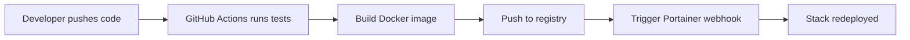

# How to Set Up CI/CD with Portainer and GitHub Actions

Author: [nawazdhandala](https://www.github.com/nawazdhandala)

Tags: Portainer, GitHub Actions, CI/CD, Docker, Automation

Description: Learn how to build a complete CI/CD pipeline using GitHub Actions to build Docker images and deploy them via Portainer.

## Pipeline Overview



## Step 1: Configure Secrets in GitHub

In your GitHub repository, go to **Settings > Secrets and variables > Actions** and add:

```text
REGISTRY_URL=registry.mycompany.com
REGISTRY_USERNAME=myuser
REGISTRY_PASSWORD=mypassword
PORTAINER_WEBHOOK_URL=https://portainer.mycompany.com/api/webhooks/abc123...
```

## Step 2: Create the GitHub Actions Workflow

```yaml
# .github/workflows/deploy.yml

name: Build and Deploy

on:
  push:
    branches:
      - main  # Only deploy from main branch

env:
  IMAGE_NAME: ${{ secrets.REGISTRY_URL }}/myapp

jobs:
  test:
    name: Run Tests
    runs-on: ubuntu-latest
    steps:
      - uses: actions/checkout@v4
      - name: Run tests
        run: |
          # Add your test commands here
          echo "Running tests..."

  build-and-push:
    name: Build and Push Docker Image
    needs: test
    runs-on: ubuntu-latest
    outputs:
      image-tag: ${{ steps.meta.outputs.version }}

    steps:
      - uses: actions/checkout@v4

      - name: Log in to registry
        uses: docker/login-action@v3
        with:
          registry: ${{ secrets.REGISTRY_URL }}
          username: ${{ secrets.REGISTRY_USERNAME }}
          password: ${{ secrets.REGISTRY_PASSWORD }}

      - name: Extract metadata for Docker
        id: meta
        uses: docker/metadata-action@v5
        with:
          images: ${{ env.IMAGE_NAME }}
          tags: |
            # Tag with git SHA for exact traceability
            type=sha,prefix=,format=short
            # Also tag as 'latest' for the main branch
            type=raw,value=latest,enable=${{ github.ref == 'refs/heads/main' }}

      - name: Build and push Docker image
        uses: docker/build-push-action@v5
        with:
          context: .
          push: true
          tags: ${{ steps.meta.outputs.tags }}
          labels: ${{ steps.meta.outputs.labels }}
          # Use GitHub Actions cache for faster builds
          cache-from: type=gha
          cache-to: type=gha,mode=max

  deploy:
    name: Deploy via Portainer
    needs: build-and-push
    runs-on: ubuntu-latest
    environment: production  # Requires approval for production

    steps:
      - name: Trigger Portainer redeploy
        run: |
          # Trigger the webhook with the specific image tag
          HTTP_STATUS=$(curl -s -o /dev/null -w "%{http_code}" \
            -X POST "${{ secrets.PORTAINER_WEBHOOK_URL }}?tag=${{ needs.build-and-push.outputs.image-tag }}")

          if [ "$HTTP_STATUS" -ne 204 ]; then
            echo "Deployment failed with status: $HTTP_STATUS"
            exit 1
          fi

          echo "Successfully triggered deployment of tag: ${{ needs.build-and-push.outputs.image-tag }}"
```

## Step 3: Configure the Portainer Stack

Your Docker Compose file should reference the image with a variable tag:

```yaml
# docker-compose.yml
version: "3.8"

services:
  app:
    # Uses the IMAGE_TAG env var, defaults to 'latest'
    image: registry.mycompany.com/myapp:${IMAGE_TAG:-latest}
    deploy:
      replicas: 2
      update_config:
        order: start-first
    ports:
      - "80:8080"
```

## Step 4: Set IMAGE_TAG in Portainer

In Portainer, set the `IMAGE_TAG` environment variable on the stack. The GitHub Actions webhook will update this to the specific SHA tag.

## Adding Deployment Notifications

```yaml
  - name: Notify Slack on success
    if: success()
    uses: rtCamp/action-slack-notify@v2
    env:
      SLACK_WEBHOOK: ${{ secrets.SLACK_WEBHOOK }}
      SLACK_MESSAGE: "Deployed myapp version ${{ needs.build-and-push.outputs.image-tag }} to production"
```

## Conclusion

This GitHub Actions + Portainer pipeline gives you automated testing, image building, and deployment with full traceability. Each deployment is linked to a specific Git commit via the image tag, making rollbacks and debugging straightforward.
