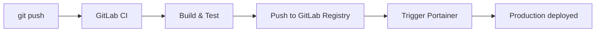

# How to Set Up CI/CD with Portainer and GitLab CI

Author: [nawazdhandala](https://www.github.com/nawazdhandala)

Tags: Portainer, GitLab CI, CI/CD, Docker, Automation

Description: Learn how to create a GitLab CI/CD pipeline that builds Docker images and automatically deploys them via Portainer.

## Pipeline Architecture



## GitLab CI/CD Variables

In your GitLab project, go to **Settings > CI/CD > Variables** and add:

```text
PORTAINER_WEBHOOK_URL   - Your Portainer webhook URL (masked)
PORTAINER_API_TOKEN     - Your Portainer API access token (masked)
```

## Complete .gitlab-ci.yml

```yaml
# .gitlab-ci.yml

stages:
  - test
  - build
  - deploy

variables:
  # Use the GitLab Container Registry
  IMAGE_TAG: $CI_REGISTRY_IMAGE:$CI_COMMIT_SHORT_SHA
  IMAGE_LATEST: $CI_REGISTRY_IMAGE:latest

# Run tests in parallel with a lightweight image
test:
  stage: test
  image: python:3.12-slim
  script:
    - pip install -r requirements.txt
    - pytest tests/ -v
  only:
    - merge_requests
    - main

# Build and push the Docker image
build:
  stage: build
  image: docker:24
  services:
    - docker:dind
  before_script:
    # Authenticate with the GitLab Container Registry
    - docker login -u $CI_REGISTRY_USER -p $CI_REGISTRY_PASSWORD $CI_REGISTRY
  script:
    # Build with layer caching
    - docker pull $IMAGE_LATEST || true
    - docker build
        --cache-from $IMAGE_LATEST
        --label "git-commit=$CI_COMMIT_SHA"
        --label "build-date=$(date -Is)"
        -t $IMAGE_TAG
        -t $IMAGE_LATEST .
    # Push both the SHA tag and latest
    - docker push $IMAGE_TAG
    - docker push $IMAGE_LATEST
  only:
    - main
    - tags

# Deploy to production via Portainer webhook
deploy:production:
  stage: deploy
  image: curlimages/curl:latest
  environment:
    name: production
    url: https://myapp.mycompany.com
  script:
    # Trigger Portainer webhook with the specific image tag
    - |
      HTTP_STATUS=$(curl -s -o /dev/null -w "%{http_code}" \
        -X POST "${PORTAINER_WEBHOOK_URL}?tag=${CI_COMMIT_SHORT_SHA}")

      if [ "$HTTP_STATUS" != "204" ]; then
        echo "Deployment failed: HTTP $HTTP_STATUS"
        exit 1
      fi
      echo "Deployed tag: ${CI_COMMIT_SHORT_SHA}"
  when: manual          # Require manual approval for production
  only:
    - main

# Auto-deploy to staging
deploy:staging:
  stage: deploy
  image: curlimages/curl:latest
  environment:
    name: staging
    url: https://staging.mycompany.com
  script:
    - |
      HTTP_STATUS=$(curl -s -o /dev/null -w "%{http_code}" \
        -X POST "${PORTAINER_STAGING_WEBHOOK_URL}?tag=${CI_COMMIT_SHORT_SHA}")
      [ "$HTTP_STATUS" = "204" ] && echo "Staging deployed" || exit 1
  only:
    - main
```

## Using Portainer's API for Advanced Deployments

For more control (e.g., updating the compose file itself):

```yaml
deploy:advanced:
  stage: deploy
  image: curlimages/curl:latest
  script:
    # Get the stack ID
    - |
      STACK_ID=$(curl -s "${PORTAINER_URL}/api/stacks" \
        -H "Authorization: Bearer ${PORTAINER_API_TOKEN}" | \
        jq '.[] | select(.Name == "my-app") | .Id')

    # Update the stack
    - |
      curl -s -X PUT "${PORTAINER_URL}/api/stacks/${STACK_ID}?endpointId=1" \
        -H "Authorization: Bearer ${PORTAINER_API_TOKEN}" \
        -H "Content-Type: application/json" \
        -d "{
          \"StackFileContent\": $(cat docker-compose.yml | jq -Rs .),
          \"Env\": [{\"name\": \"APP_VERSION\", \"value\": \"${CI_COMMIT_SHORT_SHA}\"}],
          \"PullImage\": true
        }"
```

## Conclusion

GitLab CI with Portainer provides a powerful, self-hosted CI/CD stack. The GitLab Container Registry, CI/CD pipelines, and Portainer webhooks combine for a zero-external-dependency deployment pipeline entirely within your own infrastructure.
