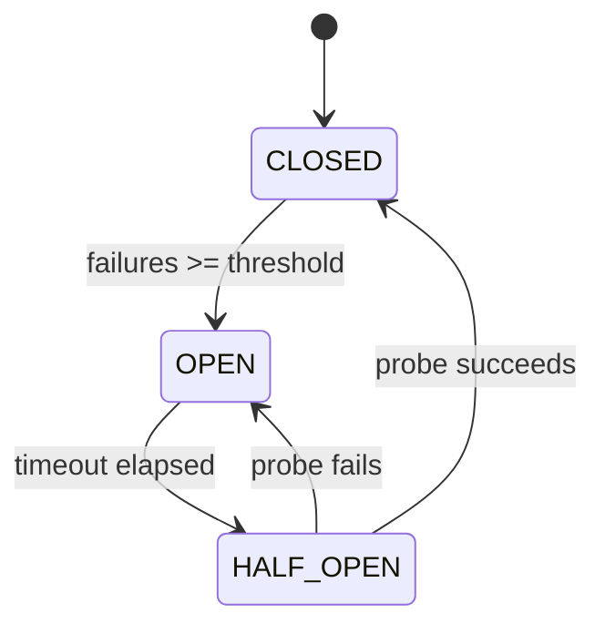

# How to Implement a Circuit Breaker for IPv4 Network Connections

Author: [nawazdhandala](https://www.github.com/nawazdhandala)

Tags: Python, IPv4, Circuit Breaker, Resilience, Networking, Pattern

Description: Learn how to implement a circuit breaker pattern for IPv4 network connections in Python to prevent cascading failures and allow automatic recovery when downstream services fail.

## Circuit Breaker States



## Implementation

```python
import time
import socket
import threading
from enum import Enum

class State(Enum):
    CLOSED    = "CLOSED"      # Normal operation
    OPEN      = "OPEN"        # Failing - reject calls immediately
    HALF_OPEN = "HALF_OPEN"   # Testing recovery

class CircuitBreaker:
    def __init__(
        self,
        failure_threshold: int   = 5,
        recovery_timeout:  float = 30.0,
        success_threshold: int   = 2,
    ):
        self.failure_threshold = failure_threshold
        self.recovery_timeout  = recovery_timeout
        self.success_threshold = success_threshold
        self._state            = State.CLOSED
        self._failures         = 0
        self._successes        = 0
        self._opened_at        = 0.0
        self._lock             = threading.Lock()

    @property
    def state(self) -> State:
        with self._lock:
            if self._state == State.OPEN:
                if time.monotonic() - self._opened_at >= self.recovery_timeout:
                    self._state     = State.HALF_OPEN
                    self._successes = 0
            return self._state

    def call(self, func, *args, **kwargs):
        state = self.state
        if state == State.OPEN:
            raise RuntimeError("Circuit OPEN - service unavailable")

        try:
            result = func(*args, **kwargs)
            self._on_success()
            return result
        except Exception as e:
            self._on_failure()
            raise

    def _on_success(self) -> None:
        with self._lock:
            self._failures = 0
            if self._state == State.HALF_OPEN:
                self._successes += 1
                if self._successes >= self.success_threshold:
                    self._state = State.CLOSED

    def _on_failure(self) -> None:
        with self._lock:
            self._failures += 1
            if self._state == State.HALF_OPEN or \
               self._failures >= self.failure_threshold:
                self._state   = State.OPEN
                self._opened_at = time.monotonic()

    def __repr__(self) -> str:
        return f"CircuitBreaker(state={self._state.value}, failures={self._failures})"
```

## Usage: TCP Connection Wrapper

```python
import socket

cb = CircuitBreaker(failure_threshold=3, recovery_timeout=15.0)

def tcp_request(host: str, port: int, data: bytes) -> bytes:
    """Single TCP request/response."""
    with socket.create_connection((host, port), timeout=3.0) as s:
        s.sendall(data)
        return s.recv(4096)

def safe_request(data: bytes) -> bytes:
    return cb.call(tcp_request, "192.168.1.10", 9000, data)

# Simulate requests with failures

for i in range(10):
    try:
        response = safe_request(b"ping")
        print(f"Request {i}: {response}")
    except RuntimeError as e:
        print(f"Request {i}: {e}")  # Circuit OPEN
    except Exception as e:
        print(f"Request {i}: connection error - {e}")
```

## Async Circuit Breaker

```python
import asyncio
import time

class AsyncCircuitBreaker(CircuitBreaker):
    async def call_async(self, coro_func, *args, **kwargs):
        if self.state == State.OPEN:
            raise RuntimeError("Circuit OPEN")
        try:
            result = await coro_func(*args, **kwargs)
            self._on_success()
            return result
        except Exception:
            self._on_failure()
            raise

cb = AsyncCircuitBreaker(failure_threshold=3, recovery_timeout=10.0)

async def fetch(host: str, port: int) -> bytes:
    reader, writer = await asyncio.open_connection(host, port)
    writer.write(b"ping\n")
    await writer.drain()
    data = await asyncio.wait_for(reader.readline(), timeout=2.0)
    writer.close()
    return data

async def safe_fetch() -> bytes:
    return await cb.call_async(fetch, "192.168.1.10", 9000)
```

## Conclusion

The circuit breaker transitions through CLOSED (normal), OPEN (failing fast), and HALF_OPEN (probing recovery). Set `failure_threshold` based on your acceptable error rate and `recovery_timeout` based on the downstream service's typical recovery time. In HALF_OPEN state, allow a limited number of probe requests before closing the circuit - `success_threshold=2` guards against flapping. Use circuit breakers around any network I/O that calls an external service, and expose the breaker state in health check endpoints so operators can see when services are degraded.
