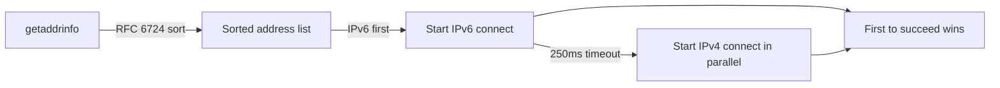

# How to Understand How Clients Choose Between IPv4 and IPv6

Author: [nawazdhandala](https://www.github.com/nawazdhandala)

Tags: IPv6, Dual-Stack, Address Selection, RFC 6724, Happy Eyeballs

Description: An explanation of the mechanisms clients use to choose between IPv4 and IPv6 when both are available, including RFC 6724 address selection and the Happy Eyeballs algorithm.

## The Address Selection Problem

In a dual-stack network, a client might have:
- Multiple IPv6 addresses (global unicast, link-local, ULA, privacy extensions)
- One or more IPv4 addresses

When connecting to a hostname that has both A and AAAA records, the client must choose:
1. Which **destination** to try (IPv4 or IPv6)
2. Which **source address** to use

## RFC 6724: Default Address Selection

RFC 6724 (updating RFC 3484) defines the standard algorithm for IPv6 address selection. It applies **policies** via a policy table to rank address pairs.

The default policy table on Linux:

```bash
# View the current address selection policy table
ip addrlabel list

# Or check /etc/gai.conf (getaddrinfo configuration)
cat /etc/gai.conf
```

## The gai.conf Policy Table

The `getaddrinfo()` system call uses `/etc/gai.conf` to sort addresses. The default policy table (from RFC 6724) ranks:

```
# /etc/gai.conf (Linux)
# label <prefix> <label>   — assign labels to address ranges
# precedence <prefix> <value> — higher precedence = preferred

# Prefer IPv6 loopback
label  ::1/128       0
# IPv4-mapped addresses
label  ::ffff:0:0/96  4
# NAT64 prefix
label  64:ff9b::/96   5

# Precedence table (higher = more preferred)
# ::1/128 (IPv6 loopback): 50
# ::/0 (IPv6 global): 40
# ::ffff:0:0/96 (IPv4-mapped): 35
# Others: lower precedence
precedence  ::1/128       50
precedence  ::/0          40
precedence  ::ffff:0:0/96 35
precedence  2002::/16     30
precedence  ::/96         20
precedence  ::ffff:0:0/96 10
```

## The Destination Address Selection Rules

RFC 6724 defines 10 rules applied in order. Key rules are:

**Rule 1: Avoid unusable addresses** — Prefer reachable destinations over unreachable ones.

**Rule 4: Prefer home address** — If Mobile IPv6 is used, prefer the home address.

**Rule 6: Prefer matching label** — Prefer destination addresses where the src/dst labels match.

**Rule 8: Prefer shorter prefix** — Prefer the most specific/longest matching address.

**Rule 9: Use longest matching prefix** — Prefer source addresses that share the most prefix bits with the destination.

**Rule 10: Otherwise prefer by policy** — Use the precedence table (`/etc/gai.conf`).

## Why IPv6 Is Preferred by Default

The default `/etc/gai.conf` assigns:
- `::` (IPv6 global) precedence **40**
- `::ffff:0:0/96` (IPv4-mapped = IPv4) precedence **35**

IPv6 has higher precedence (40 > 35), so dual-stack clients prefer IPv6 when both are available and reachable.

## Happy Eyeballs: The Connection Layer

RFC 6724 selects destination addresses, but Happy Eyeballs (RFC 8305) handles the connection racing:



## Checking Current Address Selection Behavior

```bash
# See how getaddrinfo resolves a hostname and what order
python3 -c "
import socket
results = socket.getaddrinfo('example.com', 80)
for family, type, proto, canonname, sockaddr in results:
    print(f'{family.name}: {sockaddr[0]}')
"
# IPv6 should appear first if Happy Eyeballs/RFC 6724 is working

# Test which address curl actually uses
curl -w "%{remote_ip}\n" -o /dev/null -s https://example.com
```

## Modifying Address Selection Preferences

To change the address selection policy (e.g., prefer IPv4 for a specific subnet):

```bash
# Edit /etc/gai.conf to prefer IPv4 over IPv6 globally
# Add: precedence ::ffff:0:0/96 100   (higher than IPv6's 40)
sudo vim /etc/gai.conf

# Or force IPv4 preference for specific application
curl -4 https://example.com

# In Python: specify address family
import socket
sock = socket.socket(socket.AF_INET, socket.SOCK_STREAM)  # IPv4 only
```

## Windows Address Selection

Windows implements address selection via the prefix policy table:

```powershell
# View Windows prefix policy table
netsh interface ipv6 show prefixpolicies

# Check which address is preferred for a destination
Test-NetConnection -ComputerName example.com -Port 80

# Force IPv6 preference
netsh interface ipv6 set prefixpolicies
```

## Summary

Clients choose between IPv4 and IPv6 through a two-layer process: RFC 6724 address selection sorts destination addresses by preference (IPv6 first by default), and Happy Eyeballs (RFC 8305) races connections to handle broken IPv6 paths gracefully. The `/etc/gai.conf` file on Linux controls address selection policy and can be modified to change preferences. Modern clients always prefer IPv6 when it's available and working, falling back to IPv4 only when needed.
