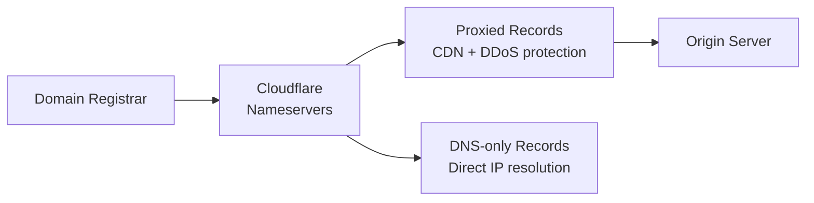

# How to Manage Cloudflare DNS with OpenTofu

Author: [nawazdhandala](https://www.github.com/nawazdhandala)

Tags: OpenTofu, Cloudflare, DNS, CDN, Security, Infrastructure as Code

Description: Learn how to manage Cloudflare DNS zones and records using OpenTofu with the Cloudflare provider, including proxied records, page rules, and zone settings configuration.

---

Cloudflare combines DNS management with CDN, DDoS protection, and WAF in a single platform. The Cloudflare OpenTofu provider manages DNS records, zone settings, page rules, and security configurations as code.

## Cloudflare DNS Architecture



## Provider Configuration

```hcl
# providers.tf
terraform {
  required_providers {
    cloudflare = {
      source  = "cloudflare/cloudflare"
      version = "~> 4.0"
    }
  }
}

provider "cloudflare" {
  api_token = var.cloudflare_api_token
}
```

## Zone and DNS Records

```hcl
# dns.tf
data "cloudflare_zone" "main" {
  name = var.domain_name
}

# Proxied A record — goes through Cloudflare CDN and DDoS protection
resource "cloudflare_record" "root" {
  zone_id = data.cloudflare_zone.main.id
  name    = var.domain_name
  type    = "A"
  value   = var.origin_ip
  proxied = true  # Route through Cloudflare
  ttl     = 1     # TTL 1 = Auto when proxied

  lifecycle {
    # Prevent accidental deletion
    prevent_destroy = var.environment == "production"
  }
}

resource "cloudflare_record" "www" {
  zone_id = data.cloudflare_zone.main.id
  name    = "www"
  type    = "CNAME"
  value   = var.domain_name
  proxied = true
  ttl     = 1
}

# Non-proxied record for services that don't need CDN
resource "cloudflare_record" "mail" {
  zone_id = data.cloudflare_zone.main.id
  name    = "mail"
  type    = "A"
  value   = var.mail_server_ip
  proxied = false  # Direct DNS — email servers can't use CDN proxy
  ttl     = 300
}

# MX records
resource "cloudflare_record" "mx" {
  for_each = {
    "10" = "mail.${var.domain_name}"
    "20" = "mail2.${var.domain_name}"
  }

  zone_id  = data.cloudflare_zone.main.id
  name     = var.domain_name
  type     = "MX"
  value    = each.value
  priority = tonumber(each.key)
  proxied  = false
  ttl      = 300
}

# SPF, DKIM, DMARC
resource "cloudflare_record" "spf" {
  zone_id = data.cloudflare_zone.main.id
  name    = var.domain_name
  type    = "TXT"
  value   = "v=spf1 include:_spf.google.com ~all"
  ttl     = 300
  proxied = false
}
```

## Zone Settings

```hcl
# zone_settings.tf
resource "cloudflare_zone_settings_override" "main" {
  zone_id = data.cloudflare_zone.main.id

  settings {
    ssl                      = "full_strict"
    min_tls_version          = "1.2"
    tls_1_3                  = "on"
    always_use_https         = "on"
    automatic_https_rewrites = "on"
    brotli                   = "on"
    http2                    = "on"
    http3                    = "on"
    security_level           = var.environment == "production" ? "medium" : "essentially_off"
    browser_cache_ttl        = 14400
  }
}
```

## Page Rules

```hcl
resource "cloudflare_page_rule" "cache_assets" {
  zone_id  = data.cloudflare_zone.main.id
  target   = "https://${var.domain_name}/assets/*"
  priority = 1

  actions {
    cache_level = "cache_everything"
    edge_cache_ttl = 86400  # 1 day
  }
}

resource "cloudflare_page_rule" "no_cache_api" {
  zone_id  = data.cloudflare_zone.main.id
  target   = "https://api.${var.domain_name}/*"
  priority = 2

  actions {
    cache_level = "bypass"
  }
}
```

## Best Practices

- Use `proxied = true` for HTTP/HTTPS records to get Cloudflare DDoS protection and CDN without additional configuration.
- Never proxy non-HTTP services (mail, FTP, VPN) — use `proxied = false` for those records.
- Set `min_tls_version = "1.2"` and `always_use_https = "on"` for all production zones.
- Use the Cloudflare API token (not Global API Key) with minimal scopes — `Zone:DNS:Edit` for DNS management only.
- Add `prevent_destroy = true` lifecycle rules on critical DNS records in production zones.
