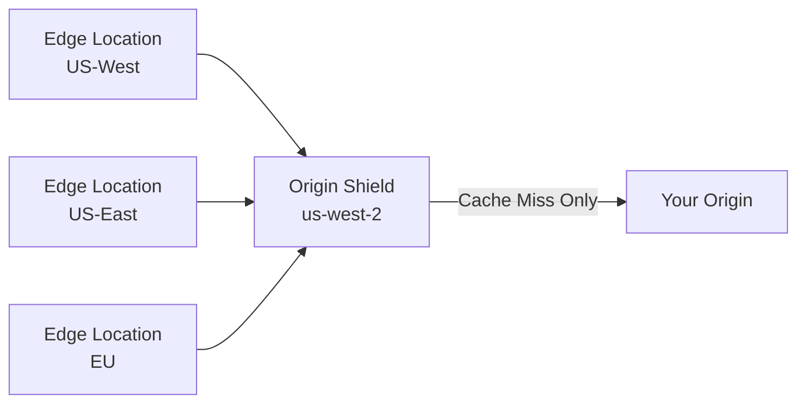

# How to Set Up Origin Shield with OpenTofu on CloudFront

Author: [nawazdhandala](https://www.github.com/nawazdhandala)

Tags: OpenTofu, AWS, CloudFront, Origin Shield, CDN, Infrastructure as Code, Performance

Description: Learn how to enable CloudFront Origin Shield using OpenTofu to reduce load on your origin servers by adding an additional caching layer between edge locations and your origin.

---

CloudFront Origin Shield is an optional additional caching layer that sits between CloudFront's regional edge caches and your origin. It consolidates requests from all edge locations through a single point, dramatically reducing the number of requests that reach your origin. This is especially valuable for origins with limited capacity or high data transfer costs.

## How Origin Shield Works



Without Origin Shield, each edge location makes its own request to the origin on cache misses. With Origin Shield, all edge locations check Origin Shield first, and only one request reaches the origin per unique object.

## Enabling Origin Shield on a Distribution

```hcl
# main.tf

terraform {
  required_providers {
    aws = {
      source  = "hashicorp/aws"
      version = "~> 5.30"
    }
  }
}

provider "aws" {
  region = "us-east-1"  # CloudFront is a global service, provider must be us-east-1
}

resource "aws_cloudfront_distribution" "with_origin_shield" {
  enabled             = true
  is_ipv6_enabled     = true
  default_root_object = "index.html"
  aliases             = [var.domain_name]

  origin {
    domain_name = var.origin_domain_name
    origin_id   = "primary-origin"

    # Optional custom origin settings
    custom_origin_config {
      http_port              = 80
      https_port             = 443
      origin_protocol_policy = "https-only"
      origin_ssl_protocols   = ["TLSv1.2"]

      # Increase timeouts to handle slow origin responses during Shield cache miss
      origin_read_timeout      = 60
      origin_keepalive_timeout = 60
    }

    # Enable Origin Shield - choose the region closest to your origin
    origin_shield {
      enabled              = true
      origin_shield_region = var.origin_shield_region  # e.g., "us-west-2"
    }
  }

  default_cache_behavior {
    target_origin_id       = "primary-origin"
    viewer_protocol_policy = "redirect-to-https"
    allowed_methods        = ["GET", "HEAD", "OPTIONS"]
    cached_methods         = ["GET", "HEAD"]
    compress               = true

    cache_policy_id = data.aws_cloudfront_cache_policy.caching_optimized.id
  }

  viewer_certificate {
    acm_certificate_arn      = data.aws_acm_certificate.site.arn
    ssl_support_method       = "sni-only"
    minimum_protocol_version = "TLSv1.2_2021"
  }

  restrictions {
    geo_restriction {
      restriction_type = "none"
    }
  }

  tags = var.common_tags
}

data "aws_cloudfront_cache_policy" "caching_optimized" {
  name = "Managed-CachingOptimized"
}

data "aws_acm_certificate" "site" {
  domain   = var.domain_name
  statuses = ["ISSUED"]
}
```

## Choosing the Right Origin Shield Region

```hcl
# variables.tf
variable "origin_shield_region" {
  description = "Origin Shield region - pick the AWS region closest to your origin"
  type        = string

  # Valid values: us-east-1, us-east-2, us-west-2, ap-south-1,
  # ap-northeast-1, ap-southeast-1, ap-southeast-2,
  # eu-central-1, eu-west-1, eu-west-2, sa-east-1
  default = "us-east-1"

  validation {
    condition = contains([
      "us-east-1", "us-east-2", "us-west-2",
      "ap-south-1", "ap-northeast-1", "ap-southeast-1", "ap-southeast-2",
      "eu-central-1", "eu-west-1", "eu-west-2", "sa-east-1"
    ], var.origin_shield_region)
    error_message = "Must be a valid Origin Shield region."
  }
}
```

## Monitoring Origin Shield Effectiveness

```hcl
# monitoring.tf
# Alert when Origin Shield cache hit rate drops significantly
resource "aws_cloudwatch_metric_alarm" "origin_shield_requests" {
  alarm_name          = "high-origin-requests"
  comparison_operator = "GreaterThanThreshold"
  evaluation_periods  = 2
  metric_name         = "Requests"
  namespace           = "AWS/CloudFront"
  period              = 300
  statistic           = "Sum"
  threshold           = var.origin_requests_threshold

  dimensions = {
    DistributionId = aws_cloudfront_distribution.with_origin_shield.id
    Region         = "Global"
  }

  alarm_description = "More requests than expected are reaching the origin - check Origin Shield cache hit rate"
  alarm_actions     = [var.alert_sns_topic_arn]
}
```

## Best Practices

- Choose the Origin Shield region closest to your origin, not to your users - the goal is to minimize origin-to-Shield latency.
- Origin Shield adds cost ($0.0080/10,000 HTTP requests) - calculate break-even point based on your origin egress cost savings.
- Monitor the `OriginShieldHit` metric to measure Shield effectiveness - aim for a hit rate above 70%.
- Use Origin Shield with high-traffic, slow-changing content (product images, documentation) for maximum benefit.
- Combine Origin Shield with a long TTL cache policy - Shield only helps when content is actually cached.
