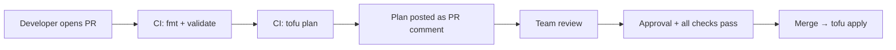

# How to Set Up Code Review for OpenTofu Pull Requests

Author: [nawazdhandala](https://www.github.com/nawazdhandala)

Tags: OpenTofu, Code Review, Pull Requests, GitHub Action, CI/CD, Team Workflows, Infrastructure as Code

Description: Learn how to establish an effective code review workflow for OpenTofu infrastructure changes, including automated plan comments on PRs, required reviewers, and review checklists.

---

Infrastructure code review catches mistakes before they reach production. A good PR workflow posts the `tofu plan` output directly in the PR, requires approval from infrastructure team members, and enforces checks that automated tooling can verify.

## PR Workflow



## GitHub Actions: Plan on PR

```yaml
# .github/workflows/plan.yml

name: OpenTofu Plan
on:
  pull_request:
    paths: ['**.tf', '**.tfvars', '**.hcl']

jobs:
  plan:
    runs-on: ubuntu-latest
    permissions:
      contents: read
      pull-requests: write
      id-token: write

    steps:
      - uses: actions/checkout@v4

      - name: Configure AWS credentials
        uses: aws-actions/configure-aws-credentials@v4
        with:
          role-to-assume: ${{ secrets.AWS_PLAN_ROLE_ARN }}
          aws-region: us-east-1

      - uses: opentofu/setup-opentofu@v1
        with:
          tofu_version: "1.6.0"

      - name: Init
        run: tofu init
        working-directory: ${{ env.TF_DIR }}

      - name: Format check
        run: tofu fmt -check -recursive .

      - name: Validate
        run: tofu validate
        working-directory: ${{ env.TF_DIR }}

      - name: Plan
        id: plan
        run: |
          tofu plan -no-color -out=tfplan 2>&1 | tee plan_output.txt
          echo "exitcode=${PIPESTATUS[0]}" >> $GITHUB_OUTPUT
        working-directory: ${{ env.TF_DIR }}
        continue-on-error: true

      - name: Post plan to PR
        uses: actions/github-script@v7
        with:
          script: |
            const fs = require('fs');
            const plan = fs.readFileSync('${{ env.TF_DIR }}/plan_output.txt', 'utf8');
            const maxLength = 65000;
            const truncated = plan.length > maxLength
              ? plan.substring(0, maxLength) + '\n\n... truncated ...'
              : plan;

            github.rest.issues.createComment({
              issue_number: context.issue.number,
              owner: context.repo.owner,
              repo: context.repo.repo,
              body: `## OpenTofu Plan\n```\n${truncated}\n````
            });

      - name: Fail if plan failed
        if: steps.plan.outputs.exitcode != '0'
        run: exit 1
    env:
      TF_DIR: environments/production
```

## Branch Protection Rules

```hcl
# GitHub branch protection via OpenTofu
resource "github_branch_protection" "main" {
  repository_id = github_repository.infra.node_id
  pattern       = "main"

  required_status_checks {
    strict = true
    contexts = [
      "OpenTofu Plan / plan",
      "OpenTofu Validate / validate",
    ]
  }

  required_pull_request_reviews {
    required_approving_review_count = 2
    dismiss_stale_reviews           = true
    require_code_owner_reviews      = true
    restrict_dismissals             = true
    dismissal_restrictions          = ["/infrastructure-team"]
  }

  enforce_admins = var.environment == "production"
}

resource "github_repository_file" "codeowners" {
  repository = github_repository.infra.name
  file       = ".github/CODEOWNERS"
  content    = <<-EOT
    # Infrastructure team owns all OpenTofu files
    *.tf @myorg/infrastructure-team
    *.tfvars @myorg/infrastructure-team
    environments/ @myorg/infrastructure-team
    modules/ @myorg/infrastructure-team
  EOT
}
```

## PR Review Checklist Template

```hcl
resource "github_repository_file" "pr_template" {
  repository = github_repository.infra.name
  file       = ".github/PULL_REQUEST_TEMPLATE/infrastructure.md"
  content    = <<-EOT
    ## Infrastructure Change Description

    <!-- Describe what infrastructure is being changed and why -->

    ## Review Checklist

    ### Reviewer checks
    - [ ] Plan output reviewed and changes are expected
    - [ ] No unintended resource deletions
    - [ ] New resources are properly tagged
    - [ ] Security groups / firewall rules are minimal
    - [ ] Sensitive values use Secrets Manager / Key Vault, not tfvars

    ### Author checks
    - [ ] `tofu fmt` has been run
    - [ ] `tofu validate` passes locally
    - [ ] Variable descriptions are added for new variables
    - [ ] Module README updated if module interface changed
    - [ ] Tested in dev/staging environment

    ## Plan Summary

    <!-- Copy the high-level plan summary here: X to add, Y to change, Z to destroy -->
  EOT
}
```

## Best Practices

- Post the full `tofu plan` output as a PR comment automatically - reviewers should not need to run the plan locally.
- Require at least 2 approvals for production changes and configure CODEOWNERS so infrastructure team members are auto-requested.
- Enable `dismiss_stale_reviews` so pushing new commits invalidates previous approvals and forces re-review.
- Fail the CI pipeline if `tofu plan` exits non-zero - don't allow merging a PR with a broken plan.
- Include a PR template with a checklist - it takes 30 seconds to fill in and catches common mistakes before review.
