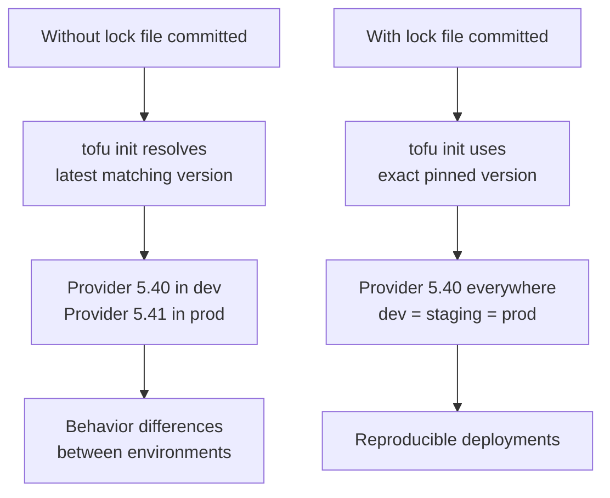

# Why You Should Commit the Lock File in OpenTofu

Author: [nawazdhandala](https://www.github.com/nawazdhandala)

Tags: OpenTofu, Lock File, Version Control, Git, Best Practices, terraform.lock.hcl, Infrastructure as Code

Description: Learn why committing the .terraform.lock.hcl dependency lock file to version control is a critical best practice for reproducible OpenTofu deployments and how to set up your team to manage it correctly.

---

The `.terraform.lock.hcl` file is not a build artifact — it's a dependency specification. Committing it to version control ensures reproducible deployments, prevents silent provider upgrades, and provides a change history for infrastructure dependencies just like `package-lock.json` in Node.js or `Pipfile.lock` in Python.

## Why Commit the Lock File



## The Problem Without a Committed Lock File

```bash
# Scenario: Version constraint "~> 5.0" allows any 5.x version
# Developer runs tofu init on Monday — gets 5.40.0
# CI/CD runs tofu apply on Friday — gets 5.41.0 (released Tuesday)
# The Friday deployment uses different provider code than tested on Monday

# This can cause:
# - Plan diffs that weren't seen during development
# - Resource recreation from changed default values
# - New attribute validation that rejects existing configurations
# - Subtle behavioral differences in resource management
```

## Correct .gitignore Configuration

```gitignore
# .gitignore — DO NOT add .terraform.lock.hcl to this file

# These should be ignored (local cache):
.terraform/
*.tfstate
*.tfstate.backup
*.tfplan
override.tf
override.tf.json
*_override.tf
*_override.tf.json
.terraformrc

# DO NOT IGNORE:
# .terraform.lock.hcl — commit this file!
```

## Lock File as Dependency Audit Trail

```bash
# The lock file provides a full history of dependency changes

git log --oneline .terraform.lock.hcl
# abc1234 Upgrade AWS provider to 5.45.0
# def5678 Add helm provider 2.12.1
# ghi9012 Upgrade kubernetes provider to 2.27.0
# jkl3456 Initial providers: aws 5.40.0, kubernetes 2.25.0

# See what changed in a provider upgrade
git show abc1234:.terraform.lock.hcl | diff - .terraform.lock.hcl
```

## Setting Up Lock File Workflow

```bash
# 1. Generate lock file for all team platforms on first init
tofu init

tofu providers lock \
  -platform=linux/amd64 \
  -platform=linux/arm64 \
  -platform=darwin/amd64 \
  -platform=darwin/arm64

# 2. Commit everything
git add .terraform.lock.hcl providers.tf
git commit -m "Add OpenTofu lock file with all platform checksums"

# 3. Verify .gitignore doesn't exclude the lock file
grep -n "lock" .gitignore  # Should not match .terraform.lock.hcl
```

## CI/CD: Enforce Lock File Usage

```yaml
# .github/workflows/terraform.yml
jobs:
  plan:
    steps:
      - uses: actions/checkout@v4

      - name: Setup OpenTofu
        uses: opentofu/setup-opentofu@v1
        with:
          tofu_version: "1.6.x"

      # CORRECT: init without -upgrade respects the lock file
      - name: OpenTofu Init
        run: tofu init
        env:
          TF_INPUT: "false"

      # WRONG: this would upgrade providers and may cause unexpected diffs
      # - name: OpenTofu Init
      #   run: tofu init -upgrade

      - name: Detect lock file drift
        run: |
          # If lock file changed during init, it wasn't committed correctly
          if ! git diff --quiet .terraform.lock.hcl; then
            echo "ERROR: Lock file changed during init. Commit the updated lock file:"
            echo "  tofu init && git add .terraform.lock.hcl && git commit"
            exit 1
          fi

      - name: OpenTofu Plan
        run: tofu plan
```

## When the Lock File Should Change

```bash
# Acceptable reasons to update the lock file:
# 1. Adding a new provider
# 2. Upgrading a provider version (intentional, reviewed)
# 3. Adding platform checksums for a new developer OS

# The update process:
# 1. Make the intentional change to providers.tf
# 2. Run tofu init -upgrade (or tofu providers lock)
# 3. Review the diff in .terraform.lock.hcl
# 4. Test with tofu plan
# 5. Commit BOTH files together

git add providers.tf .terraform.lock.hcl
git commit -m "Upgrade AWS provider: 5.40.0 -> 5.45.0

- Review CHANGELOG: no breaking changes for our configuration
- Tested in dev environment with no unexpected plan diffs"
```

## Lock File in Monorepo Structure

```bash
# Each OpenTofu module has its own lock file
infrastructure/
├── modules/
│   ├── vpc/
│   │   ├── providers.tf
│   │   └── .terraform.lock.hcl  ← Commit this
│   └── eks/
│       ├── providers.tf
│       └── .terraform.lock.hcl  ← Commit this
└── environments/
    ├── dev/
    │   ├── providers.tf
    │   └── .terraform.lock.hcl  ← Commit this
    └── production/
        ├── providers.tf
        └── .terraform.lock.hcl  ← Commit this

# Each lock file is independent — different modules can use different provider versions
```

## Best Practices

- Never add `.terraform.lock.hcl` to `.gitignore` — this is the most common lock file mistake. The lock file is a critical part of your configuration, not a build artifact.
- Commit the lock file at the same time as `providers.tf` changes — having one without the other in a commit makes it harder to understand why the lock file changed.
- In CI/CD, run `tofu init` (not `tofu init -upgrade`) and fail if the lock file changes — this prevents CI from silently using upgraded provider versions that weren't reviewed.
- Include a meaningful commit message when the lock file changes — "Upgrade AWS provider 5.40 → 5.45, tested in dev" is far more useful than "Update lock file".
- Review lock file changes in PRs the same way you review application dependency upgrades — a provider upgrade is an infrastructure dependency change that can affect production behavior.
