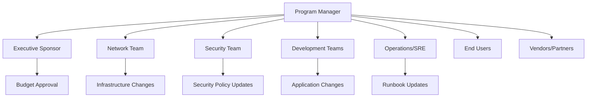

# How to Communicate IPv6 Migration Plans to Stakeholders

Author: [nawazdhandala](https://www.github.com/nawazdhandala)

Tags: IPv6, Migration, Stakeholder Communication, Change Management, Project Management

Description: Develop and deliver IPv6 migration communications for different stakeholder groups including executives, developers, operations, and end users with tailored messaging for each audience.

## Introduction

IPv6 migration communication failures often cause more problems than technical failures. Stakeholders who are not prepared for changes raise last-minute objections; developers who are not briefed write new code with IPv4 hardcoding; operations staff who are not trained slow down incident response. Tailored communications for each audience prevent these issues.

## Stakeholder Map



## Executive Communication

Executives need business impact, risk, and timeline - not technical details:

```markdown
# Subject: IPv6 Migration Program Update - Q1 2026

## Why We're Doing This
IPv6 migration is required for continued growth. IPv4 address exhaustion
means new cloud regions and IoT devices increasingly operate on IPv6-only
networks. Without IPv6, our services will be unreachable to a growing
segment of users.

## Investment Required
- Total budget: $350,000 (12-month program)
- Peak headcount: 3 FTE equivalent across 4 teams
- No user-facing downtime expected

## Timeline
- Q1 2026: Assessment and planning complete
- Q2 2026: Infrastructure and DNS changes
- Q3 2026: All public services dual-stack
- Q4 2026: Full validation and optimization

## Key Risks
1. Application remediation scope may expand (+20% contingency allocated)
2. Third-party service dependency on vendor X (escalation in progress)

## Current Status: ON TRACK
```

## Developer Communication

Developers need specific action items and technical context:

```markdown
# Subject: IPv6 Migration - Developer Action Required by [DATE]

## What You Need to Do

Your team owns these services that require changes:
- **payment-service**: Remove hardcoded IP 203.0.113.5 (line 142 in config.py)
- **user-auth**: Bind server to `::` instead of `0.0.0.0` (see example below)
- **admin-api**: Database VARCHAR(15) field too short for IPv6 (migrate to VARCHAR(45))

## Code Changes Required

### Socket Binding
```python
# BEFORE

server.bind(('0.0.0.0', 8080))

# AFTER
server.bind(('::', 8080))
server.setsockopt(socket.IPPROTO_IPV6, socket.IPV6_V6ONLY, 0)
```

### Database
```sql
ALTER TABLE sessions ALTER COLUMN client_ip TYPE VARCHAR(45);
```

## Timeline
- Changes due in your service: by 2026-04-30
- Testing window: 2026-05-01 to 2026-05-15
- Questions: #ipv6-migration Slack channel
```text

## Operations Team Communication

Operations needs runbook updates and escalation paths:

```markdown
# IPv6 Migration: Operations Runbook Update

## New Monitoring Checks
We've added IPv6 monitoring to Prometheus. New alerts:
- `IPv6ServiceDown`: Page on-call if any service goes down for IPv6 clients
- `IPv6TrafficDrop`: Alert if IPv6 traffic drops to zero during business hours
- `HighIPv6ErrorRate`: Alert if IPv6 5xx rate > 1%

## Troubleshooting IPv6 Issues

### Check if service is listening on IPv6
```bash
ss -tlnp | grep '::'
# Should show [::]:80, [::]:443 for web services
```

### Test IPv6 connectivity
```bash
ping6 2001:db8::1
curl -6 https://www.example.com
```

### Rollback (if needed)
See runbook: /wiki/IPv6-Rollback-Procedures

## Escalation
IPv6 incidents: page network team + application team
Rollback decision authority: on-call engineer can rollback DNS immediately
```text

## End User Communication

For external-facing changes, brief communication prevents confusion:

```markdown
# Subject: Network Upgrade - No Action Required

We're upgrading our network to support IPv6, the next generation
of internet addressing. This upgrade:

- Improves connectivity for users on modern networks
- Has no impact on your existing access methods
- Requires no changes from you

If you experience any connectivity issues after [DATE], please
contact support@example.com with your network provider information.
```

## Communication Timeline Template

| Week | Audience | Message | Channel |
|------|----------|---------|---------|
| -8w | Executives | Program kickoff approval | Email |
| -6w | All teams | IPv6 program announcement | All-hands |
| -4w | Developers | Code changes required brief | Email + Slack |
| -2w | Operations | Runbook review workshop | Meeting |
| -1w | All teams | Go-live reminder | Email |
| Day 0 | Operations | Change window notification | Slack |
| Day +1 | Executives | Post-go-live status | Email |
| +2w | All | Retrospective invite | Calendar |

## Conclusion

Effective IPv6 migration communication tailors depth and content to each audience. Executives need business justification and timeline; developers need specific code changes with examples; operations staff need runbook updates and escalation paths; end users need brief reassurance. Start communications 8 weeks before major changes to allow time for questions and code remediation. Create a dedicated Slack channel or mailing list for IPv6 migration questions to prevent issues from being overlooked.
