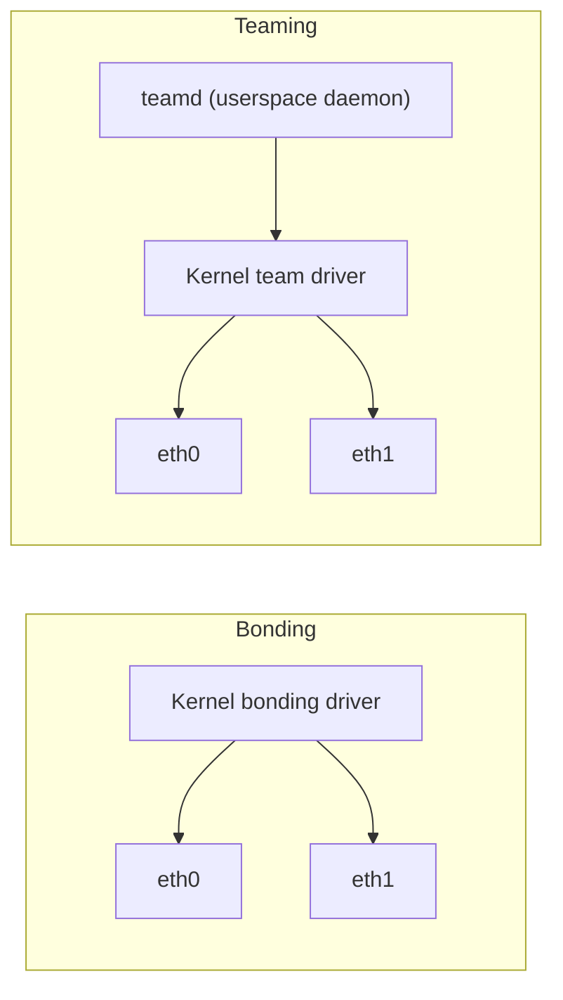

# How to Compare Bonding vs Teaming on Linux

Author: [nawazdhandala](https://www.github.com/nawazdhandala)

Tags: Linux, Network Bonding, Network Teaming, Teamd, Comparison, Networking, High Availability

Description: Compare Linux network bonding and network teaming architectures, configuration approaches, and use cases to choose the right link aggregation solution.

## Introduction

Linux offers two mechanisms for link aggregation and redundancy: the traditional kernel bonding driver and the newer network teaming (teamd). Red Hat introduced teaming as a more flexible, userspace-driven alternative to bonding. Understanding the differences helps you choose the right tool for your environment.

## Architecture Comparison



| Aspect | Bonding | Teaming |
|---|---|---|
| Architecture | Pure kernel | Kernel + userspace daemon (teamd) |
| Configuration tool | ip, nmcli, Netplan | nmcli, teamd JSON config |
| Flexibility | Moderate | High (pluggable runners) |
| Monitoring | MII or ARP | Multiple methods (ethtool, ARP, ICMP, NSNA) |
| Performance | Slightly higher | Slightly lower (userspace overhead) |
| Support | All distros | RHEL/Fedora (less support elsewhere) |
| Status | Maintained | Maintained but not widely adopted |

## Bonding Configuration Example

```bash
# Simple active-backup bond

nmcli connection add type bond con-name bond0 ifname bond0 \
    bond.options "mode=active-backup,miimon=100"
nmcli connection add type ethernet con-name bond-eth0 ifname eth0 master bond0
nmcli connection add type ethernet con-name bond-eth1 ifname eth1 master bond0
```

## Teaming Configuration Example

```bash
# Create a team in active-backup mode
nmcli connection add type team con-name team0 ifname team0 \
    team.config '{"runner": {"name": "activebackup"}, "link_watch": {"name": "ethtool"}}'

# Add slave interfaces
nmcli connection add type team-slave con-name team-eth0 ifname eth0 master team0
nmcli connection add type team-slave con-name team-eth1 ifname eth1 master team0

nmcli connection up team0
```

## Available Teaming Runners

```json
// Active-backup runner
{"runner": {"name": "activebackup"}}

// LACP (802.3ad equivalent)
{"runner": {"name": "lacp"}}

// Round-robin
{"runner": {"name": "roundrobin"}}

// Load-based transmit balancing
{"runner": {"name": "loadbalance"}}
```

## Teaming Link Watch Options

Teaming offers more link monitoring options than bonding:

```json
// Ethtool (equivalent to bonding MII)
{"link_watch": {"name": "ethtool"}}

// ARP ping (more application-aware)
{"link_watch": {"name": "arp_ping", "source_host": "10.0.0.1", "target_host": "10.0.0.254"}}

// NSNA ping (IPv6 neighbor solicitation)
{"link_watch": {"name": "nsna_ping", "target_host": "ff02::1"}}
```

## When to Choose Bonding

- You need broad distribution support
- You want a pure kernel solution with minimal dependencies
- You're running non-RHEL distributions
- You're using Netplan (Ubuntu)

## When to Choose Teaming

- You need complex link monitoring (ARP ping, ICMP checks)
- You're on RHEL/CentOS and want an officially supported solution
- You need more flexible runner logic

## Conclusion

Network bonding is the more portable, widely-supported, and pure-kernel solution. Network teaming offers more flexible link monitoring and runner architecture but requires `teamd`. On Ubuntu, bonding with Netplan is the natural choice. On RHEL/CentOS, both are supported via nmcli. For new deployments, bonding remains the most commonly used approach due to its wider tool support and simpler architecture.
