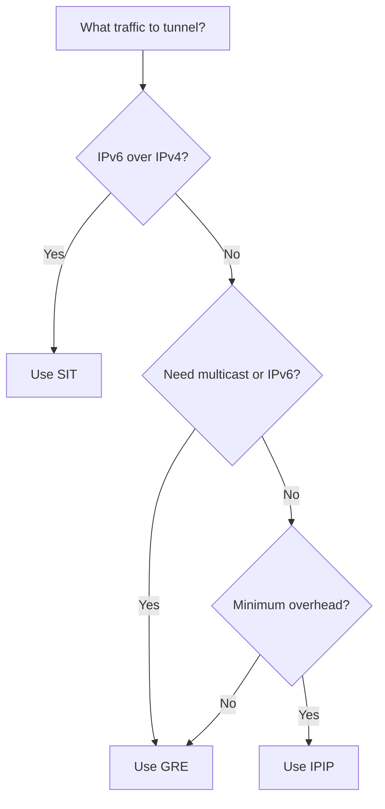

# How to Compare GRE vs IPIP vs SIT Tunnels on Linux

Author: [nawazdhandala](https://www.github.com/nawazdhandala)

Tags: Linux, GRE, IPIP, SIT, Tunnel, Comparison, Networking

Description: Compare the three main Linux tunnel types — GRE, IPIP, and SIT — to choose the right encapsulation protocol based on your use case, overhead, and protocol requirements.

## Introduction

Linux supports three primary IP tunneling protocols: GRE (Generic Routing Encapsulation), IPIP (IP-in-IP), and SIT (Simple Internet Transition). Each serves different purposes and has different overhead. Choosing the right one depends on what traffic you need to tunnel and what features you need.

## Comparison Table

| Feature | GRE | IPIP | SIT |
|---|---|---|---|
| Protocol number | 47 | 4 | 41 |
| IPv4 payload | Yes | Yes | No |
| IPv6 payload | Yes | No | Yes |
| Multicast support | Yes | No | No |
| Overhead | 24 bytes | 20 bytes | 20 bytes |
| Complexity | Medium | Low | Low |
| Common use | Site-to-site VPN | Simple IP routing | IPv6-over-IPv4 |

## When to Use GRE

GRE is the most versatile. Use it when you need:
- Multicast routing over the tunnel (OSPF, PIM)
- Routing protocols that require multicast
- IPv6 and IPv4 in the same tunnel
- Bridging-over-GRE (GRETAP)

```bash
ip tunnel add gre0 mode gre local 10.0.0.1 remote 10.0.0.2 ttl 255
ip addr add 172.16.0.1/30 dev gre0
```

## When to Use IPIP

IPIP is the lightest option. Use it when you need:
- Simple IPv4-over-IPv4 with minimal overhead
- No multicast requirement
- Maximum performance (smallest header)

```bash
ip tunnel add ipip0 mode ipip local 10.0.0.1 remote 10.0.0.2 ttl 255
ip addr add 172.16.0.1/30 dev ipip0
```

## When to Use SIT

SIT is specifically for IPv6 transition. Use it when you need:
- IPv6 connectivity over IPv4-only networks
- Connecting to IPv6 tunnel brokers (Hurricane Electric)
- IPv6-over-IPv4 encapsulation

```bash
ip tunnel add sit0 mode sit local <public-ipv4> remote <broker-ipv4> ttl 255
ip addr add <your-ipv6>/64 dev sit0
```

## Overhead Comparison

```
IPIP packet:  [IP outer 20][IP inner 20][payload]
SIT packet:   [IP outer 20][IPv6 inner 40][payload]
GRE packet:   [IP outer 20][GRE 4-16][IP inner 20][payload]
```

## Quick Decision Guide



## Tunnel Creation Syntax Reference

```bash
# GRE
ip tunnel add <name> mode gre local <local-ip> remote <remote-ip> ttl 255

# IPIP
ip tunnel add <name> mode ipip local <local-ip> remote <remote-ip> ttl 255

# SIT (6in4)
ip tunnel add <name> mode sit local <local-ipv4> remote <remote-ipv4> ttl 255
```

## Conclusion

GRE is the most capable but has the most overhead. IPIP is the fastest for pure IPv4 tunneling but lacks multicast and IPv6 support. SIT is purpose-built for IPv6 over IPv4 transition. For most site-to-site VPN scenarios, GRE is the natural choice. For performance-sensitive IPv4-only tunnels, IPIP is better. For IPv6 connectivity in an IPv4 environment, use SIT.
