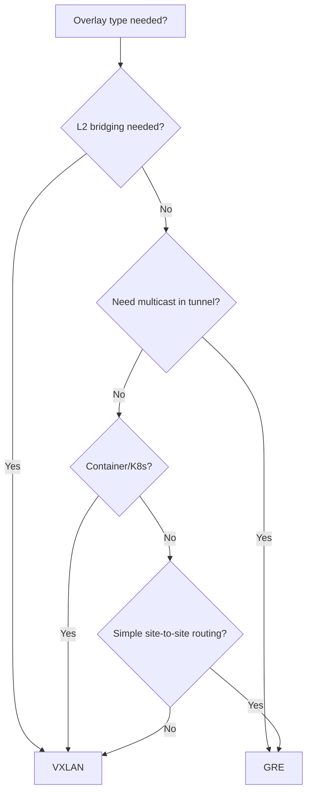

# How to Compare VXLAN vs GRE for Overlay Networks

Author: [nawazdhandala](https://www.github.com/nawazdhandala)

Tags: Linux, VXLAN, GRE, Overlay Network, Comparison, Networking, SDN, Containers

Description: Compare VXLAN and GRE tunneling protocols for overlay network use cases, covering scalability, overhead, multicast support, and typical deployment scenarios.

## Introduction

VXLAN and GRE are both popular overlay tunneling protocols on Linux, but they have different design goals and characteristics. VXLAN was purpose-built for multi-tenant data center overlays with massive scale, while GRE is a general-purpose encapsulation protocol that predates VXLAN.

## Feature Comparison

| Feature | VXLAN | GRE |
|---|---|---|
| Protocol | UDP/4789 | IP Protocol 47 |
| Layer support | Layer 2 (Ethernet) | Layer 3 (IP) |
| Segment ID | 24-bit VNI (16M segments) | 32-bit key (optional) |
| Overhead | 50 bytes | 24 bytes (minimum) |
| Multicast flooding | Yes (native BUM support) | No |
| Hardware offload | Widely supported | Less common |
| Control plane | FDB-based or BGP EVPN | Routing tables |
| Scale | Data center (thousands of VTEPs) | Moderate |
| Use in containers | Kubernetes, Docker | Less common |

## Overhead Comparison

```
Physical MTU: 1500 bytes

GRE:   1500 - 24 = 1476 bytes usable
VXLAN: 1500 - 50 = 1450 bytes usable
```

GRE has 26 bytes less overhead than VXLAN.

## When to Choose VXLAN

```bash
# Use VXLAN when:
# 1. You need Layer 2 extension (MAC-level bridging between sites)
# 2. You're building a container/Kubernetes overlay
# 3. You need more than 4094 VLAN segments
# 4. You need hardware VTEP offloading (NICs with VXLAN offload)
# 5. You want BGP EVPN control plane integration

# Create VXLAN
ip link add vxlan0 type vxlan id 100 dstport 4789 local 10.0.0.1 dev eth0
```

## When to Choose GRE

```bash
# Use GRE when:
# 1. You need simple Layer 3 routing between sites
# 2. You need multicast over the tunnel (OSPF, PIM-SM)
# 3. You're connecting to non-Linux endpoints (Cisco, etc.)
# 4. Minimum overhead is important
# 5. You want to tunnel non-IP protocols

# Create GRE
ip tunnel add gre0 mode gre local 10.0.0.1 remote 10.0.0.2 ttl 255
```

## Side-by-Side Setup Comparison

```bash
# VXLAN setup
ip link add vxlan0 type vxlan id 100 dstport 4789 local 10.0.0.1 dev eth0
ip link add br-vxlan type bridge && ip link set br-vxlan up
ip link set vxlan0 master br-vxlan
ip addr add 10.200.0.1/24 dev br-vxlan
bridge fdb append 00:00:00:00:00:00 dev vxlan0 dst 10.0.0.2 permanent

# GRE setup (equivalent Layer 3 routing)
ip tunnel add gre0 mode gre local 10.0.0.1 remote 10.0.0.2 ttl 255
ip addr add 172.16.0.1/30 dev gre0
ip link set gre0 up
ip route add 10.200.0.0/24 via 172.16.0.2
```

## Decision Guide



## Conclusion

VXLAN is the better choice for container networking, multi-tenant overlays, and Layer 2 extension scenarios. GRE is the better choice for simple site-to-site routing, protocol flexibility (non-IP payloads), and lower overhead. Both are well-supported on Linux and interoperate with other vendors. The primary technical differentiator is VXLAN's native Layer 2 semantics vs GRE's Layer 3 focus.
