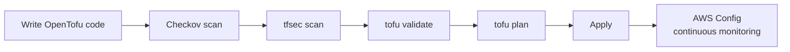

# How to Implement Compliance as Code with OpenTofu

Author: [nawazdhandala](https://www.github.com/nawazdhandala)

Tags: OpenTofu, Compliance, Checkov, tfsec, AWS Config, Security, Infrastructure as Code

Description: Learn how to implement compliance as code using OpenTofu with static analysis tools like Checkov and tfsec, AWS Config rules, and custom validation blocks to enforce security and compliance requirements automatically.

---

Compliance as code means security and regulatory requirements are checked automatically — not through manual audits. Static analysis tools scan OpenTofu configurations before deployment, while AWS Config evaluates running infrastructure continuously.

## Compliance Pipeline



## Static Analysis with Checkov

```yaml
# .github/workflows/security.yml
- name: Run Checkov
  uses: bridgecrewio/checkov-action@master
  with:
    directory: .
    framework: terraform
    soft_fail: false
    output_format: sarif
    output_file_path: checkov-results.sarif

- name: Upload Checkov results
  uses: github/codeql-action/upload-sarif@v2
  with:
    sarif_file: checkov-results.sarif
```

## tfsec Configuration

```yaml
# .tfsec/config.yml
severity_overrides:
  AWS006: WARNING  # Security group allows ingress from 0.0.0.0/0

exclude_checks:
  - AWS018  # Security group has description (we document elsewhere)

custom_checks:
  - code: CUSTOM001
    description: Production databases must have deletion protection enabled
    impact: Database could be accidentally deleted
    resolution: Set deletion_protection = true for production
    requiredTypes:
      - resource
    requiredLabels:
      - aws_db_instance
    severity: CRITICAL
    matchSpec:
      action: isTrue
      name: deletion_protection
    relatedInfoLinks:
      - https://registry.terraform.io/providers/hashicorp/aws/latest/docs/resources/db_instance
```

## Custom Validation Blocks

```hcl
# Compliance requirements enforced at plan time
variable "kms_key_arn" {
  type = string

  validation {
    condition     = var.environment != "production" || length(var.kms_key_arn) > 0
    error_message = "KMS key ARN is required for production environments"
  }
}

variable "backup_retention_days" {
  type = number

  validation {
    condition     = var.environment != "production" || var.backup_retention_days >= 7
    error_message = "Production databases require at least 7 days of backup retention"
  }
}

resource "aws_db_instance" "main" {
  # ...
  lifecycle {
    precondition {
      condition     = var.storage_encrypted || var.environment == "dev"
      error_message = "Database storage must be encrypted in staging and production"
    }
  }
}
```

## AWS Config Compliance Rules

```hcl
# config_compliance.tf
locals {
  compliance_rules = {
    s3-bucket-server-side-encryption-enabled = {
      source_identifier = "S3_BUCKET_SERVER_SIDE_ENCRYPTION_ENABLED"
    }
    rds-instance-public-access-check = {
      source_identifier = "RDS_INSTANCE_PUBLIC_ACCESS_CHECK"
    }
    ec2-instances-in-vpc = {
      source_identifier = "INSTANCES_IN_VPC"
    }
    iam-root-access-key-check = {
      source_identifier = "IAM_ROOT_ACCESS_KEY_CHECK"
    }
    cloudtrail-enabled = {
      source_identifier = "CLOUD_TRAIL_ENABLED"
    }
  }
}

resource "aws_config_config_rule" "compliance" {
  for_each = local.compliance_rules
  name     = each.key

  source {
    owner             = "AWS"
    source_identifier = each.value.source_identifier
  }
}

# Alert on compliance violations
resource "aws_config_delivery_channel" "compliance" {
  name           = "compliance-delivery"
  s3_bucket_name = aws_s3_bucket.config.id
  sns_topic_arn  = aws_sns_topic.compliance_alerts.arn
}
```

## Compliance Report Generation

```bash
# Query compliance status across all Config rules
aws configservice describe-compliance-by-config-rule \
  --compliance-types NON_COMPLIANT \
  --query 'ComplianceByConfigRules[*].{Rule:ConfigRuleName,Status:Compliance.ComplianceType}' \
  --output table
```

## Best Practices

- Run Checkov and tfsec in CI before plan — static analysis catches issues in seconds vs. minutes for Config rules.
- Use `lifecycle.precondition` blocks in OpenTofu for compliance requirements that depend on variable values.
- Enable AWS Security Hub to aggregate findings from Config, GuardDuty, and Inspector in one compliance dashboard.
- Treat Checkov failures as build failures — marking them as warnings leads to alert fatigue and ignored violations.
- Create custom tfsec rules for organization-specific requirements that generic tools don't cover.
