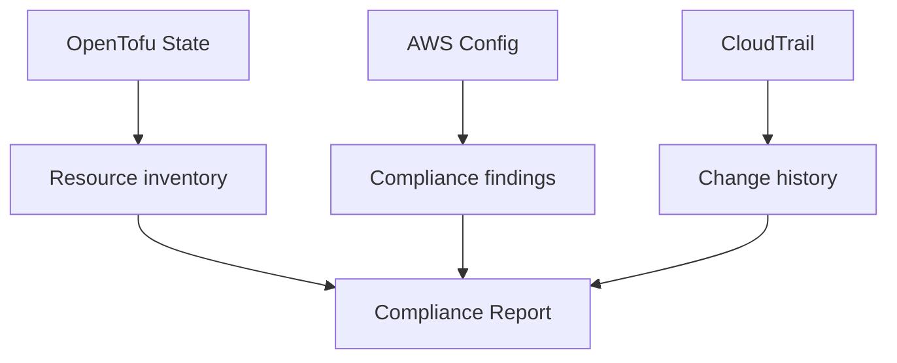

# How to Generate Compliance Reports from OpenTofu State

Author: [nawazdhandala](https://www.github.com/nawazdhandala)

Tags: OpenTofu, Compliance Reports, State, Audit, Security, AWS Config, Infrastructure as Code

Description: Learn how to generate compliance reports from OpenTofu state files and AWS Config findings, including state inspection, resource inventory, and automated audit report generation.

---

OpenTofu state contains a complete inventory of managed infrastructure. Combined with AWS Config compliance findings, you can generate reports that answer compliance questions: "Are all databases encrypted?" "Which resources are missing required tags?" "What changed last quarter?"

## Report Sources



## Querying State for Resource Inventory

```bash
# List all resources in state
tofu state list

# Show specific resource details
tofu state show aws_db_instance.main

# Output structured inventory as JSON
tofu show -json | jq '.values.root_module.resources[] | {
  type: .type,
  name: .name,
  encrypted: .values.storage_encrypted,
  multi_az: .values.multi_az
}'

# Check for unencrypted databases in state
tofu show -json | jq '
  .values.root_module.resources[]
  | select(.type == "aws_db_instance")
  | select(.values.storage_encrypted == false)
  | {name: .name, instance: .values.identifier}
'
```

## OpenTofu Outputs for Compliance Reporting

```hcl
# compliance_outputs.tf
output "compliance_inventory" {
  description = "Compliance-relevant attributes of managed resources"
  value = {
    databases = {
      for k, v in aws_db_instance.managed : k => {
        identifier         = v.identifier
        encrypted          = v.storage_encrypted
        multi_az           = v.multi_az
        deletion_protection = v.deletion_protection
        backup_retention   = v.backup_retention_period
        publicly_accessible = v.publicly_accessible
      }
    }

    buckets = {
      for k, v in aws_s3_bucket.managed : k => {
        bucket = v.bucket
        region = v.region
      }
    }
  }
}
```

## Automated Compliance Report Lambda

```hcl
# compliance_report.tf
resource "aws_lambda_function" "compliance_reporter" {
  function_name = "${var.environment}-compliance-reporter"
  role          = aws_iam_role.reporter.arn
  filename      = data.archive_file.reporter.output_path
  handler       = "reporter.handler"
  runtime       = "python3.12"
  timeout       = 300

  environment {
    variables = {
      REPORT_BUCKET      = aws_s3_bucket.reports.id
      CONFIG_RULES       = jsonencode(var.compliance_config_rules)
      REQUIRED_TAGS      = "Environment,Team,Project,CostCenter"
      NOTIFICATION_EMAIL = var.compliance_email
    }
  }
}

# Generate monthly compliance report
resource "aws_cloudwatch_event_rule" "monthly_report" {
  name                = "${var.environment}-monthly-compliance-report"
  schedule_expression = "cron(0 8 1 * ? *)"  # 1st of every month at 8 AM
}

resource "aws_cloudwatch_event_target" "report_lambda" {
  rule      = aws_cloudwatch_event_rule.monthly_report.name
  target_id = "compliance-reporter"
  arn       = aws_lambda_function.compliance_reporter.arn
}
```

## AWS Config Compliance Summary

```bash
# Generate a compliance summary from AWS Config
aws configservice describe-compliance-by-config-rule \
  --query 'ComplianceByConfigRules[*].{
    Rule: ConfigRuleName,
    Status: Compliance.ComplianceType,
    CompliantCount: Compliance.ComplianceContributorCount.CompliantResourceCount,
    NonCompliantCount: Compliance.ComplianceContributorCount.NonCompliantResourceCount
  }' \
  --output table

# Get details on non-compliant resources for a specific rule
aws configservice get-compliance-details-by-config-rule \
  --config-rule-name required-tags \
  --compliance-types NON_COMPLIANT \
  --query 'EvaluationResults[*].{
    ResourceType: EvaluationResultIdentifier.EvaluationResultQualifier.ResourceType,
    ResourceId: EvaluationResultIdentifier.EvaluationResultQualifier.ResourceId,
    Annotation: Annotation
  }' \
  --output table
```

## Change Tracking with CloudTrail

```hcl
# cloudtrail.tf — track all infrastructure API calls
resource "aws_cloudtrail" "infrastructure" {
  name                          = "${var.environment}-infrastructure-trail"
  s3_bucket_name                = aws_s3_bucket.cloudtrail.id
  include_global_service_events = true
  is_multi_region_trail         = true
  enable_log_file_validation    = true

  event_selector {
    read_write_type           = "All"
    include_management_events = true

    data_resource {
      type   = "AWS::S3::Object"
      values = ["${aws_s3_bucket.state.arn}/"]
    }
  }

  tags = {
    Environment = var.environment
    Purpose     = "compliance-audit"
  }
}
```

## Best Practices

- Use `tofu show -json` to extract compliance-relevant attributes programmatically for audits.
- Define `output` blocks that expose compliance attributes (encryption status, multi_az, deletion_protection) so auditors can query them without reading HCL.
- Enable CloudTrail with log file validation — this proves to auditors that log files have not been tampered with.
- Store compliance reports in S3 with versioning and object lock for tamper-proof retention.
- Schedule monthly compliance reports and send summaries to security and engineering leadership.
