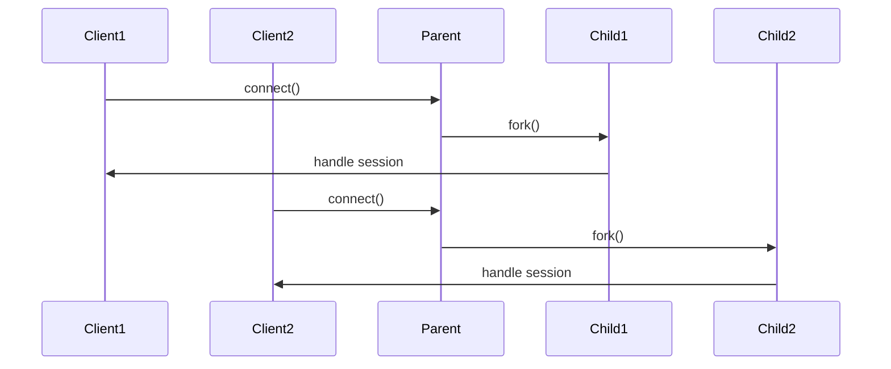

# How to Build a Concurrent TCP Server for IPv4 Using Fork

Author: [nawazdhandala](https://www.github.com/nawazdhandala)

Tags: TCP, IPv4, Networking, C, Linux, Sockets, Concurrency

Description: Learn how to build a concurrent TCP server for IPv4 using the fork() system call to handle multiple client connections simultaneously.

---

A concurrent TCP server handles multiple clients at the same time by spawning a child process for each new connection. This is a foundational pattern in Unix network programming, enabling robust, scalable server design.

## Why Use Fork for Concurrency?

The `fork()` approach is straightforward: the parent process accepts new connections, and for each connection it spawns a child to handle that client. The child process inherits a copy of the file descriptors and handles the session independently. This model provides strong isolation between clients.



## Setting Up the Socket

Before forking, you need a listening socket bound to an IPv4 address and port.

```c
/* server.c - Create, bind, and listen on an IPv4 TCP socket */
#include <stdio.h>
#include <stdlib.h>
#include <string.h>
#include <unistd.h>
#include <sys/types.h>
#include <sys/socket.h>
#include <netinet/in.h>
#include <signal.h>

#define PORT 8080
#define BACKLOG 10

int main() {
    int server_fd, client_fd;
    struct sockaddr_in address;
    socklen_t addrlen = sizeof(address);

    /* Create an IPv4 TCP socket */
    server_fd = socket(AF_INET, SOCK_STREAM, 0);
    if (server_fd < 0) { perror("socket"); exit(1); }

    /* Allow address reuse to avoid "Address already in use" on restart */
    int opt = 1;
    setsockopt(server_fd, SOL_SOCKET, SO_REUSEADDR, &opt, sizeof(opt));

    /* Bind to all IPv4 interfaces on PORT */
    memset(&address, 0, sizeof(address));
    address.sin_family = AF_INET;
    address.sin_addr.s_addr = INADDR_ANY;  /* 0.0.0.0 */
    address.sin_port = htons(PORT);

    if (bind(server_fd, (struct sockaddr *)&address, sizeof(address)) < 0) {
        perror("bind"); exit(1);
    }

    /* Start listening; BACKLOG controls the connection queue size */
    listen(server_fd, BACKLOG);
    printf("Server listening on port %d\n", PORT);
    return 0;
}
```

## Accepting Connections and Forking

After the socket is ready, the main loop accepts clients and forks a child for each one.

```c
/* Reap zombie child processes automatically */
signal(SIGCHLD, SIG_IGN);

while (1) {
    client_fd = accept(server_fd, (struct sockaddr *)&address, &addrlen);
    if (client_fd < 0) { perror("accept"); continue; }

    pid_t pid = fork();
    if (pid < 0) {
        perror("fork"); close(client_fd); continue;
    }

    if (pid == 0) {
        /* Child process: close the listening socket, handle the client */
        close(server_fd);
        handle_client(client_fd);
        close(client_fd);
        exit(0);
    } else {
        /* Parent process: close the client fd; child owns it now */
        close(client_fd);
    }
}
```

## Implementing the Client Handler

The child process reads from and writes to the client socket.

```c
/* handle_client - Echo data back to the client */
void handle_client(int fd) {
    char buffer[1024];
    ssize_t n;

    while ((n = read(fd, buffer, sizeof(buffer))) > 0) {
        /* Echo each received message back */
        write(fd, buffer, n);
    }
}
```

## Preventing Zombie Processes

Setting `SIGCHLD` to `SIG_IGN` tells the kernel to reap children automatically. Alternatively, use a `waitpid` loop in the `SIGCHLD` handler for more control.

```c
/* SIGCHLD handler that reaps all finished children */
void sigchld_handler(int s) {
    while (waitpid(-1, NULL, WNOHANG) > 0);
}
```

## Compiling and Testing

```bash
# Compile the server

gcc -o server server.c

# Start the server
./server &

# Test with netcat (sends "hello" to 127.0.0.1:8080)
echo "hello" | nc 127.0.0.1 8080
```

## Key Takeaways

- Use `AF_INET` and `SOCK_STREAM` for IPv4 TCP sockets.
- Always close the inherited socket in the opposite process after forking.
- Set `SO_REUSEADDR` to enable quick server restarts.
- Handle `SIGCHLD` to prevent zombie processes from accumulating.

For production servers, consider replacing `fork()` with a thread pool or event-driven I/O (e.g., `epoll`) to reduce process creation overhead.
