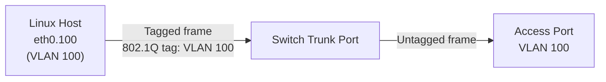

# How to Configure 802.1Q VLAN Tagging on Linux

Author: [nawazdhandala](https://www.github.com/nawazdhandala)

Tags: Linux, VLAN, 802.1Q, VLAN Tagging, iproute2, Networking, Kernel

Description: Understand and configure 802.1Q VLAN tagging on Linux, including loading the kernel module, creating tagged subinterfaces, and verifying tag behavior with tcpdump.

## Introduction

802.1Q is the IEEE standard for VLAN tagging on Ethernet. It inserts a 4-byte tag into the Ethernet frame header, containing the VLAN ID (12 bits, supporting 1–4094 VLANs). Linux supports 802.1Q through the `8021q` kernel module, which intercepts tagged frames and presents them as separate virtual interfaces.

## How 802.1Q Tagging Works



When you send a packet from `eth0.100`, the kernel adds the 802.1Q tag (VLAN 100) to the frame before it leaves `eth0`. The connected switch recognizes the tag and forwards to the appropriate VLAN.

## Step 1: Load the 8021q Module

```bash
# Load the 802.1Q VLAN kernel module

modprobe 8021q

# Verify it's loaded
lsmod | grep 8021q

# Make it persistent (load at boot)
echo "8021q" > /etc/modules-load.d/8021q.conf
```

## Step 2: Create a Tagged VLAN Interface

```bash
# Create VLAN 100 on eth0
ip link add link eth0 name eth0.100 type vlan id 100

# Show detailed VLAN info (protocol, ID, parent)
ip -d link show eth0.100
```

Output from `ip -d link show eth0.100`:
```text
3: eth0.100@eth0: <BROADCAST,MULTICAST> mtu 1500 qdisc noop state DOWN
    link/ether aa:bb:cc:dd:ee:ff brd ff:ff:ff:ff:ff:ff
    vlan protocol 802.1Q id 100 <REORDER_HDR>
```

## Step 3: Configure the VLAN Interface

```bash
# Bring up both parent and VLAN interfaces
ip link set eth0 up
ip link set eth0.100 up

# Assign an IP address
ip addr add 192.168.100.10/24 dev eth0.100
```

## Verify Tagging with tcpdump

To confirm that frames are being tagged:

```bash
# Capture on the parent interface (shows raw 802.1Q tags)
tcpdump -i eth0 -e -v vlan 100

# The -e flag shows Ethernet headers including 802.1Q tag
# Look for: 802.1Q vlan#100
```

## VLAN Protocol: 802.1Q vs 802.1ad

Linux supports both standard 802.1Q and QinQ (802.1ad):

```bash
# Standard 802.1Q VLAN (default)
ip link add link eth0 name eth0.100 type vlan id 100 proto 802.1Q

# 802.1ad (outer VLAN for QinQ)
ip link add link eth0 name eth0.1000 type vlan id 1000 proto 802.1ad
```

## Check VLAN Statistics

```bash
# View per-VLAN statistics via /proc
cat /proc/net/vlan/eth0.100

# Or use ip -s
ip -s link show eth0.100
```

## Common VLAN Issues

| Issue | Likely Cause | Fix |
|---|---|---|
| No connectivity | Parent interface down | `ip link set eth0 up` |
| Frames not tagged | 8021q module not loaded | `modprobe 8021q` |
| Wrong VLAN traffic | VLAN ID mismatch with switch | Verify switch trunk config |
| Fragmentation | MTU too large with tag overhead | Reduce MTU to 1496 |

## Conclusion

802.1Q VLAN tagging on Linux works through the `8021q` kernel module and `ip link` VLAN subinterfaces. The kernel automatically inserts and strips 802.1Q tags transparently. Verify tagging behavior with `tcpdump -i <parent-interface> -e vlan <id>`. Connect to a switch trunk port configured to carry the same VLAN IDs.
