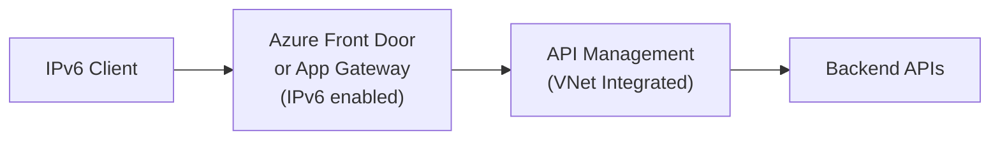

# How to Configure Azure API Management with IPv6

Author: [nawazdhandala](https://www.github.com/nawazdhandala)

Tags: Azure, API Management, IPv6, Networking, VNet, Terraform

Description: Configure Azure API Management to accept IPv6 traffic by deploying it behind an IPv6-enabled Application Gateway or configuring dual-stack VNet integration.

## Introduction

Azure API Management (APIM) does not natively expose an IPv6 endpoint on its own. IPv6 access is achieved by placing APIM inside a VNet and fronting it with an Azure Application Gateway or Azure Front Door, both of which support IPv6.

## Architecture Overview



## Option 1: Azure Front Door (Recommended for Global IPv6)

Azure Front Door automatically provides IPv6 endpoints.

```bash
# Create a Front Door profile
az afd profile create \
  --profile-name my-afd-profile \
  --resource-group my-rg \
  --sku Standard_AzureFrontDoor

# Create an endpoint
az afd endpoint create \
  --profile-name my-afd-profile \
  --endpoint-name my-api-endpoint \
  --resource-group my-rg \
  --enabled-state Enabled

# Add an origin group pointing to APIM gateway URL
az afd origin-group create \
  --profile-name my-afd-profile \
  --origin-group-name apim-origins \
  --resource-group my-rg \
  --probe-path /status-0123456789abcdef \
  --probe-protocol Https \
  --probe-interval-in-seconds 30

az afd origin create \
  --profile-name my-afd-profile \
  --origin-group-name apim-origins \
  --origin-name apim-origin \
  --resource-group my-rg \
  --host-name myapim.azure-api.net \
  --origin-host-header myapim.azure-api.net \
  --https-port 443
```

Front Door's anycast network automatically resolves to both A and AAAA records globally.

## Option 2: Application Gateway v2 with IPv6 Frontend

```bash
# Create a dual-stack Application Gateway
az network application-gateway create \
  --name my-appgw \
  --resource-group my-rg \
  --location eastus \
  --sku Standard_v2 \
  --capacity 2 \
  --vnet-name my-vnet \
  --subnet appgw-subnet \
  --frontend-port 443 \
  --http-settings-protocol Https \
  --http-settings-port 443 \
  --routing-rule-type Basic \
  --servers myapim.azure-api.net \
  --priority 100

# Add an IPv6 frontend IP configuration
az network application-gateway frontend-ip create \
  --gateway-name my-appgw \
  --resource-group my-rg \
  --name ipv6-frontend \
  --public-ip-address my-ipv6-pip
```

## Terraform: APIM with Front Door IPv6

```hcl
resource "azurerm_cdn_frontdoor_profile" "apim_fd" {
  name                = "apim-frontdoor"
  resource_group_name = azurerm_resource_group.main.name
  sku_name            = "Standard_AzureFrontDoor"
}

resource "azurerm_cdn_frontdoor_endpoint" "apim_endpoint" {
  name                     = "apim-endpoint"
  cdn_frontdoor_profile_id = azurerm_cdn_frontdoor_profile.apim_fd.id
}

resource "azurerm_cdn_frontdoor_origin_group" "apim" {
  name                     = "apim-origins"
  cdn_frontdoor_profile_id = azurerm_cdn_frontdoor_profile.apim_fd.id

  load_balancing {}
}

resource "azurerm_cdn_frontdoor_origin" "apim" {
  name                          = "apim-origin"
  cdn_frontdoor_origin_group_id = azurerm_cdn_frontdoor_origin_group.apim.id
  enabled                       = true
  host_name                     = azurerm_api_management.main.gateway_url
  origin_host_header            = azurerm_api_management.main.gateway_url
  https_port                    = 443
  priority                      = 1
  weight                        = 1000
}
```

## Step 3: Verify IPv6 Access

```bash
# Check that Front Door domain resolves to IPv6
dig AAAA my-api-endpoint.z01.azurefd.net

# Test API over IPv6
curl -6 https://my-api-endpoint.z01.azurefd.net/my-api/v1/health

# Test with APIM subscription key
curl -6 https://my-api-endpoint.z01.azurefd.net/my-api/v1/resource \
  -H "Ocp-Apim-Subscription-Key: your-key"
```

## Handle IPv6 Client IPs in APIM Policies

```xml
<!-- APIM inbound policy to log client IP -->
<inbound>
    <set-variable name="clientIP"
        value="@(context.Request.IpAddress)" />
    <!-- context.Request.IpAddress handles both IPv4 and IPv6 -->
    <trace source="client-ip">
        <message>@($"Client IP: {context.Variables["clientIP"]}")</message>
    </trace>
    <base />
</inbound>
```

## Conclusion

Azure API Management achieves IPv6 access through Front Door (global) or Application Gateway v2 (regional). Both approaches require no changes to APIM itself. Use OneUptime to monitor both the Front Door IPv6 endpoint and internal APIM health checks simultaneously.
