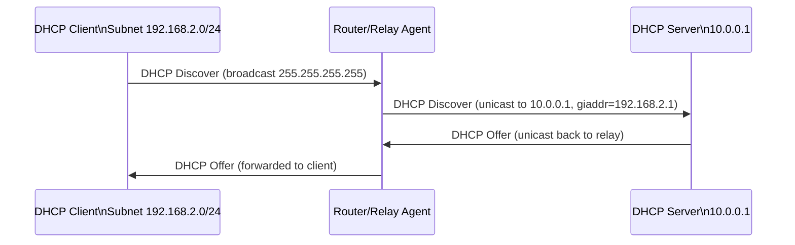

# How to Configure DHCP Relay for Cross-Subnet Broadcast

Author: [nawazdhandala](https://www.github.com/nawazdhandala)

Tags: Networking, DHCP, Broadcast, Relay, Linux, Cisco, IPv4

Description: Configure a DHCP relay agent on a Linux router or Cisco switch to forward DHCP broadcast requests from clients on one subnet to a DHCP server on a different subnet.

## Introduction

DHCP clients send broadcast Discover messages that routers normally drop. A DHCP relay agent (IP Helper) converts these broadcasts into unicast packets addressed to a central DHCP server, enabling one server to serve multiple subnets.

## How DHCP Relay Works



The relay adds the **giaddr** (gateway IP address) field so the DHCP server knows which subnet the request came from and issues an address from the correct pool.

## Option 1: DHCP Relay on Linux with isc-dhcp-relay

```bash
# Install the relay agent
sudo apt install isc-dhcp-relay

# Configure during installation or edit /etc/default/isc-dhcp-relay
sudo tee /etc/default/isc-dhcp-relay << 'EOF'
# The DHCP server IP
SERVERS="10.0.0.1"

# Interfaces to listen on for client broadcasts
INTERFACES="eth1 eth2"

# Additional options
OPTIONS=""
EOF

# Enable and start the relay
sudo systemctl enable --now isc-dhcp-relay

# Verify it is relaying
sudo journalctl -u isc-dhcp-relay -f
```

Ensure IP forwarding is enabled:

```bash
echo 1 | sudo tee /proc/sys/net/ipv4/ip_forward
```

## Option 2: Using dhcrelay Directly

```bash
# Install dhcp-relay
sudo apt install isc-dhcp-relay

# Run dhcrelay manually: listen on eth1, forward to 10.0.0.1
sudo dhcrelay -i eth1 10.0.0.1

# For multiple interfaces and multiple DHCP servers
sudo dhcrelay -i eth1 -i eth2 10.0.0.1 10.0.0.2
```

## Option 3: Cisco ip helper-address

On a Cisco router, configure IP helper on the interface closest to the clients:

```
! Configure DHCP relay (ip helper-address) on the client-facing SVI
interface vlan 20
 ip address 192.168.2.1 255.255.255.0
 ip helper-address 10.0.0.1
```

By default, `ip helper-address` forwards DHCP (port 67/68) and several other UDP services. To forward only DHCP:

```
! Disable generic UDP forwarding first
no ip forward-protocol udp 69
no ip forward-protocol udp 137
no ip forward-protocol udp 138

! Re-enable for DHCP only
ip forward-protocol udp 67
```

## Configuring the DHCP Server for Multiple Subnets

Ensure the DHCP server has a scope for each relay subnet. In isc-dhcp-server (`/etc/dhcp/dhcpd.conf`):

```
# Scope for local server subnet
subnet 10.0.0.0 netmask 255.255.255.0 {
}

# Scope for relayed subnet 192.168.2.0/24
subnet 192.168.2.0 netmask 255.255.255.0 {
  range 192.168.2.100 192.168.2.200;
  option routers 192.168.2.1;
  option domain-name-servers 8.8.8.8;
  default-lease-time 86400;
}
```

## Verifying Relay Operation

```bash
# On the relay host — watch forwarded DHCP packets
sudo tcpdump -i eth1 -n "udp port 67 or udp port 68"

# On the DHCP server — confirm it receives relayed requests with giaddr set
sudo tcpdump -i eth0 -n -v "udp port 67" | grep "giaddr"
```

## Conclusion

A DHCP relay agent removes the broadcast limitation of DHCP, allowing a single server to allocate addresses across all subnets. On Linux, `isc-dhcp-relay` handles this with minimal configuration; on Cisco, `ip helper-address` achieves the same result.
