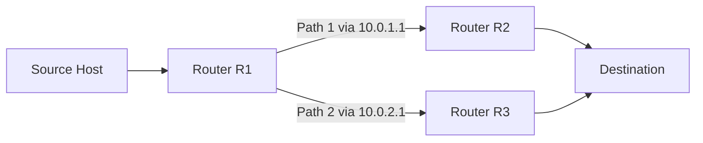

# How to Configure Equal-Cost Multi-Path (ECMP) Routing

Author: [nawazdhandala](https://www.github.com/nawazdhandala)

Tags: Networking, ECMP, Routing, Linux, Load Balancing, IPv4

Description: Configure Equal-Cost Multi-Path routing on Linux and network devices to spread traffic across multiple paths for increased throughput and redundancy.

## Introduction

Equal-Cost Multi-Path (ECMP) routing allows a router to use multiple next-hop paths of equal metric to a single destination. Instead of choosing one path and leaving others idle, the router distributes flows across all equal-cost paths — improving throughput and providing automatic failover.

## How ECMP Works

When the routing table contains multiple routes to the same destination with the same administrative distance and metric, the router performs per-flow or per-packet load balancing across the available next-hops.



## Configuring ECMP on Linux

Linux supports ECMP natively through the `ip route` command with multiple nexthop entries.

Add multiple equal-cost routes to the same destination:

```bash
# Add ECMP route with two next-hops of equal weight
ip route add 10.10.0.0/16 \
  nexthop via 192.168.1.1 dev eth0 weight 1 \
  nexthop via 192.168.2.1 dev eth1 weight 1

# Verify the multipath route
ip route show 10.10.0.0/16
```

For weighted ECMP (send 2x traffic via the first path):

```bash
# Weight 2 means twice as many flows go through eth0
ip route add 10.10.0.0/16 \
  nexthop via 192.168.1.1 dev eth0 weight 2 \
  nexthop via 192.168.2.1 dev eth1 weight 1
```

## ECMP Hash Policy

Linux uses a hash of flow identifiers to keep packets from the same flow on the same path, avoiding TCP out-of-order issues.

Configure the hashing policy:

```bash
# Show current ECMP hash policy
sysctl net.ipv4.fib_multipath_hash_policy

# Set to hash by source+destination IP and L4 ports (recommended)
sysctl -w net.ipv4.fib_multipath_hash_policy=1

# Persist across reboots
echo "net.ipv4.fib_multipath_hash_policy=1" >> /etc/sysctl.conf
```

Hash policy values:
- `0` — Layer 3 only (src IP, dst IP)
- `1` — Layer 3 + Layer 4 (src/dst IP + src/dst port)

## Configuring ECMP with FRR (Free Range Routing)

For dynamic ECMP with OSPF:

```bash
# /etc/frr/ospfd.conf excerpt
router ospf
  network 192.168.1.0/24 area 0
  network 192.168.2.0/24 area 0
  maximum-paths 4   # allow up to 4 ECMP paths
```

For BGP ECMP:

```bash
# FRR BGP config
router bgp 65001
  address-family ipv4 unicast
    maximum-paths 4        # IBGP ECMP
    maximum-paths ibgp 4   # eBGP ECMP
```

## Verifying ECMP

```bash
# Check that multiple nexthops appear in the routing table
ip route show 10.10.0.0/16

# Monitor per-interface traffic to confirm load distribution
watch -n 1 "ip -s link show eth0; ip -s link show eth1"

# Use ss or netstat to see flows distributed across interfaces
ss -tn | awk '{print $5}' | sort | uniq -c
```

## Conclusion

ECMP is a straightforward way to maximize bandwidth utilization and add redundancy without additional protocols. On Linux, it requires only a few `ip route` commands and proper sysctl tuning. For production networks, pair ECMP with dynamic routing (OSPF or BGP) so that failed paths are automatically removed from the ECMP group.
