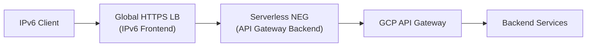

# How to Configure GCP API Gateway with IPv6

Author: [nawazdhandala](https://www.github.com/nawazdhandala)

Tags: GCP, API Gateway, IPv6, Google Cloud, Networking, Terraform

Description: Enable IPv6 access for GCP API Gateway by routing traffic through a Global External Load Balancer with IPv6 frontend configuration.

## Introduction

GCP API Gateway itself does not expose a native IPv6 endpoint — it operates via a managed service URL. To serve IPv6 clients, you route API Gateway traffic through a Global External HTTPS Load Balancer, which supports IPv6 frontends natively.

## Architecture Overview



## Step 1: Create the API Gateway

```bash
# Create an API config from an OpenAPI spec
gcloud api-gateway api-configs create my-api-config \
  --api=my-api \
  --openapi-spec=openapi.yaml \
  --project=my-project \
  --backend-auth-service-account=my-sa@my-project.iam.gserviceaccount.com

# Deploy the gateway
gcloud api-gateway gateways create my-gateway \
  --api=my-api \
  --api-config=my-api-config \
  --location=us-central1 \
  --project=my-project
```

## Step 2: Create a Serverless NEG for API Gateway

A Network Endpoint Group (NEG) of type `serverless` points the Load Balancer to API Gateway.

```bash
# Get the API Gateway default hostname
GW_HOST=$(gcloud api-gateway gateways describe my-gateway \
  --location=us-central1 \
  --format='value(defaultHostname)')

# Create a serverless NEG targeting the API Gateway FQDN
gcloud compute network-endpoint-groups create apigw-neg \
  --region=us-central1 \
  --network-endpoint-type=serverless \
  --cloud-run-service="" \
  --cloud-function-name="" \
  --app-engine-app="" \
  --serverless-deployment-platform=apigateway \
  --serverless-deployment-resource=my-gateway
```

## Step 3: Create the Load Balancer with IPv6 Frontend

```bash
# Create a backend service
gcloud compute backend-services create apigw-backend \
  --global \
  --load-balancing-scheme=EXTERNAL

# Add the NEG to the backend service
gcloud compute backend-services add-backend apigw-backend \
  --global \
  --network-endpoint-group=apigw-neg \
  --network-endpoint-group-region=us-central1

# Create a URL map
gcloud compute url-maps create apigw-urlmap \
  --default-service=apigw-backend

# Reserve a global IPv6 static IP
gcloud compute addresses create apigw-ipv6 \
  --ip-version=IPV6 \
  --global

# Create HTTPS target proxy (with your SSL cert)
gcloud compute target-https-proxies create apigw-https-proxy \
  --url-map=apigw-urlmap \
  --ssl-certificates=my-ssl-cert

# Create the IPv6 forwarding rule (frontend)
gcloud compute forwarding-rules create apigw-ipv6-rule \
  --global \
  --target-https-proxy=apigw-https-proxy \
  --address=apigw-ipv6 \
  --ports=443 \
  --ip-version=IPV6
```

## Step 4: Terraform Alternative

```hcl
# IPv6 frontend address
resource "google_compute_global_address" "apigw_ipv6" {
  name       = "apigw-ipv6"
  ip_version = "IPV6"
}

# Forwarding rule for IPv6
resource "google_compute_global_forwarding_rule" "apigw_ipv6" {
  name        = "apigw-ipv6-rule"
  target      = google_compute_target_https_proxy.apigw.self_link
  ip_address  = google_compute_global_address.apigw_ipv6.address
  port_range  = "443"
  ip_version  = "IPV6"
}
```

## Step 5: Verify IPv6 Connectivity

```bash
# Get the IPv6 frontend IP
IPV6=$(gcloud compute addresses describe apigw-ipv6 \
  --global --format='value(address)')

# Test over IPv6
curl -6 -v "https://[$IPV6]/" \
  -H "Host: api.example.com"

# Check DNS AAAA records after DNS propagation
dig AAAA api.example.com
```

## Conclusion

GCP API Gateway gains IPv6 access via Global Load Balancer IPv6 frontends, providing scalable, DDoS-protected IPv6 ingress. Use OneUptime to monitor both IPv4 and IPv6 frontends of your API Gateway independently to detect version-specific outages.
