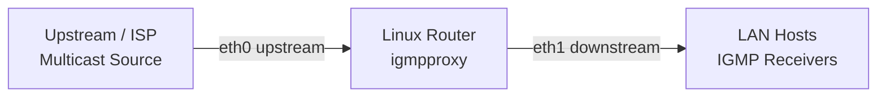

# How to Configure IGMP Proxy on a Linux Router

Author: [nawazdhandala](https://www.github.com/nawazdhandala)

Tags: Networking, Multicast, IGMP, Linux, Routing, Igmpproxy

Description: Set up igmpproxy on a Linux router to forward multicast traffic from an upstream interface to downstream LAN segments without running a full PIM routing daemon.

## Introduction

`igmpproxy` is a lightweight daemon that proxies IGMP membership reports between a downstream LAN and an upstream multicast-capable network. It is ideal for home or small office routers where a full PIM implementation is unnecessary.

## Installing igmpproxy

```bash
# Ubuntu/Debian

sudo apt update && sudo apt install -y igmpproxy

# RHEL/CentOS/Fedora
sudo dnf install -y igmpproxy
```

## Network Topology



The router has:
- `eth0`: upstream interface connected to a multicast source or ISP
- `eth1`: downstream interface facing the LAN

## Enabling IP Forwarding and Multicast Routing

```bash
# Enable general IP forwarding
echo 1 | sudo tee /proc/sys/net/ipv4/ip_forward

# Enable multicast routing (required for igmpproxy)
echo 1 | sudo tee /proc/sys/net/ipv4/conf/all/mc_forwarding

# Make permanent in /etc/sysctl.d/
sudo tee /etc/sysctl.d/99-multicast.conf << 'EOF'
net.ipv4.ip_forward = 1
net.ipv4.conf.all.mc_forwarding = 1
EOF
sudo sysctl --system
```

## Configuring igmpproxy

The configuration file is `/etc/igmpproxy.conf`:

```bash
sudo tee /etc/igmpproxy.conf << 'EOF'
##
## igmpproxy configuration
##

# Upstream interface - where multicast sources are reachable
phyint eth0 upstream  ratelimit 0  threshold 1
    altnet 0.0.0.0/0

# Downstream interface - where LAN receivers are
phyint eth1 downstream  ratelimit 0  threshold 1

# Disable all other interfaces
phyint lo disabled
EOF
```

Key options:
- `upstream`: receives multicast from sources, sends IGMP queries upstream
- `downstream`: receives IGMP joins from LAN, forwards multicast to LAN
- `altnet`: permitted source networks on the upstream interface
- `threshold`: minimum TTL for packets forwarded out this interface
- `ratelimit`: max kbps rate limit (0 = unlimited)

## Starting igmpproxy

```bash
# Start and enable igmpproxy
sudo systemctl enable --now igmpproxy

# Check it is running
sudo systemctl status igmpproxy
```

## Verifying Proxy Operation

```bash
# Check that multicast routing entries are created
cat /proc/net/ip_mr_cache

# Watch igmpproxy logs
sudo journalctl -u igmpproxy -f
```

When a LAN host joins a group, igmpproxy creates an upstream IGMP join. When the last LAN member leaves, it sends an upstream Leave.

## iptables Rules for igmpproxy

Allow IGMP and forwarded multicast:

```bash
# Allow IGMP on both interfaces
sudo iptables -A INPUT  -p igmp -j ACCEPT
sudo iptables -A OUTPUT -p igmp -j ACCEPT

# Allow multicast forwarding between interfaces
sudo iptables -A FORWARD -d 224.0.0.0/4 -j ACCEPT
sudo iptables -A FORWARD -s 224.0.0.0/4 -j ACCEPT
```

## Restricting Forwarded Groups

To limit which multicast groups are proxied, add `altnet` entries scoped to specific ranges:

```ini
phyint eth0 upstream  ratelimit 0  threshold 1
    altnet 239.0.0.0/8    # Only proxy administratively-scoped multicast
```

## Conclusion

`igmpproxy` provides a simple, low-overhead way to extend multicast delivery to a LAN without full PIM routing. Configure the upstream and downstream interfaces, enable kernel multicast forwarding, and let igmpproxy handle IGMP proxying automatically.
