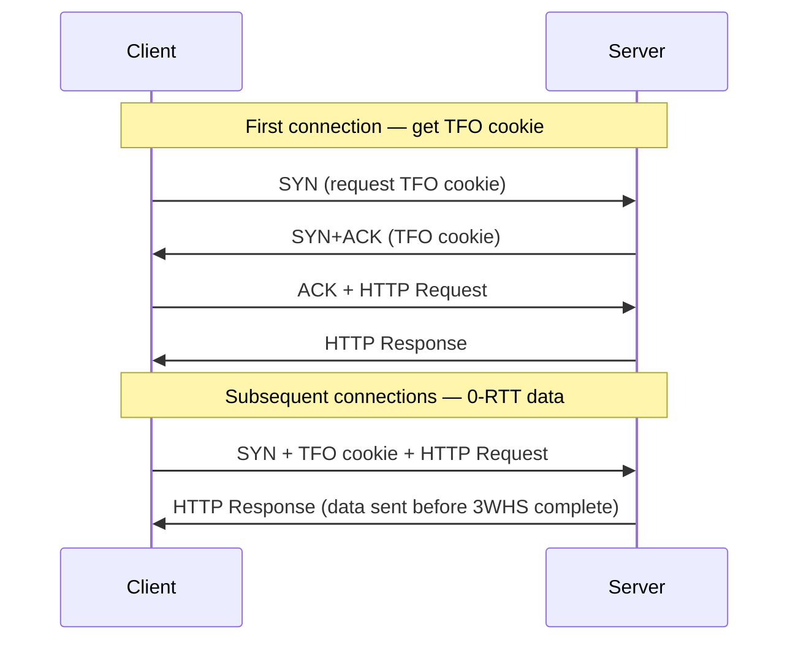

# How to Configure IPv6 TCP Fast Open

Author: [nawazdhandala](https://www.github.com/nawazdhandala)

Tags: IPv6, TCP Fast Open, TFO, Linux, Performance, Networking

Description: Enable and configure TCP Fast Open for IPv6 connections on Linux to reduce connection setup latency by sending data in the initial SYN packet.

## Introduction

TCP Fast Open (TFO) allows data to be sent in the TCP SYN packet on repeat connections, eliminating one round-trip from the connection setup. This is especially valuable for high-latency IPv6 paths such as mobile or intercontinental connections.

## How TFO Works



## Step 1: Enable TFO in the Linux Kernel

```bash
# Check current TFO setting
sysctl net.ipv4.tcp_fastopen
# 0 = disabled
# 1 = client mode
# 2 = server mode
# 3 = both client and server

# Enable TFO for both client and server roles
echo "net.ipv4.tcp_fastopen = 3" | \
  sudo tee -a /etc/sysctl.d/99-tfo.conf

# Also tune the TFO cookie size (in bytes, default 8)
echo "net.ipv4.tcp_fastopen_key = 1" | \
  sudo tee -a /etc/sysctl.d/99-tfo.conf

sudo sysctl -p /etc/sysctl.d/99-tfo.conf
```

Note: TFO uses the same kernel parameter for both IPv4 and IPv6.

## Step 2: Configure NGINX to Use TFO

```nginx
# nginx.conf — enable TFO on IPv6 listeners
server {
    # fastopen=256 enables TFO with a queue size of 256
    listen [::]:80 fastopen=256 reuseport;
    listen 80 fastopen=256 reuseport;

    listen [::]:443 ssl fastopen=256 reuseport;
    listen 443 ssl fastopen=256 reuseport;

    server_name example.com;
    # ... rest of config
}
```

## Step 3: TFO in Python (Server)

```python
import socket

# Create an IPv6 TCP socket with TFO enabled
server = socket.socket(socket.AF_INET6, socket.SOCK_STREAM)
server.setsockopt(socket.SOL_SOCKET, socket.SO_REUSEADDR, 1)
server.setsockopt(socket.SOL_SOCKET, socket.SO_REUSEPORT, 1)

# Enable TCP Fast Open — value is the queue length for pending TFO requests
# TCP_FASTOPEN = 23 on Linux
TCP_FASTOPEN = 23
server.setsockopt(socket.IPPROTO_TCP, TCP_FASTOPEN, 5)

server.bind(("::", 8080, 0, 0))
server.listen(128)
print("Server listening on [::]:8080 with TFO enabled")

while True:
    conn, addr = server.accept()
    # addr[0] will be the IPv6 address of the client
    print(f"Connection from {addr[0]}")
    data = conn.recv(4096)
    conn.sendall(b"HTTP/1.1 200 OK\r\nContent-Length: 5\r\n\r\nHello")
    conn.close()
```

## Step 4: TFO in Python (Client)

```python
import socket

# MSG_FASTOPEN flag — not available as a Python constant, define it
MSG_FASTOPEN = 0x20000000

client = socket.socket(socket.AF_INET6, socket.SOCK_STREAM)

server_addr = ("2001:db8::1", 8080, 0, 0)
request = b"GET / HTTP/1.1\r\nHost: example.com\r\nConnection: close\r\n\r\n"

# sendto with MSG_FASTOPEN sends data in the SYN packet
# On first connection, the kernel requests a TFO cookie
client.sendto(request, MSG_FASTOPEN, server_addr)

response = client.recv(4096)
print(response.decode())
client.close()
```

## Step 5: Verify TFO is Working

```bash
# Check TFO statistics
cat /proc/net/netstat | grep -i "fastopen"

# Or with ss
ss -6 -t -i | grep "fastopen"

# Use tcpdump to capture SYN packets and look for TFO option
sudo tcpdump -i eth0 -n -v \
  "tcp[tcpflags] & tcp-syn != 0 and ip6" | \
  grep -i "fast"

# Test with curl (curl uses TFO automatically when enabled in kernel)
curl -6 --tcp-fastopen https://example.com/
```

## Conclusion

TCP Fast Open reduces connection latency by one RTT on repeat connections. The kernel setting applies to both IPv4 and IPv6 — simply enable `tcp_fastopen = 3` and add `fastopen=` to your NGINX listeners. Monitor connection setup times with OneUptime to quantify the improvement.
