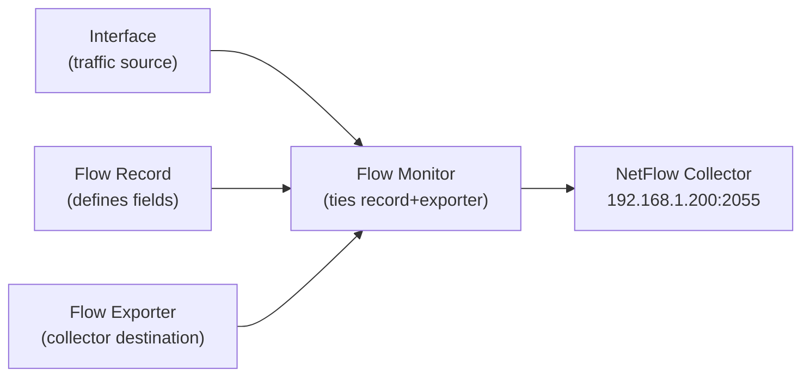

# How to Configure NetFlow v9 (Flexible NetFlow) on Cisco IOS

Author: [nawazdhandala](https://www.github.com/nawazdhandala)

Tags: NetFlow, Flexible NetFlow, Cisco IOS, Traffic Analysis, Network Monitoring

Description: Learn how to configure NetFlow version 9 (Flexible NetFlow) on Cisco IOS, including custom flow records, exporters, and monitors for advanced traffic visibility.

## NetFlow v9 vs v5

NetFlow v9 introduced a template-based format that makes it extensible (unlike the fixed v5 format). Flexible NetFlow (FNF) is Cisco's implementation of v9 that allows customizable flow records-you choose exactly which fields to capture.

Key improvements over v5:
- Template-based: collector learns the format from the router
- Custom fields: capture exactly what you need
- IPv6 support
- MPLS label visibility
- VLAN and VRF tracking

## Flexible NetFlow Architecture



## Step 1: Create a Flow Record

The flow record defines which fields to capture in the key (match) and non-key (collect) sections:

```text
! Define what fields to use to identify a unique flow (key fields)
flow record MY_FLOW_RECORD
 ! Match on standard 5-tuple
 match ipv4 source address
 match ipv4 destination address
 match transport source-port
 match transport destination-port
 match ip protocol
 !
 ! Collect these additional fields per flow
 collect counter bytes
 collect counter packets
 collect timestamp sys-uptime first
 collect timestamp sys-uptime last
 collect interface input
 collect interface output
 collect transport tcp flags
 collect ipv4 tos
```

## Step 2: Create a Flow Exporter

Define where and how to send the flow data:

```text
! Create an exporter pointing to the collector
flow exporter MY_EXPORTER
 ! Collector IP and port
 destination 192.168.1.200
 transport udp 2055
 !
 ! Use NetFlow v9 format
 export-protocol netflow-v9
 !
 ! Source interface (use loopback for stability)
 source Loopback0
 !
 ! Template send interval (resend templates every 60 packets)
 template data timeout 60
 options interface-table timeout 60
 options exporter-stats timeout 300
```

## Step 3: Create a Flow Monitor

The monitor ties the record and exporter together:

```bash
! Create flow monitor referencing the record and exporter
flow monitor MY_MONITOR
 record MY_FLOW_RECORD
 exporter MY_EXPORTER
 !
 ! Cache size and timeout settings
 cache timeout active 60       ! Export active flows after 60 seconds
 cache timeout inactive 30     ! Export idle flows after 30 seconds
 cache entries 10000           ! Maximum cache entries
```

## Step 4: Apply the Monitor to Interfaces

Apply the monitor to the interfaces you want to capture traffic on:

```text
! Apply to WAN interface
Router(config)# interface GigabitEthernet0/0
Router(config-if)# ip flow monitor MY_MONITOR input
Router(config-if)# ip flow monitor MY_MONITOR output

! Apply to LAN interface
Router(config)# interface GigabitEthernet0/1
Router(config-if)# ip flow monitor MY_MONITOR input
```

## Step 5: Create a Simplified Record for Bandwidth Monitoring

For basic bandwidth monitoring, use a simpler record:

```text
flow record BANDWIDTH_RECORD
 match ipv4 source address
 match ipv4 destination address
 match ip protocol
 collect counter bytes long
 collect counter packets long
 collect interface input
```

## Step 6: Verify Flexible NetFlow

```bash
! Show active flow cache
Router# show flow monitor MY_MONITOR cache

  Cache type:                        Normal
  Cache size:                         10000
  Current entries:                      245
  High Watermark:                      1023

! Show export statistics
Router# show flow exporter MY_EXPORTER statistics

  Flow Exporter MY_EXPORTER:
    Packet send statistics (last cleared 2h 00m ago):
      Successfully sent:         15000
      Client send errors:            0

! Show flow records
Router# show flow record MY_FLOW_RECORD
```

## Step 7: Pre-Built Templates for Common Use Cases

Cisco provides default flow records for common scenarios:

```text
! Use the pre-defined IPv4 original flow record (similar to v5)
flow record netflow-original
! This is available on most IOS versions as a shortcut

flow monitor SIMPLE_MONITOR
 record netflow-original
 exporter MY_EXPORTER
```

## Conclusion

Flexible NetFlow on Cisco IOS provides granular, customizable flow monitoring. Create a flow record defining key and non-key fields, an exporter pointing to your collector, and a flow monitor combining them. Apply the monitor to interfaces for input and output traffic. The template-based NetFlow v9 format ensures your collector always knows how to interpret the data.
