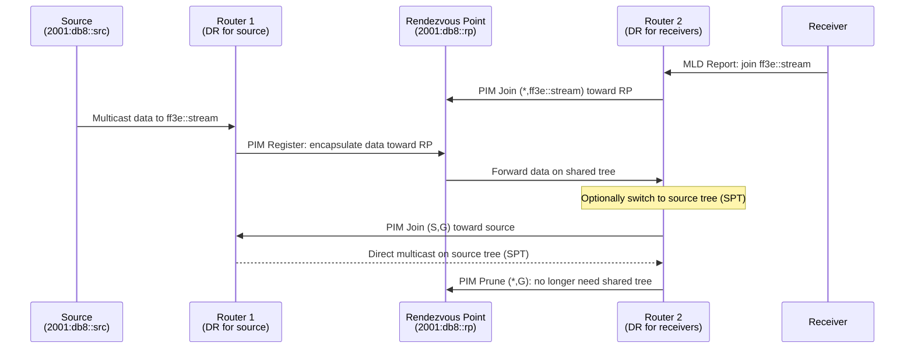

# How to Configure PIM-SM for IPv6 Multicast Routing

Author: [nawazdhandala](https://www.github.com/nawazdhandala)

Tags: IPv6, PIM-SM, Multicast Routing, Pimd, Networks

Description: A guide to configuring PIM-SM (Protocol Independent Multicast - Sparse Mode) for IPv6 multicast routing on Linux using the pimd daemon.

## What Is PIM-SM?

PIM-SM (Protocol Independent Multicast - Sparse Mode) is a multicast routing protocol designed for networks where multicast group members are spread sparsely. It uses a Rendezvous Point (RP) to coordinate multicast distribution trees.

For IPv6, PIM-SM is defined in RFC 7761 and works identically to its IPv4 counterpart, just using IPv6 addresses and `ff0x::` multicast groups.

## Installing PIM for IPv6 on Linux

The `pimd` daemon handles both PIM-SM and is available on most Linux distributions. For IPv6 multicast routing, use `pim6sd` or FRRouting (FRR):

```bash
# Install FRRouting (supports IPv6 PIM)

apt install frr

# Enable the PIM daemon in FRR
sed -i 's/pimd=no/pimd=yes/' /etc/frr/daemons

# Restart FRR
systemctl restart frr
```

## Basic PIM-SM IPv6 Configuration in FRR

```bash
# Access FRR vtysh CLI
vtysh

# Enter configuration mode
configure terminal

# Enable PIM on interfaces
interface eth0
 ipv6 pim
 ipv6 pim drpriority 10

interface eth1
 ipv6 pim

# Configure the Rendezvous Point (RP)
# All routers in the domain must agree on the RP address
ipv6 pim rp 2001:db8::rp ff3e::/32

# Enable MLD on interfaces (required for PIM-SM)
interface eth0
 ipv6 mld

interface eth1
 ipv6 mld

# End and save
end
write memory
```

## Enabling Multicast Routing in the Kernel

```bash
# Enable IPv6 forwarding (required)
sysctl -w net.ipv6.conf.all.forwarding=1

# Load IPv6 multicast routing kernel module
modprobe ip6_mr

# Verify
lsmod | grep ip6_mr
sysctl net.ipv6.conf.all.mc_forwarding
```

## PIM-SM Operation for IPv6



## Configuring a PIM-SM RP Router

The RP is a critical router in PIM-SM. All multicast sources register with the RP first:

```bash
# On the RP router (FRR vtysh)
configure terminal

interface eth0
 ipv6 pim

interface eth1
 ipv6 pim

# Configure this router as the RP for ff3e::/32
ipv6 pim rp 2001:db8::rp ff3e::/32

end
write memory
```

## Verifying PIM-SM IPv6 State

```bash
# Check PIM neighbor table
vtysh -c "show ipv6 pim neighbor"

# Check PIM interface state
vtysh -c "show ipv6 pim interface"

# Check multicast routing table (mroute)
vtysh -c "show ipv6 mroute"

# Check RP information
vtysh -c "show ipv6 pim rp-info"

# Check PIM join/prune state
vtysh -c "show ipv6 pim join"

# Linux kernel multicast routing table
ip -6 mroute show
```

## Testing PIM-SM IPv6 Multicast

```bash
# On a receiver: join a multicast group
python3 -c "
import socket, struct, time
s = socket.socket(socket.AF_INET6, socket.SOCK_DGRAM)
s.setsockopt(socket.SOL_SOCKET, socket.SO_REUSEADDR, 1)
s.bind(('', 5000))
group = socket.inet_pton(socket.AF_INET6, 'ff3e::db8:test')
ifidx = struct.pack('I', socket.if_nametoindex('eth0'))
s.setsockopt(socket.IPPROTO_IPV6, socket.IPV6_JOIN_GROUP, group + ifidx)
while True:
    data, addr = s.recvfrom(1024)
    print(f'Received from {addr}: {data}')
"

# On the source: send multicast traffic
python3 -c "
import socket
s = socket.socket(socket.AF_INET6, socket.SOCK_DGRAM)
s.setsockopt(socket.IPPROTO_IPV6, socket.IPV6_MULTICAST_HOPS, 16)
s.setsockopt(socket.IPPROTO_IPV6, socket.IPV6_MULTICAST_IF, socket.if_nametoindex('eth0'))
for i in range(10):
    s.sendto(f'packet {i}'.encode(), ('ff3e::db8:test', 5000))
    print(f'Sent packet {i}')
    import time; time.sleep(1)
"
```

## Summary

PIM-SM for IPv6 works identically to IPv4 PIM-SM using IPv6 addresses and `ff3e::/32` (global multicast) groups. Configure FRRouting with `ipv6 pim` on each interface, set an RP address with `ipv6 pim rp`, enable MLD on interfaces, and load the `ip6_mr` kernel module. Verify with `show ipv6 pim neighbor` and `show ipv6 mroute` in FRR's vtysh CLI.
