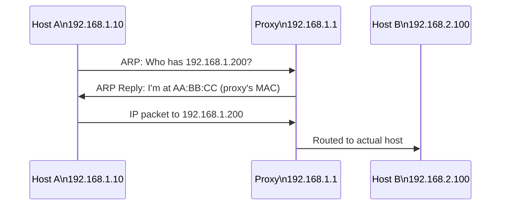

# How to Configure Proxy ARP on Linux for IPv4 Networks

Author: [nawazdhandala](https://www.github.com/nawazdhandala)

Tags: Linux, Networking, ARP, Proxy ARP, IPv4, Routing

Description: Enable proxy ARP on a Linux interface to allow the host to answer ARP requests on behalf of remote hosts, enabling non-routed subnets to communicate transparently.

## Introduction

Proxy ARP allows a Linux host or router to reply to ARP requests on behalf of hosts in another network. This is useful when devices cannot be moved to the correct subnet but still need to communicate, or in certain VPN and tunnel configurations where the server answers ARP for remote client IPs.

## How Proxy ARP Works

When Host A (`192.168.1.10`) sends an ARP request for `192.168.1.200` (which is actually across a router), the proxy ARP device intercepts the request and replies with its own MAC address. Host A then sends traffic to the proxy, which routes it onward.



## Enabling Proxy ARP on an Interface

```bash
# Enable proxy ARP on eth0
echo 1 | sudo tee /proc/sys/net/ipv4/conf/eth0/proxy_arp

# Verify
cat /proc/sys/net/ipv4/conf/eth0/proxy_arp
# Output: 1

# Enable on all interfaces
echo 1 | sudo tee /proc/sys/net/ipv4/conf/all/proxy_arp
```

## Making Proxy ARP Persistent

```bash
sudo tee /etc/sysctl.d/99-proxy-arp.conf << 'EOF'
net.ipv4.conf.eth0.proxy_arp = 1
EOF

sudo sysctl --system
```

## Proxy ARP in VPN Scenarios

OpenVPN and WireGuard servers sometimes use proxy ARP to make VPN clients appear to be on the local subnet. The VPN server answers ARP requests for client IPs, and LAN hosts route traffic through the VPN server without needing explicit routes.

```bash
# After assigning VPN client IPs in the 192.168.1.0/24 range,
# enable proxy ARP on the LAN-facing interface
echo 1 | sudo tee /proc/sys/net/ipv4/conf/eth0/proxy_arp

# Add a host route for each VPN client
sudo ip route add 192.168.1.150 dev tun0
```

## Proxy ARP with Specific Host Routes

For proxy ARP to forward traffic correctly, the proxy must have a route to the actual host:

```bash
# Add route to the real host through the tunnel
sudo ip route add 192.168.2.100 via 10.8.0.1

# Now enable proxy ARP on the LAN interface
echo 1 | sudo tee /proc/sys/net/ipv4/conf/eth0/proxy_arp
```

## Checking if Proxy ARP Is Responding

```bash
# On another host on the segment, send an ARP request
arping -I eth0 192.168.2.100

# If the proxy answers, you will see the proxy's MAC address
# Output: ARPING 192.168.2.100 from 192.168.1.10 eth0
#         Unicast reply from 192.168.2.100 [AA:BB:CC:DD:EE:FF]
```

## Disabling Proxy ARP

```bash
echo 0 | sudo tee /proc/sys/net/ipv4/conf/eth0/proxy_arp
```

## Conclusion

Proxy ARP is a powerful but niche feature. Enable it on the interface facing the subnet where you want to intercept ARP requests, ensure host routes exist for the targets, and verify with `arping` that the proxy responds with its own MAC. Always combine with IP forwarding enabled.
