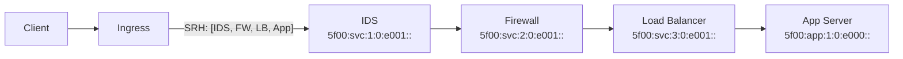

# How to Configure SRv6 for Service Chaining

Author: [nawazdhandala](https://www.github.com/nawazdhandala)

Tags: SRv6, Service Chaining, NSH, NFV, Service Function Chaining, Networking

Description: Configure SRv6-based service chaining to direct traffic through ordered sequences of network functions like firewalls, IDS, and load balancers without MPLS or NSH.

## Introduction

SRv6 service chaining encodes a sequence of network service functions in the Segment Routing Header. Instead of a separate Service Function Chaining overlay (like NSH), the segment list itself carries the service chain instructions.

## Service Chain Design



## Step 1: Assign SIDs to Service Functions

Each network function node must own a SID and configure the corresponding End.X function.

```bash
# On the IDS node (5f00:svc:1::/48 is IDS locator)
ip -6 addr add 5f00:svc:1::1/128 dev lo
ip -6 route add 5f00:svc:1:0:e001::/128 \
  encap seg6local action End.X \
  nh6 fe80::fw1 \    # After inspection, forward to FW
  dev eth0

# On the Firewall node
ip -6 addr add 5f00:svc:2::1/128 dev lo
ip -6 route add 5f00:svc:2:0:e001::/128 \
  encap seg6local action End.X \
  nh6 fe80::lb1 \    # After filtering, forward to LB
  dev eth0

# On the Load Balancer node
ip -6 addr add 5f00:svc:3::1/128 dev lo
ip -6 route add 5f00:svc:3:0:e001::/128 \
  encap seg6local action End.X \
  nh6 fe80::app1 \   # After load balancing decision, forward to App
  dev eth0

# On the Application Server (final decap)
ip -6 addr add 5f00:app:1::1/128 dev lo
ip -6 route add 5f00:app:1:0:e000::/128 \
  encap seg6local action End.DT6 \
  vrftable 100 \
  dev lo
```

## Step 2: Configure Ingress Encapsulation

```bash
# Ingress router: apply service chain to incoming traffic
# All traffic from 2001:db8:clients::/48 goes through full chain

ip -6 route add 2001:db8:app::/48 \
  encap seg6 mode encap \
  segs \
    5f00:svc:1:0:e001::,\   # IDS
    5f00:svc:2:0:e001::,\   # Firewall
    5f00:svc:3:0:e001::,\   # Load Balancer
    5f00:app:1:0:e000::     # Application delivery
  dev eth0
```

## Step 3: Policy-Based Chain Selection

Different traffic classes can use different service chains.

```bash
# Mark traffic with fwmark for policy routing
ip6tables -t mangle -A PREROUTING \
  -s 2001:db8:vip::/48 -j MARK --set-mark 10   # VIP traffic: full chain
ip6tables -t mangle -A PREROUTING \
  -s 2001:db8:regular::/48 -j MARK --set-mark 20  # Regular: FW only

# Route marked traffic into different SRv6 chains
ip -6 rule add fwmark 10 table 200
ip -6 rule add fwmark 20 table 201

# Table 200: full chain
ip -6 route add default table 200 \
  encap seg6 mode encap \
  segs 5f00:svc:1:0:e001::,5f00:svc:2:0:e001::,5f00:app:1:0:e000:: \
  dev eth0

# Table 201: firewall only
ip -6 route add default table 201 \
  encap seg6 mode encap \
  segs 5f00:svc:2:0:e001::,5f00:app:1:0:e000:: \
  dev eth0
```

## Step 4: Service Node Health Checks

Monitor each service function independently.

```bash
# Health check script for SRv6 service chain
#!/bin/bash
SERVICES=(
  "5f00:svc:1::1:IDS"
  "5f00:svc:2::1:Firewall"
  "5f00:svc:3::1:LoadBalancer"
  "5f00:app:1::1:AppServer"
)

for svc in "${SERVICES[@]}"; do
  addr="${svc%%:*}"
  name="${svc##*:}"
  if ping6 -c 2 -W 2 "$addr" > /dev/null 2>&1; then
    echo "OK: $name ($addr)"
  else
    echo "FAIL: $name ($addr) — service chain broken!"
  fi
done
```

## Step 5: Verify the Chain End-to-End

```bash
# Trace the full service chain
traceroute6 2001:db8:app::server1

# Expected hops:
# 1. 5f00:svc:1::1 (IDS)
# 2. 5f00:svc:2::1 (Firewall)
# 3. 5f00:svc:3::1 (Load Balancer)
# 4. 2001:db8:app::server1 (final delivery)

# Capture at the LB to verify correct SRH
sudo tcpdump -i eth0 -n \
  "ip6 proto 43" -vv | grep -A5 "routing:"
```

## Conclusion

SRv6 service chaining replaces NSH-based overlays with native IPv6 headers. Service functions become SRv6 waypoints identified by SIDs. The ingress node encodes the entire service chain in the SRH. Use OneUptime to create synthetic monitors that traverse each step of your service chain to detect failures at specific functions.
