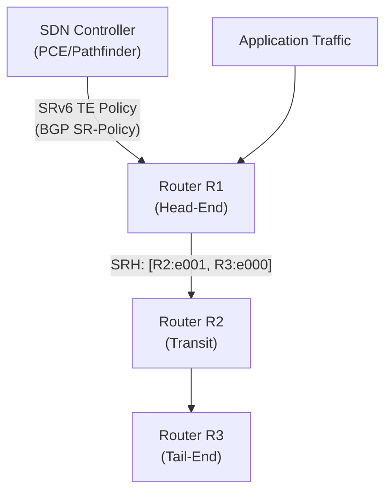

# How to Configure SRv6 Traffic Engineering

Author: [nawazdhandala](https://www.github.com/nawazdhandala)

Tags: SRv6, Traffic Engineering, TE Policy, Segment Routing, BGP, Networking

Description: Configure SRv6 Traffic Engineering policies to steer traffic along explicit paths using candidate paths, color communities, and SRTE controller integration.

## Introduction

SRv6 Traffic Engineering (SRv6-TE) allows operators to define explicit packet paths through the network. Unlike hop-by-hop routing, TE policies encode the entire path as a segment list, enabling deterministic latency, bandwidth reservation, and disjoint path protection.

## SRv6-TE Architecture



## Step 1: Configure TE Policy on Linux (iproute2)

```bash
# Static SRv6 TE: route specific traffic via explicit SID path

# Traffic destined for 10.0.100.0/24 takes explicit path

# Method 1: Match by destination prefix
ip -6 route add 5f00:3::/32 \
  encap seg6 mode encap \
  segs 5f00:1:2:0:e001::,5f00:2:3:0:e001::,5f00:3:1:0:e000:: \
  dev eth0

# Method 2: Match by source address (per-customer TE)
ip -6 rule add from 2001:db8:customer1::/48 table 200
ip -6 route add 5f00:3::/32 table 200 \
  encap seg6 mode encap \
  segs 5f00:1:2:0:e001::,5f00:3:1:0:e000:: \
  dev eth0
```

## Step 2: BGP SR-Policy (RFC 9256)

BGP distributes SRv6 TE policies from a controller or head-end to all participating routers.

```text
! BGP SR-Policy configuration (Cisco IOS-XR notation)
router bgp 65000
 address-family link-state link-state
 !
 neighbor 2001:db8::controller
  remote-as 65000
  address-family link-state link-state
   route-policy ACCEPT in
  !
 !
!

segment-routing traffic-eng
 policy POLICY-TO-DC2
  color 100 end-point ipv6 5f00:3:1::1
  candidate-paths
   preference 200
    explicit segment-list PATH-TO-DC2
    !
   !
   preference 100
    dynamic
     metric type igp
    !
   !
  !
 !
 segment-list PATH-TO-DC2
  index 10 srv6 sid 5f00:1:2:0:e001::  ! Waypoint: router in site 1
  index 20 srv6 sid 5f00:2:3:0:e001::  ! Waypoint: router in site 2
  index 30 srv6 sid 5f00:3:1:0:e000::  ! Destination
 !
!
```

## Step 3: Color-Based Steering

Traffic is steered into TE policies by BGP Color communities.

```text
! Route policy to set color community
route-policy SET-COLOR-100
  set extcommunity color 100
end-policy

! Apply to BGP next-hop resolution
router bgp 65000
 address-family vpnv6 unicast
  nexthop resolution prefix-length minimum 32
  route-policy SET-COLOR-100 out
```

When BGP routes have color 100 and the endpoint is a known TE policy endpoint, traffic is automatically steered into the matching TE policy.

## Step 4: ECMP and Weighted Candidate Paths

```text
! Multiple candidate paths for load balancing
segment-routing traffic-eng
 policy LB-POLICY
  color 200 end-point ipv6 5f00:4:1::1
  candidate-paths
   preference 100
    explicit segment-list PATH-1   ! Primary path
    !
   preference 100                  ! Same preference = ECMP
    explicit segment-list PATH-2   ! Secondary path
    !
   preference 50                   ! Lower preference = backup
    dynamic                         ! IGP-computed fallback
   !
  !
 !
!
```

## Step 5: Monitoring TE Policies

```bash
# Cisco IOS-XR
show segment-routing traffic-eng policy
show segment-routing traffic-eng policy detail
show segment-routing traffic-eng forwarding policy

# Expected output:
# Policy: POLICY-TO-DC2
# Color: 100, End-point: 5f00:3:1::1
# Status: Up
# Candidate-paths:
#   Preference 200 (Active):
#     SID List: 5f00:1:2:0:e001:: → 5f00:2:3:0:e001:: → 5f00:3:1:0:e000::
#     Packets: 1234567, Bytes: 987654321

# Linux: check TE policy routes
ip -6 route show | grep "encap seg6"

# Verify traffic is following the policy
traceroute6 5f00:3:1::1
# Should show hops corresponding to segment list
```

## Conclusion

SRv6 Traffic Engineering gives operators precise control over packet paths. Explicit segment lists eliminate dependency on shortest-path routing for TE use cases. BGP SR-Policy enables centralized, controller-driven TE at scale. Use OneUptime to monitor TE policy endpoint reachability and latency to validate that policies are achieving their design objectives.
