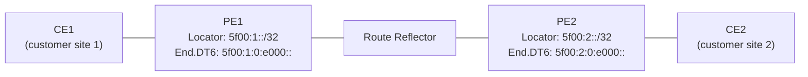

# How to Configure SRv6 with BGP

Author: [nawazdhandala](https://www.github.com/nawazdhandala)

Tags: SRv6, BGP, BGP-LU, BGP VPN, RFC 9252, Networking

Description: Configure BGP to distribute SRv6 SIDs for L3VPN services using BGP with SRv6 extensions, including VPNv4/VPNv6 over SRv6 transport.

## Introduction

BGP carries SRv6 SIDs as next-hop attributes, enabling L3VPN, EVPN, and global routing services over SRv6. RFC 9252 defines BGP SR-based services, and RFC 9256 defines BGP SR Policy for TE.

## BGP SRv6 Architecture



## Step 1: Configure BGP with SRv6 in FRRouting

FRRouting (FRR) supports SRv6 BGP from version 8.0+.

```
! frr.conf — PE router with SRv6 BGP

! Configure SRv6 globally
segment-routing
  srv6
    locators
      locator MAIN
        prefix 5f00:1:1::/48
      !
    !
  !
!

! Configure BGP with SRv6 for L3VPN
router bgp 65000
  bgp router-id 10.0.0.1
  no bgp ebgp-requires-policy
  !
  neighbor 5f00:rr::1 remote-as 65000
  neighbor 5f00:rr::1 update-source lo
  !
  address-family ipv6 vpn
    neighbor 5f00:rr::1 activate
    neighbor 5f00:rr::1 send-community extended
  !
  !
  vrf CUSTOMER_A
    bgp router-id 10.1.0.1
    !
    address-family ipv6 unicast
      redistribute connected
      ! Advertise with SRv6 SID
      sid vpn export 5f00:1:1:0:e000:: locator MAIN
      export vpn
      import vpn
    !
  !
!
```

## Step 2: Verify BGP SRv6 Advertisements

```bash
# Check BGP VPNv6 routes with SRv6 SIDs (FRR)
vtysh -c "show bgp vrf CUSTOMER_A ipv6 unicast detail"

# Expected: each route has an SRv6 SID in the extended community
# Route Distinguisher: 65000:100
# BGP routing table entry for 2001:db8:customer::/48
#   Nexthop: 5f00:1:1::1
#   SRv6 SID: 5f00:1:1:0:e000:: (End.DT6)

# Show all BGP SRv6 SIDs
vtysh -c "show bgp l2vpn evpn detail" | grep "SRv6"

# Show SRv6 locator
vtysh -c "show segment-routing srv6 locator detail"
```

## Step 3: BGP SR Policy (RFC 9256)

Distribute SRv6 TE policies via BGP from a controller.

```
! frr.conf — BGP SR-Policy configuration
router bgp 65000
  bgp router-id 10.0.0.1
  !
  neighbor 5f00:controller::1 remote-as 65000
  !
  address-family ipv6 sr-te-policy
    neighbor 5f00:controller::1 activate
  !
!
```

## Step 4: Import SRv6 Routes from BGP

On the remote PE receiving SRv6 VPN routes:

```
! Remote PE: receive VPN routes and install with SRv6 next-hop
router bgp 65000
  !
  vrf CUSTOMER_A
    !
    address-family ipv6 unicast
      import vpn
      ! FRR automatically installs received routes with SRv6 SID as encap
    !
  !
!
```

```bash
# Verify imported VPN routes on remote PE
vtysh -c "show ipv6 route vrf CUSTOMER_A"

# Each imported route should have an SRv6 encap next-hop
# K>* 2001:db8:customer::/48
#       via 5f00:1:1:0:e000::, encap SRv6
#       (from BGP VPNv6)
```

## Step 5: BGP EVPN with SRv6

```
! BGP EVPN with SRv6 for data center L2/L3 services
router bgp 65000
  !
  address-family l2vpn evpn
    neighbor 5f00:spine::1 activate
    advertise-all-vni
    !
  !
  !
  vni 100
    rd 65000:100
    route-target import 65000:100
    route-target export 65000:100
    segment-routing srv6 locator MAIN
  !
!
```

## Checking BGP SRv6 on Cisco IOS-XR

```
! Cisco IOS-XR equivalent
router bgp 65000
 address-family vpnv6 unicast
  allocate-label all
  !
 !
 vrf CUSTOMER_A
  rd 65000:100
  address-family ipv6 unicast
   segment-routing srv6
    locator MyLocator
    alloc mode per-vrf
   !
  !
 !
!
```

## Conclusion

BGP distributes SRv6 SIDs as service labels for L3VPN, EVPN, and TE policies. FRRouting provides a complete open-source SRv6+BGP stack for lab and production use. Monitor BGP session state and SRv6 SID advertisement counts with OneUptime to detect control plane issues before they impact data plane forwarding.
