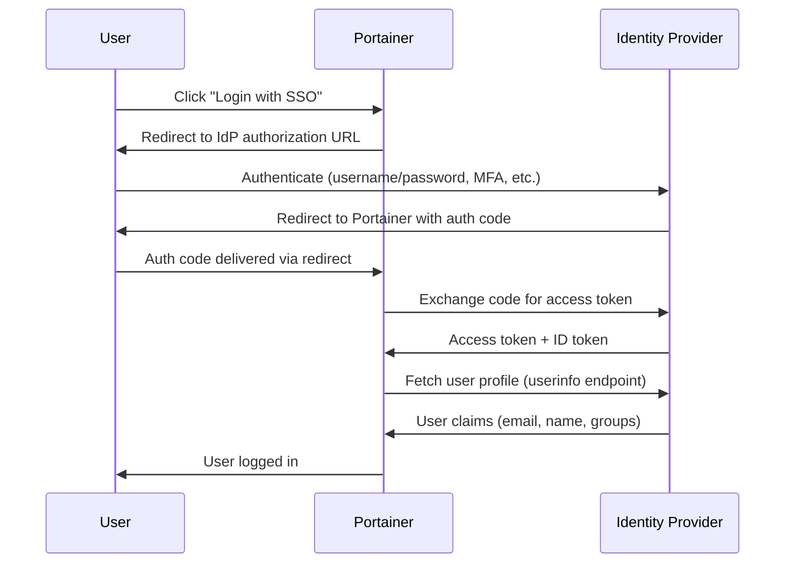

# How to Configure SSO (Single Sign-On) in Portainer

Author: [nawazdhandala](https://www.github.com/nawazdhandala)

Tags: Portainer, SSO, OAuth, SAML, Authentication

Description: A comprehensive overview of configuring Single Sign-On in Portainer using OAuth/OIDC to centralize authentication across your organization.

---

Single Sign-On (SSO) allows users to authenticate once with your organization's identity provider and access Portainer without a separate login. Portainer implements SSO via OAuth 2.0 and OpenID Connect (OIDC).

## SSO Architecture



## Supported SSO Providers

Portainer BE supports any OAuth 2.0 / OIDC provider including:
- Microsoft Azure AD / Entra ID
- Google Workspace
- Okta
- Auth0
- Keycloak
- GitHub
- GitLab
- Authelia
- Authentik
- Custom OIDC providers

## Configure SSO via the UI

1. Log in as an administrator
2. Navigate to **Settings > Authentication**
3. Select **OAuth** from the authentication method options
4. Choose your provider or select **Custom** for manual configuration
5. Enter your provider's OAuth endpoints and credentials
6. Set the **User Identifier** field
7. Configure **Automatic user provisioning** if desired
8. Click **Save settings**

## Configure SSO via API

```bash
TOKEN=$(curl -s -X POST \
  https://localhost:9443/api/auth \
  -H "Content-Type: application/json" \
  -d '{"username":"admin","password":"yourpassword"}' \
  --insecure | python3 -c "import sys,json; print(json.load(sys.stdin)['jwt'])")

# Generic OIDC SSO configuration

curl -X PUT \
  https://localhost:9443/api/settings \
  -H "Authorization: Bearer $TOKEN" \
  -H "Content-Type: application/json" \
  -d '{
    "AuthenticationMethod": 3,
    "OAuthSettings": {
      "ClientID": "portainer",
      "ClientSecret": "your-client-secret",
      "AuthorizationURI": "https://idp.example.com/auth",
      "AccessTokenURI": "https://idp.example.com/token",
      "ResourceURI": "https://idp.example.com/userinfo",
      "RedirectURI": "https://portainer.example.com/",
      "UserIdentifier": "email",
      "Scopes": "openid profile email",
      "OAuthAutoCreateUsers": true,
      "DefaultTeamID": 0,
      "HideInternalAuth": false
    }
  }' \
  --insecure
```

## SSO Best Practices

### 1. Keep Internal Auth as Fallback

Always keep at least one local admin account active in case SSO fails:

```bash
# Do NOT set HideInternalAuth to true until SSO is verified working
# Keep admin@portainer account as emergency fallback
"HideInternalAuth": false   # Keep internal login visible
```

### 2. Set Default Team for New Users

Assign new SSO users to a default team with limited permissions:

```bash
# Get the team ID for your default team
TEAMS=$(curl -s https://localhost:9443/api/teams \
  -H "Authorization: Bearer $TOKEN" --insecure)
DEFAULT_TEAM_ID=$(echo $TEAMS | python3 -c "
import sys, json
teams = json.load(sys.stdin)
default = [t for t in teams if t['Name'] == 'new-users']
print(default[0]['Id'] if default else 0)
")

# Set the default team
# Update OAuthSettings.DefaultTeamID = $DEFAULT_TEAM_ID
```

### 3. Configure Token Expiry

Portainer inherits session expiry from the OAuth token validity. Configure your IdP to set appropriate token lifetimes.

---

*Secure and monitor your SSO-integrated Portainer with [OneUptime](https://oneuptime.com).*
