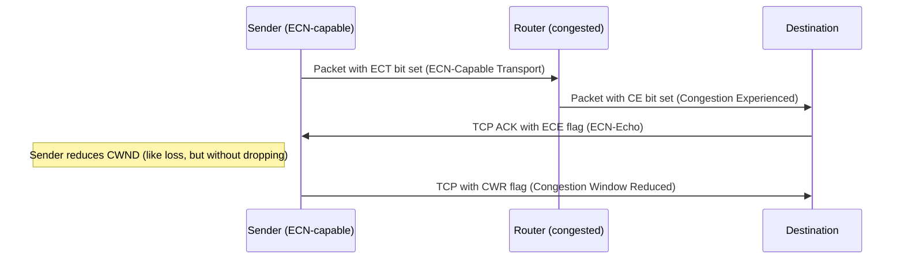

# How to Configure TCP ECN (Explicit Congestion Notification) on Linux

Author: [nawazdhandala](https://www.github.com/nawazdhandala)

Tags: TCP, ECN, Linux, Congestion Control, Networking, Performance

Description: Configure TCP Explicit Congestion Notification (ECN) to allow network devices to signal congestion to TCP endpoints without dropping packets, reducing retransmissions.

## Introduction

Explicit Congestion Notification (ECN) allows a network router to signal congestion to TCP endpoints by setting a bit in the IP header instead of dropping packets. The receiver reflects this signal back to the sender via the TCP header. The sender can then reduce its CWND proactively, avoiding packet loss while still responding to congestion.

## How ECN Works



## Enabling ECN on Linux

```bash
# View current ECN setting

sysctl net.ipv4.tcp_ecn

# Values:
# 0 = ECN disabled
# 1 = ECN enabled, request ECN on all outbound connections
# 2 = ECN enabled, but only accept when requested by remote (more compatible)

# Enable ECN with backwards compatibility
sysctl -w net.ipv4.tcp_ecn=1

# Make permanent
echo "net.ipv4.tcp_ecn=1" >> /etc/sysctl.conf
sysctl -p
```

## Verifying ECN Negotiation in Handshake

```bash
# Capture a TCP handshake and check for ECN flags
tcpdump -i eth0 -n -v 'tcp[tcpflags] & tcp-syn != 0' -c 5 2>/dev/null

# Look for ECN flags in the SYN packet:
# Flags [S] seq ..., urg 0, ECE
# Flags [S.] ack ..., ECE CWR   ← both ECE and CWR in SYN-ACK = ECN negotiated

# ECN negotiation uses TCP control bits in SYN:
# ECN-capable: SYN with ECE+CWR bits set
# ECN-accepted: SYN-ACK with ECE bit set
```

## Monitoring ECN Activity

```bash
# Check ECN congestion signal statistics
nstat -a | grep -i "CE\|ECN"

# Key counters:
# TcpExtTCPSACKReneging: SACK blocks discarded by ECN
# TcpExtTCPECN*: various ECN activity counters

# Detailed ECN stats
cat /proc/net/snmp | awk '/^TcpExt:/{getline; print}' | tr ' ' '\n' | \
  grep -i "ecn\|ce" | paste - -

# Or with nstat
nstat -z | grep TcpExt | grep -i "Ecn\|CE"
```

## ECN and iptables

```bash
# Mark packets as ECN-capable (if not already)
iptables -t mangle -A POSTROUTING -p tcp \
  -m ecn --ecn-tcp-ece \
  -j LOG --log-prefix "ECN: "

# You can also set ECN bits in iptables
iptables -t mangle -A POSTROUTING -p tcp \
  -j ECN --ecn-tcp-remove   # Remove ECN bits (for compatibility)
```

## ECN Compatibility Concerns

```bash
# Some older middleboxes break ECN by stripping ECN bits or mishandling CE marks
# Test ECN compatibility with a remote host

# Method 1: Check if connection falls back from ECN
tcpdump -i eth0 -n -v 'tcp[tcpflags] & tcp-syn != 0' | grep ECE

# Method 2: Test with and without ECN
sysctl -w net.ipv4.tcp_ecn=0
time curl -o /dev/null http://remote-server/10mb.bin

sysctl -w net.ipv4.tcp_ecn=1
time curl -o /dev/null http://remote-server/10mb.bin
# If ECN version is slower: middlebox breaking ECN, use mode 2

# ECN mode 2 (accept if offered, don't request): safer for general use
sysctl -w net.ipv4.tcp_ecn=2
```

## Conclusion

ECN reduces packet loss by signaling congestion before the queue overflows. For networks that support it end-to-end (modern data center or cloud), ECN mode 1 enables proactive congestion response. For internet-facing services where some paths have ECN-hostile middleboxes, mode 2 provides compatibility. Monitor with nstat to verify ECN signals are being received and acted upon.
