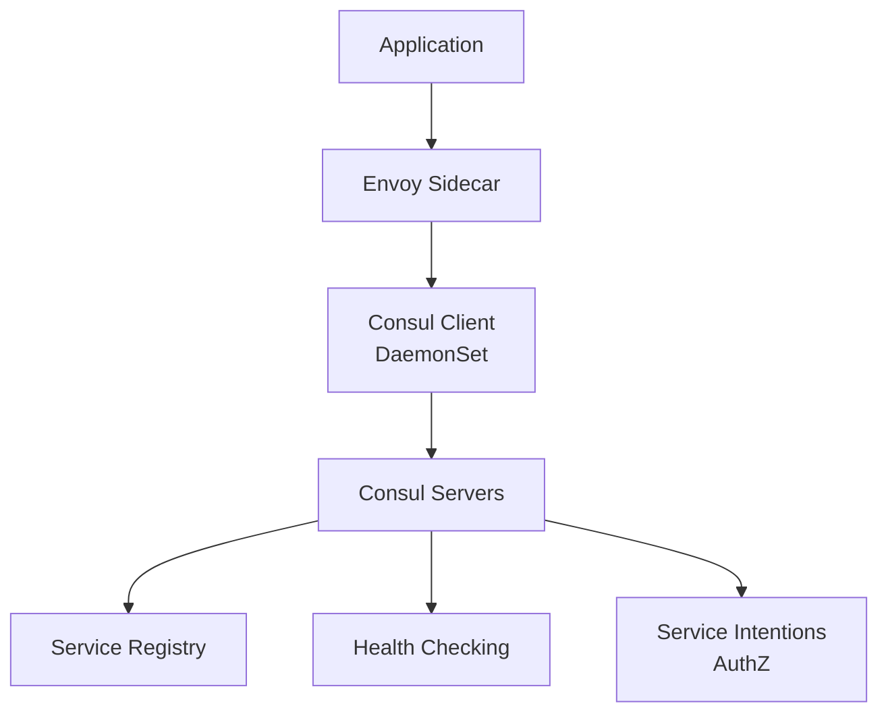

# How to Deploy Consul Connect with OpenTofu

Author: [nawazdhandala](https://www.github.com/nawazdhandala)

Tags: OpenTofu, Consul, Consul Connect, Service Mesh, Kubernetes, Helm, Infrastructure as Code

Description: Learn how to deploy HashiCorp Consul Connect service mesh on Kubernetes using OpenTofu with service intentions, transparent proxy, and multi-datacenter federation.

---

Consul Connect is HashiCorp's service mesh that provides service discovery, health checking, mTLS, and authorization between services. It works on both Kubernetes and VMs, making it suitable for hybrid environments. OpenTofu deploys Consul using the official Helm chart.

## Consul Architecture



## Consul Helm Deployment

```hcl
# consul.tf

resource "helm_release" "consul" {
  name             = "consul"
  repository       = "https://helm.releases.hashicorp.com"
  chart            = "consul"
  version          = "1.3.2"
  namespace        = "consul"
  create_namespace = true

  values = [
    yamlencode({
      global = {
        name       = "consul"
        datacenter = "${var.environment}-dc1"
        tls = {
          enabled         = true
          httpsOnly       = true
          enableAutoEncrypt = true
        }

        acls = {
          manageSystemACLs = true
        }

        gossipEncryption = {
          autoGenerate = true
        }
      }

      server = {
        replicas    = var.environment == "production" ? 3 : 1
        storageClass = "gp3"
        storage     = "10Gi"

        resources = {
          requests = { cpu = "100m", memory = "128Mi" }
          limits   = { cpu = "500m", memory = "512Mi" }
        }
      }

      client = {
        enabled = true
        grpc    = true
      }

      connectInject = {
        enabled = true
        default = false  # Opt-in per namespace

        transparentProxy = {
          defaultEnabled = true
        }
      }

      ui = {
        enabled = true
        service = {
          type = "ClusterIP"
        }
        ingress = {
          enabled = true
          hosts = [{ host = "consul.${var.domain}", paths = ["/"] }]
          tls   = [{ secretName = "consul-ui-tls", hosts = ["consul.${var.domain}"] }]
        }
      }
    })
  ]
}
```

## Enable Service Injection

```hcl
resource "kubernetes_namespace" "apps" {
  metadata {
    name = "apps"
    labels = {
      "consul.hashicorp.com/connect-inject" = "true"
    }
  }
}
```

## Service Intentions (Authorization)

```hcl
# intentions.tf - define which services can talk to each other
resource "kubernetes_manifest" "allow_api_to_db" {
  manifest = {
    apiVersion = "consul.hashicorp.com/v1alpha1"
    kind       = "ServiceIntentions"
    metadata = {
      name      = "database"
      namespace = "apps"
    }
    spec = {
      destination = { name = "database" }
      sources = [
        {
          name   = "api-service"
          action = "allow"
        }
      ]
    }
  }
  depends_on = [helm_release.consul]
}

# Deny all traffic by default (zero-trust)
resource "kubernetes_manifest" "deny_default" {
  manifest = {
    apiVersion = "consul.hashicorp.com/v1alpha1"
    kind       = "ServiceIntentions"
    metadata = {
      name      = "deny-all"
      namespace = "apps"
    }
    spec = {
      destination = { name = "*" }
      sources = [
        {
          name   = "*"
          action = "deny"
        }
      ]
    }
  }
}
```

## Service Defaults

```hcl
resource "kubernetes_manifest" "api_service_defaults" {
  manifest = {
    apiVersion = "consul.hashicorp.com/v1alpha1"
    kind       = "ServiceDefaults"
    metadata = {
      name      = "api-service"
      namespace = "apps"
    }
    spec = {
      protocol = "http"
    }
  }
}
```

## Best Practices

- Enable ACLs (`manageSystemACLs = true`) from the start - retrofitting ACLs on an existing Consul cluster is complex.
- Use Service Intentions with a default-deny posture - define explicit `allow` intentions rather than relying on default-allow.
- Enable transparent proxy (`defaultEnabled = true`) so services communicate through Consul Connect automatically without application code changes.
- Deploy an odd number of Consul servers (3 or 5) to maintain Raft quorum if a server fails.
- Use gossip encryption and TLS from day one - rotating these credentials after initial deployment requires cluster downtime.
