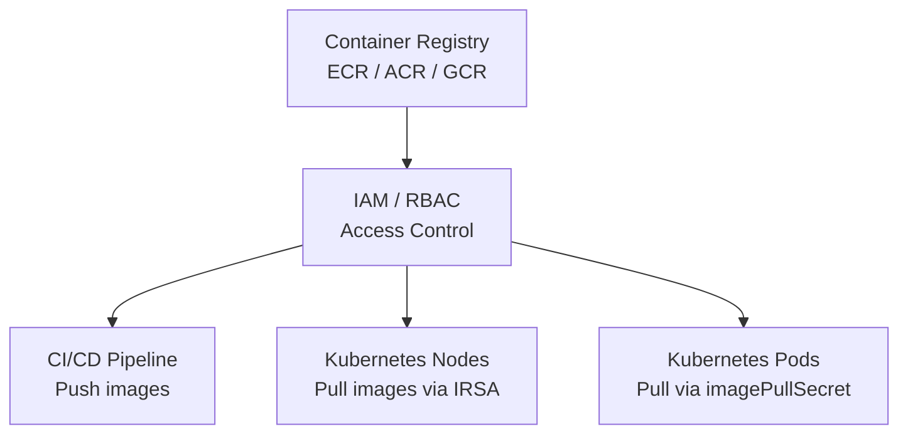

# How to Configure Container Registry Authentication with OpenTofu

Author: [nawazdhandala](https://www.github.com/nawazdhandala)

Tags: OpenTofu, Container Registry, ECR, ACR, GCR, Artifact Registry, Docker, Kubernetes, Infrastructure as Code

Description: Learn how to configure container registry authentication for AWS ECR, Azure Container Registry, and GCP Artifact Registry using OpenTofu, including Kubernetes imagePullSecrets and cross-account access.

---

Container registry authentication connects Kubernetes clusters, CI/CD pipelines, and applications to container registries securely. OpenTofu manages the registries, IAM policies for push/pull access, and Kubernetes image pull secrets for private registry authentication.

## Registry Authentication Architecture



## AWS ECR Configuration

```hcl
# ecr.tf
resource "aws_ecr_repository" "app" {
  name                 = "${var.prefix}/${var.app_name}"
  image_tag_mutability = "IMMUTABLE"  # Prevent tag overwriting

  image_scanning_configuration {
    scan_on_push = true  # Scan for vulnerabilities on every push
  }

  encryption_configuration {
    encryption_type = "AES256"
  }

  tags = {
    Environment = var.environment
    ManagedBy   = "opentofu"
  }
}

# Lifecycle policy — keep last 10 production images, clean up PRs after 7 days
resource "aws_ecr_lifecycle_policy" "app" {
  repository = aws_ecr_repository.app.name

  policy = jsonencode({
    rules = [
      {
        rulePriority = 1
        description  = "Keep last 10 tagged production images"
        selection = {
          tagStatus      = "tagged"
          tagPrefixList  = ["v"]
          countType      = "imageCountMoreThan"
          countNumber    = 10
        }
        action = { type = "expire" }
      },
      {
        rulePriority = 2
        description  = "Expire untagged images after 7 days"
        selection = {
          tagStatus   = "untagged"
          countType   = "sinceImagePushed"
          countUnit   = "days"
          countNumber = 7
        }
        action = { type = "expire" }
      }
    ]
  })
}
```

## ECR Cross-Account Access

```hcl
# ecr_policy.tf — allow EKS nodes from another account to pull images

resource "aws_ecr_repository_policy" "cross_account" {
  repository = aws_ecr_repository.app.name

  policy = jsonencode({
    Version = "2012-10-17"
    Statement = [
      {
        Sid    = "AllowCrossAccountPull"
        Effect = "Allow"
        Principal = {
          AWS = [
            "arn:aws:iam::${var.eks_account_id}:root",
          ]
        }
        Action = [
          "ecr:GetDownloadUrlForLayer",
          "ecr:BatchGetImage",
          "ecr:BatchCheckLayerAvailability",
        ]
      }
    ]
  })
}
```

## Azure Container Registry

```hcl
# acr.tf
resource "azurerm_container_registry" "main" {
  name                = "${replace(var.prefix, "-", "")}acr"
  resource_group_name = azurerm_resource_group.main.name
  location            = azurerm_resource_group.main.location
  sku                 = "Premium"  # Premium for geo-replication and private endpoints
  admin_enabled       = false      # Use managed identity, not admin credentials

  network_rule_set {
    default_action = "Deny"
    ip_rule {
      action   = "Allow"
      ip_range = var.allowed_cidr_range
    }
  }

  tags = {
    Environment = var.environment
    ManagedBy   = "opentofu"
  }
}

# Grant AKS kubelet identity pull access
resource "azurerm_role_assignment" "aks_acr_pull" {
  principal_id                     = azurerm_kubernetes_cluster.main.kubelet_identity[0].object_id
  role_definition_name             = "AcrPull"
  scope                            = azurerm_container_registry.main.id
  skip_service_principal_aad_check = true
}

# Grant CI/CD service principal push access
resource "azurerm_role_assignment" "cicd_acr_push" {
  principal_id         = var.cicd_service_principal_id
  role_definition_name = "AcrPush"
  scope                = azurerm_container_registry.main.id
}
```

## GCP Artifact Registry

```hcl
# artifact_registry.tf
resource "google_artifact_registry_repository" "main" {
  repository_id = "${var.prefix}-registry"
  location      = var.region
  format        = "DOCKER"
  project       = var.project_id

  cleanup_policies {
    id     = "keep-tagged-releases"
    action = "KEEP"
    condition {
      tag_prefixes = ["v"]
    }
  }

  cleanup_policies {
    id     = "delete-old-untagged"
    action = "DELETE"
    condition {
      older_than   = "604800s"  # 7 days
      tag_state    = "UNTAGGED"
    }
  }
}

# Grant GKE nodes read access via Workload Identity
resource "google_artifact_registry_repository_iam_member" "gke_pull" {
  repository = google_artifact_registry_repository.main.name
  location   = google_artifact_registry_repository.main.location
  project    = var.project_id
  role       = "roles/artifactregistry.reader"
  member     = "serviceAccount:${var.gke_sa_email}"
}

# Grant CI/CD write access
resource "google_artifact_registry_repository_iam_member" "cicd_push" {
  repository = google_artifact_registry_repository.main.name
  location   = google_artifact_registry_repository.main.location
  project    = var.project_id
  role       = "roles/artifactregistry.writer"
  member     = "serviceAccount:${var.cicd_sa_email}"
}
```

## Kubernetes imagePullSecret

```hcl
# imagepullsecret.tf — for registries requiring explicit credentials
resource "kubernetes_secret" "registry_credentials" {
  metadata {
    name      = "registry-credentials"
    namespace = var.namespace
  }

  type = "kubernetes.io/dockerconfigjson"

  data = {
    ".dockerconfigjson" = jsonencode({
      auths = {
        "${var.registry_url}" = {
          auth = base64encode("${var.registry_username}:${var.registry_password}")
        }
      }
    })
  }
}
```

## Best Practices

- Use IRSA (EKS), Workload Identity (GKE), or managed identity (AKS) for node-level registry authentication — this eliminates the need for imagePullSecrets in most Kubernetes deployments and reduces credential management overhead.
- Set `image_tag_mutability = "IMMUTABLE"` on ECR repositories — immutable tags prevent overwriting production images and ensure deployments always use exactly the image that was tested.
- Enable `scan_on_push = true` on ECR repositories and configure CloudWatch alarms on CRITICAL and HIGH findings — automated scanning catches vulnerabilities before images are deployed.
- Use lifecycle policies to clean up old images — unmanaged registries accumulate thousands of images over time, incurring unnecessary storage costs.
- Never use registry admin credentials in Kubernetes imagePullSecrets — use read-only service accounts or managed identities instead. Admin credentials grant push access, which isn't needed for pod scheduling.
