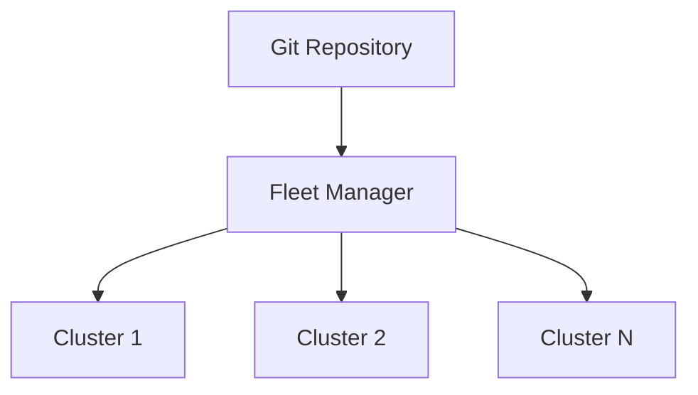

# How to Set Up Continuous Delivery with Rancher Fleet

Author: [nawazdhandala](https://www.github.com/nawazdhandala)

Tags: Rancher Fleet, GitOps, Continuous Delivery, Kubernetes, Multi-Cluster, Helm, Kustomize

Description: Learn how to set up GitOps-based continuous delivery using Rancher Fleet to automatically sync Kubernetes manifests from Git repositories to single or multiple clusters.

---

Rancher Fleet is a built-in GitOps engine in Rancher. It watches Git repositories and continuously reconciles the desired state defined in Git with the actual state of your clusters — across one or thousands of clusters.

---

## How Fleet Works



Fleet bundles your manifests (plain YAML, Helm charts, or Kustomize overlays) and delivers them to target clusters based on label selectors.

---

## Step 1: Access Fleet in Rancher

Fleet is built into Rancher. Navigate to **Rancher UI > Continuous Delivery** in the left sidebar.

---

## Step 2: Add a Git Repository

Create a `GitRepo` resource that points Fleet to your application repository:

```yaml
# gitrepo-my-app.yaml
apiVersion: fleet.cattle.io/v1alpha1
kind: GitRepo
metadata:
  name: my-app
  namespace: fleet-default   # use fleet-local for the local cluster
spec:
  # The Git repository URL to watch
  repo: https://github.com/my-org/my-app.git
  branch: main

  # Only process changes under the k8s/ directory
  paths:
    - k8s/

  # Target clusters with the label env=production
  targets:
    - name: production
      clusterSelector:
        matchLabels:
          env: production
```

```bash
kubectl apply -f gitrepo-my-app.yaml
```

---

## Step 3: Structure Your Repository

Fleet expects a specific layout for Helm and Kustomize bundles:

```
k8s/
  fleet.yaml          # Bundle configuration
  deployment.yaml     # Raw Kubernetes manifests
  service.yaml
  overlays/
    production/
      kustomization.yaml
```

A minimal `fleet.yaml` for a Helm chart:

```yaml
# k8s/fleet.yaml
defaultNamespace: my-app

helm:
  chart: ./chart         # relative path to a local chart
  releaseName: my-app
  valuesFiles:
    - values.yaml
```

---

## Step 4: Target Clusters by Label

Label your clusters in Rancher to control which clusters receive which bundles:

```bash
# Label the production cluster
kubectl label cluster.fleet.cattle.io/production \
  env=production \
  region=us-east \
  -n fleet-default
```

Update the `GitRepo` targets to match:

```yaml
targets:
  - name: production-us
    clusterSelector:
      matchLabels:
        env: production
        region: us-east
    helm:
      values:
        replicaCount: 5
```

---

## Step 5: Monitor Fleet Bundle Status

```bash
# Check the GitRepo sync status
kubectl get gitrepo my-app -n fleet-default

# Check bundle deployment status across all clusters
kubectl get bundle -n fleet-default

# Describe a bundle for detailed sync errors
kubectl describe bundle my-app-k8s -n fleet-default
```

In the Rancher UI, **Continuous Delivery > Git Repos** shows a visual status for each bundle and cluster.

---

## Step 6: Private Repositories

For private GitHub repos, create a secret with credentials and reference it in the `GitRepo`:

```bash
kubectl create secret generic github-creds \
  --namespace fleet-default \
  --from-literal=username=git \
  --from-literal=password=<github-pat>
```

```yaml
# In the GitRepo spec:
clientSecretName: github-creds
```

---

## Best Practices

- Use **fleet-local** namespace for managing the Rancher management cluster itself.
- Structure repositories as a **monorepo per team** with paths mapping to environments.
- Enable **drift correction** so Fleet auto-reverts manual changes to cluster state.
- Combine Fleet with Rancher's **Project monitoring** to alert on bundle sync failures.
