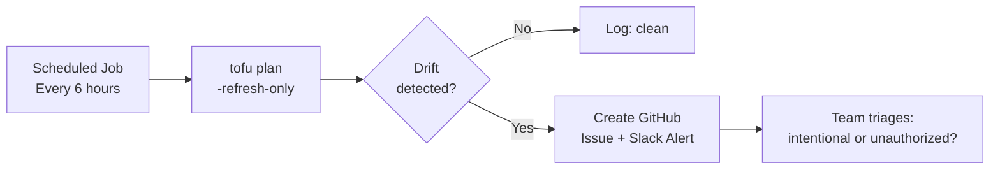

# How to Set Up Continuous Drift Monitoring with OpenTofu

Author: [nawazdhandala](https://www.github.com/nawazdhandala)

Tags: OpenTofu, Drift Monitoring, CI/CD, Automation, Infrastructure as Code, DevOps

Description: Learn how to build a continuous drift monitoring system using scheduled OpenTofu plans, alerting, and automated reporting to catch infrastructure changes before they cause incidents.

## Introduction

A single drift check is useful; continuous drift monitoring is transformative. By running `tofu plan -refresh-only` on a schedule across all environments, you catch unauthorized changes within hours rather than discovering them during an incident.

## Architecture



## GitHub Actions: Drift Detection Schedule

```yaml
# .github/workflows/drift-monitor.yml

name: Continuous Drift Monitoring

on:
  schedule:
    - cron: "0 */6 * * *"   # Every 6 hours
  workflow_dispatch:          # Allow manual trigger

jobs:
  drift-check:
    runs-on: ubuntu-latest
    strategy:
      fail-fast: false   # Check all environments even if one has drift
      matrix:
        include:
          - environment: dev
            role_arn_var: AWS_DEV_ROLE_ARN
          - environment: staging
            role_arn_var: AWS_STAGING_ROLE_ARN
          - environment: prod
            role_arn_var: AWS_PROD_ROLE_ARN

    defaults:
      run:
        working-directory: environments/${{ matrix.environment }}

    steps:
      - uses: actions/checkout@v4
      - uses: opentofu/setup-opentofu@v1
      - uses: actions/cache@v4
        with:
          path: ~/.terraform.d/plugin-cache
          key: tofu-${{ hashFiles('**/.terraform.lock.hcl') }}
      - uses: aws-actions/configure-aws-credentials@v4
        with:
          role-to-assume: ${{ vars[matrix.role_arn_var] }}
          aws-region: us-east-1

      - name: Init
        run: tofu init -lockfile=readonly

      - name: Check for Drift
        id: drift_check
        run: |
          set +e
          tofu plan -refresh-only -detailed-exitcode -no-color 2>&1 | tee drift-output.txt
          echo "exit_code=$?" >> $GITHUB_OUTPUT
          echo "drift_summary=$(tail -5 drift-output.txt | tr '\n' ' ')" >> $GITHUB_OUTPUT

      - name: Create Drift Alert
        if: steps.drift_check.outputs.exit_code == '2'
        uses: actions/github-script@v7
        with:
          script: |
            const output = require('fs').readFileSync('environments/${{ matrix.environment }}/drift-output.txt', 'utf8');
            const truncated = output.length > 3000 ? output.slice(0, 3000) + '\n...(truncated)' : output;

            await github.rest.issues.create({
              owner: context.repo.owner,
              repo: context.repo.repo,
              title: `[DRIFT] Infrastructure drift in ${{ matrix.environment }} - ${new Date().toISOString().split('T')[0]}`,
              body: `Drift detected in \`${{ matrix.environment }}\` environment at ${new Date().toISOString()}\n\n```\n${truncated}\n```\n\nTo investigate:\n1. Run \`tofu plan -refresh-only\` in \`environments/${{ matrix.environment }}/\`\n2. Determine if the change is intentional\n3. Either accept with \`tofu apply -refresh-only\` or revert with \`tofu apply\``,
              labels: ['infrastructure-drift', '${{ matrix.environment }}']
            });

      - name: Upload Drift Report
        if: always()
        uses: actions/upload-artifact@v4
        with:
          name: drift-${{ matrix.environment }}-${{ github.run_id }}
          path: environments/${{ matrix.environment }}/drift-output.txt
          retention-days: 30
```

## Drift Dashboard (Aggregated Reporting)

```bash
#!/bin/bash
# drift-report.sh - summary report across all environments
echo "=== Infrastructure Drift Report $(date) ==="

for env in dev staging prod; do
  cd "environments/$env"
  tofu init -lockfile=readonly > /dev/null 2>&1

  if tofu plan -refresh-only -detailed-exitcode -no-color > /tmp/drift.txt 2>&1; then
    echo "[$env] CLEAN - no drift"
  else
    CHANGES=$(grep "changes" /tmp/drift.txt | tail -1)
    echo "[$env] DRIFT DETECTED - $CHANGES"
  fi
  cd -
done
```

## Conclusion

Continuous drift monitoring turns a reactive process (discovering drift during incidents) into a proactive one (catching drift within hours of the change). Schedule drift checks every 4-8 hours, alert on detection, and track alerts with GitHub issues. Most drift is benign (autoscaling, tagging automation) but detecting it consistently reveals the rare unauthorized change before it causes an incident.
