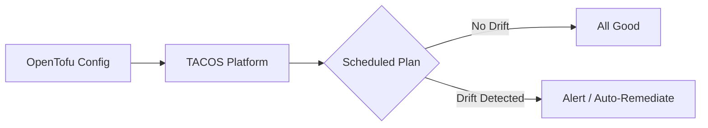

# How to Use Continuous Validation with TACOS in OpenTofu

Author: [nawazdhandala](https://www.github.com/nawazdhandala)

Tags: OpenTofu, TACOS, Continuous Validation, Infrastructure as Code, Terraform, Automation

Description: Learn how to integrate OpenTofu with TACOS (Terraform Automation and Collaboration Software) platforms to enable continuous validation and drift detection for your infrastructure.

## Introduction

Continuous validation is a practice where your infrastructure configuration is periodically checked against the real-world state of your cloud resources. TACOS platforms-such as Spacelift, Scalr, env0, and Terrateam-provide built-in mechanisms to run these checks automatically, alerting teams when drift is detected.

OpenTofu, as an open-source Terraform-compatible tool, integrates naturally with most TACOS platforms through standard workflows.

## What Is Continuous Validation?

In traditional IaC workflows, drift goes undetected until the next `plan` or `apply` run. Continuous validation schedules regular drift checks so that any out-of-band changes (manual console edits, automated scripts, etc.) are caught early.



## Setting Up Continuous Validation with Spacelift

Spacelift is one of the most popular TACOS platforms with native OpenTofu support. The following shows a minimal stack configuration using Spacelift's Terraform provider.

First, configure the Spacelift provider:

```hcl
# providers.tf

terraform {
  required_providers {
    spacelift = {
      source  = "spacelift-io/spacelift"
      version = "~> 1.0"
    }
  }
}

provider "spacelift" {
  # API key is read from SPACELIFT_API_KEY_ID and
  # SPACELIFT_API_KEY_SECRET environment variables
}
```

Now create a stack with continuous drift detection enabled:

```hcl
# stack.tf
resource "spacelift_stack" "production" {
  name        = "production-infra"
  repository  = "my-org/infra-repo"
  branch      = "main"
  project_root = "environments/production"

  # Use OpenTofu instead of Terraform
  opentofu_version = "1.7.0"

  # Enable automatic drift detection every 24 hours
  autodeploy           = false
  enable_local_preview = true

  # Schedule a drift detection run every day at midnight
  drift_detection {
    reconcile = false  # alert only; set true to auto-remediate
    schedule  = ["0 0 * * *"]
  }
}
```

## Using env0 for Continuous Validation

env0 provides a `drift-detection` feature that works with OpenTofu environments. Configure it via a `env0.yml` in your repository:

```yaml
# env0.yml
version: 1
environments:
  production:
    workspace: production
    terraformVersion: "1.7.0"  # env0 detects OpenTofu automatically
    driftDetection:
      enabled: true
      # Run every 6 hours
      cron: "0 */6 * * *"
      autoApproveApply: false
```

## Best Practices for Continuous Validation

**1. Alert before auto-remediate.** Start with notifications only. Auto-remediation can overwrite intentional manual changes. Once your team trusts the system, selectively enable it for stable resources.

**2. Exclude ephemeral resources.** Resources like spot instances or temporary test environments change frequently. Use `lifecycle { ignore_changes = all }` or exclude them from drift detection scopes.

```hcl
resource "aws_instance" "spot_worker" {
  # ...

  lifecycle {
    # Drift detection will skip changes to these attributes
    ignore_changes = [
      instance_type,
      user_data,
    ]
  }
}
```

**3. Integrate with your incident platform.** Pipe drift alerts to PagerDuty, Slack, or your monitoring tool so the right team is notified immediately.

**4. Keep state fresh.** Ensure your remote state backend (S3, GCS, Azure Blob) is always accessible to your TACOS platform. Stale or locked state files prevent accurate drift detection.

## Conclusion

Continuous validation with TACOS platforms transforms OpenTofu from a deployment tool into a living compliance system. By scheduling regular drift detection runs, you close the gap between desired and actual infrastructure state-and catch problems before they become incidents.
