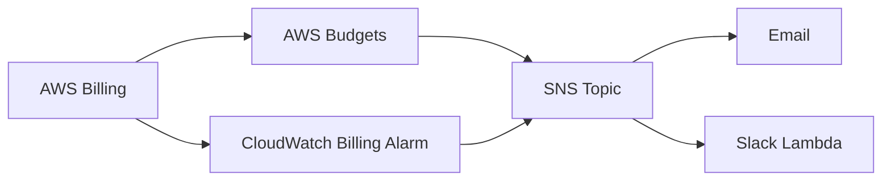

# How to Set Up Cost Alerts for OpenTofu-Managed Resources

Author: [nawazdhandala](https://www.github.com/nawazdhandala)

Tags: OpenTofu, AWS, Cost Management, AWS Budget, CloudWatch, Cost Alerts, Infrastructure as Code

Description: Learn how to create AWS Budgets cost alerts and CloudWatch billing alarms for OpenTofu-managed infrastructure to prevent unexpected cloud spend.

---

Cost surprises in cloud infrastructure are preventable. AWS Budgets and CloudWatch billing alarms notify you before a budget is breached, giving you time to investigate and act. OpenTofu makes it easy to create these guardrails alongside the infrastructure they protect.

## Cost Alert Architecture



## Account-Level Budget

```hcl
# budgets.tf

resource "aws_budgets_budget" "monthly_total" {
  name         = "monthly-total-budget"
  budget_type  = "COST"
  limit_amount = var.monthly_budget_usd
  limit_unit   = "USD"
  time_unit    = "MONTHLY"

  notification {
    comparison_operator        = "GREATER_THAN"
    threshold                  = 80
    threshold_type             = "PERCENTAGE"
    notification_type          = "ACTUAL"
    subscriber_email_addresses = [var.billing_email]
  }

  notification {
    comparison_operator        = "GREATER_THAN"
    threshold                  = 100
    threshold_type             = "PERCENTAGE"
    notification_type          = "FORECASTED"  # Alert on forecast, not just actual
    subscriber_email_addresses = [var.billing_email]
    subscriber_sns_topic_arns  = [aws_sns_topic.billing_alerts.arn]
  }
}
```

## Per-Environment Budget with Tag Filters

```hcl
resource "aws_budgets_budget" "environment" {
  for_each = {
    dev        = 200
    staging    = 500
    production = 5000
  }

  name         = "${each.key}-environment-budget"
  budget_type  = "COST"
  limit_amount = each.value
  limit_unit   = "USD"
  time_unit    = "MONTHLY"

  cost_filter {
    name   = "TagKeyValue"
    values = ["user:Environment$${each.key}"]
  }

  notification {
    comparison_operator       = "GREATER_THAN"
    threshold                 = 90
    threshold_type            = "PERCENTAGE"
    notification_type         = "ACTUAL"
    subscriber_sns_topic_arns = [aws_sns_topic.billing_alerts.arn]
  }
}
```

## CloudWatch Billing Alarm

```hcl
# billing_alarms.tf
# Note: Billing alarms must be in us-east-1
provider "aws" {
  alias  = "billing"
  region = "us-east-1"
}

resource "aws_cloudwatch_metric_alarm" "monthly_billing" {
  provider = aws.billing

  alarm_name          = "monthly-billing-threshold"
  comparison_operator = "GreaterThanThreshold"
  evaluation_periods  = 1
  metric_name         = "EstimatedCharges"
  namespace           = "AWS/Billing"
  period              = 86400  # Daily
  statistic           = "Maximum"
  threshold           = var.billing_alarm_threshold

  dimensions = {
    Currency = "USD"
  }

  alarm_actions = [aws_sns_topic.billing_alerts.arn]
  alarm_description = "Monthly AWS charges exceeded $${var.billing_alarm_threshold}"
}
```

## Service-Level Budget

```hcl
resource "aws_budgets_budget" "ec2_spend" {
  name         = "ec2-monthly-budget"
  budget_type  = "COST"
  limit_amount = "1000"
  limit_unit   = "USD"
  time_unit    = "MONTHLY"

  cost_filter {
    name   = "Service"
    values = ["Amazon Elastic Compute Cloud - Compute"]
  }

  notification {
    comparison_operator       = "GREATER_THAN"
    threshold                 = 80
    threshold_type            = "PERCENTAGE"
    notification_type         = "ACTUAL"
    subscriber_sns_topic_arns = [aws_sns_topic.billing_alerts.arn]
  }
}
```

## Best Practices

- Create budgets at multiple levels: account total, per-environment, and per-service to pinpoint spend increases quickly.
- Use `FORECASTED` notification type in addition to `ACTUAL` - getting warned when you're on track to overspend is more useful than being warned after you already have.
- Enable billing alerts at the AWS account level via the Billing console (one-time setup required) before CloudWatch billing alarms will work.
- Tag all resources with `Environment` and `Team` tags to enable cost allocation filtering in budgets.
- Wire budget alerts to SNS and then to Slack so the team sees cost alerts in context, not just in email.
