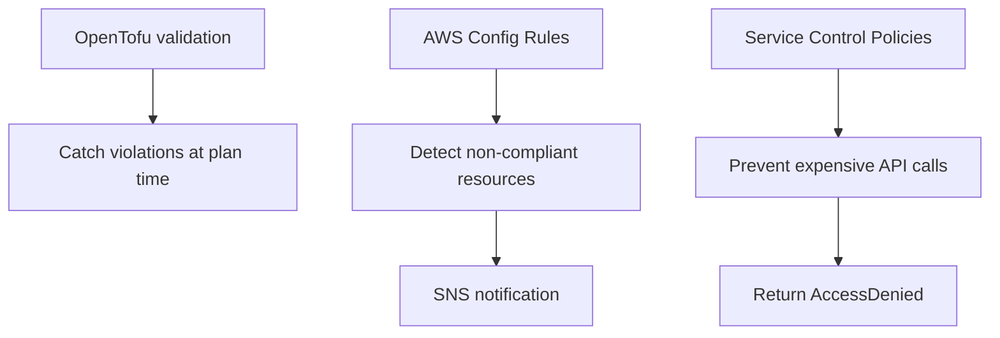

# How to Implement Cost Governance Policies with OpenTofu

Author: [nawazdhandala](https://www.github.com/nawazdhandala)

Tags: OpenTofu, Cost Governance, AWS Config, Service Control Policies, Cost Management, Infrastructure as Code

Description: Learn how to implement infrastructure cost governance using OpenTofu to enforce instance type restrictions, region limits, and resource size caps through AWS Config rules and Service Control Policies.

---

Cost governance prevents individual teams from provisioning expensive resources without oversight. AWS Config rules and Service Control Policies enforce limits at the AWS level, while OpenTofu validation blocks catch violations before they reach the cloud.

## Governance Architecture



## OpenTofu Variable Validation

```hcl
# Enforce allowed instance types per environment
variable "instance_type" {
  type = string

  validation {
    condition = contains(
      var.environment == "production"
        ? ["m5.large", "m5.xlarge", "m5.2xlarge", "c5.xlarge"]
        : ["t3.micro", "t3.small", "t3.medium"],
      var.instance_type
    )
    error_message = "Instance type not allowed for ${var.environment}. Use t3.micro/small/medium for dev."
  }
}

# Enforce DB size limits
variable "db_allocated_storage_gb" {
  type = number

  validation {
    condition = var.environment != "dev" || var.db_allocated_storage_gb <= 100
    error_message = "Dev databases are limited to 100 GB. Use staging or production for larger databases."
  }
}
```

## AWS Config Rules for Compliance

```hcl
# config_rules.tf

# Block expensive instance types in non-production accounts
resource "aws_config_config_rule" "approved_instance_types" {
  name = "approved-instance-types"

  source {
    owner             = "AWS"
    source_identifier = "DESIRED_INSTANCE_TYPE"
  }

  input_parameters = jsonencode({
    instanceType = "t2.micro,t3.micro,t3.small,t3.medium,m5.large"
  })
}

# Ensure no unencrypted EBS volumes
resource "aws_config_config_rule" "encrypted_volumes" {
  name = "ec2-ebs-encryption-by-default"

  source {
    owner             = "AWS"
    source_identifier = "EC2_EBS_ENCRYPTION_BY_DEFAULT"
  }
}

# Enforce storage capacity limits
resource "aws_config_config_rule" "rds_storage_limit" {
  name = "rds-allocated-storage-limit"

  source {
    owner             = "CUSTOM_LAMBDA"
    source_identifier = aws_lambda_function.config_rule_evaluator.arn

    source_detail {
      event_source = "aws.config"
      message_type = "ConfigurationItemChangeNotification"
    }
  }

  scope {
    compliance_resource_types = ["AWS::RDS::DBInstance"]
  }

  input_parameters = jsonencode({
    maxStorageGB = var.environment == "dev" ? 100 : 10000
  })
}
```

## Service Control Policy for Account-Level Limits

```hcl
# scp.tf — apply to AWS Organization OU
resource "aws_organizations_policy" "deny_expensive_instances" {
  name        = "deny-expensive-ec2-instances"
  description = "Prevent launching GPU and high-memory instances without approval"
  type        = "SERVICE_CONTROL_POLICY"

  content = jsonencode({
    Version = "2012-10-17"
    Statement = [
      {
        Sid    = "DenyExpensiveInstanceTypes"
        Effect = "Deny"
        Action = ["ec2:RunInstances"]
        Resource = "arn:aws:ec2:*:*:instance/*"
        Condition = {
          StringLike = {
            "ec2:InstanceType" = [
              "p3.*",    # GPU instances
              "p4.*",
              "x1.*",    # Memory-optimized
              "x2.*",
              "u-*",     # High memory
            ]
          }
        }
      }
    ]
  })
}

resource "aws_organizations_policy_attachment" "deny_expensive" {
  policy_id = aws_organizations_policy.deny_expensive_instances.id
  target_id = var.non_production_ou_id
}
```

## Automated Remediation

```hcl
# Auto-tag resources that are missing tags (instead of blocking them)
resource "aws_config_remediation_configuration" "missing_tags" {
  config_rule_name = aws_config_config_rule.required_tags.name
  target_type      = "SSM_DOCUMENT"
  target_id        = "AWS-AddTagsToResource"
  automatic        = true
  maximum_automatic_attempts = 3
  retry_attempt_seconds      = 60

  parameter {
    name         = "AutomationAssumeRole"
    static_value = aws_iam_role.config_remediation.arn
  }
}
```

## Best Practices

- Use OpenTofu `validation` blocks to catch policy violations at plan time — faster feedback than waiting for Config evaluation.
- Apply SCPs at the OU level in AWS Organizations to prevent expensive instance launches in non-production accounts.
- Configure AWS Config rule auto-remediation for low-risk fixes (like adding missing tags) but require human approval for resource deletion.
- Review Config compliance reports weekly — governance is only effective if non-compliance is acted upon.
- Start with alerting on violations before implementing blocking SCPs to avoid disrupting existing workflows.
