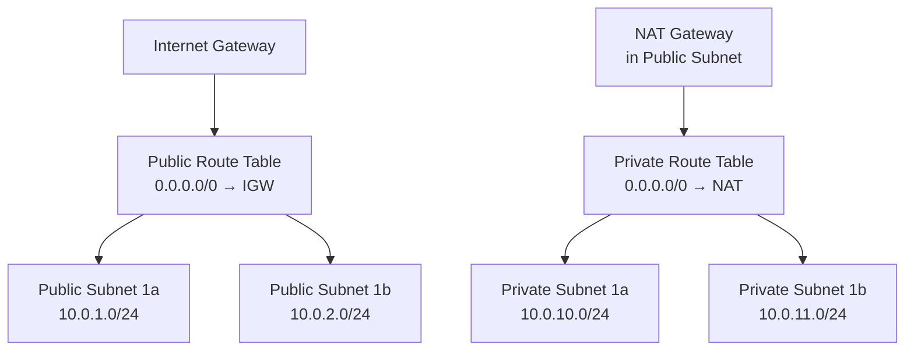

# How to Create Public and Private Subnets in an AWS VPC

Author: [nawazdhandala](https://www.github.com/nawazdhandala)

Tags: AWS, VPC, Subnets, IPv4, Public Subnet, Private Subnet, Networking

Description: Create public and private IPv4 subnets in an AWS VPC across multiple availability zones, configure auto-assign public IPs for public subnets, and understand the routing differences between subnet...

## Introduction

AWS subnets are classified as public or private based on their route table configuration - not the subnet itself. A subnet is public if it has a route to an Internet Gateway (IGW). Private subnets route outbound traffic through a NAT Gateway instead.

## Architecture



## Step 1: Create Subnets

```bash
VPC_ID=vpc-0abc123def456

# Public subnets

aws ec2 create-subnet --vpc-id $VPC_ID --cidr-block 10.0.1.0/24 \
  --availability-zone us-east-1a \
  --tag-specifications 'ResourceType=subnet,Tags=[{Key=Name,Value=public-1a}]'

aws ec2 create-subnet --vpc-id $VPC_ID --cidr-block 10.0.2.0/24 \
  --availability-zone us-east-1b \
  --tag-specifications 'ResourceType=subnet,Tags=[{Key=Name,Value=public-1b}]'

# Private subnets
aws ec2 create-subnet --vpc-id $VPC_ID --cidr-block 10.0.10.0/24 \
  --availability-zone us-east-1a \
  --tag-specifications 'ResourceType=subnet,Tags=[{Key=Name,Value=private-1a}]'

aws ec2 create-subnet --vpc-id $VPC_ID --cidr-block 10.0.11.0/24 \
  --availability-zone us-east-1b \
  --tag-specifications 'ResourceType=subnet,Tags=[{Key=Name,Value=private-1b}]'
```

## Step 2: Enable Auto-Assign Public IPs for Public Subnets

```bash
PUB_SUBNET_ID=subnet-0pub1a

# Instances launched in public subnets get a public IP automatically
aws ec2 modify-subnet-attribute \
  --subnet-id $PUB_SUBNET_ID \
  --map-public-ip-on-launch
```

## Step 3: Create Internet Gateway and Attach to VPC

```bash
# Create IGW
IGW_ID=$(aws ec2 create-internet-gateway \
  --tag-specifications 'ResourceType=internet-gateway,Tags=[{Key=Name,Value=prod-igw}]' \
  --query 'InternetGateway.InternetGatewayId' --output text)

# Attach to VPC
aws ec2 attach-internet-gateway --internet-gateway-id $IGW_ID --vpc-id $VPC_ID
```

## Step 4: Configure Public Route Table

```bash
# Create and configure public route table
PUB_RT=$(aws ec2 create-route-table --vpc-id $VPC_ID \
  --query 'RouteTable.RouteTableId' --output text)

# Route all traffic to IGW
aws ec2 create-route --route-table-id $PUB_RT \
  --destination-cidr-block 0.0.0.0/0 --gateway-id $IGW_ID

# Associate public subnets
aws ec2 associate-route-table --route-table-id $PUB_RT --subnet-id $PUB_SUBNET_ID
```

## Step 5: Create NAT Gateway for Private Subnets

```bash
# Allocate Elastic IP for NAT
EIP=$(aws ec2 allocate-address --domain vpc --query 'AllocationId' --output text)

# Create NAT Gateway in a public subnet
NAT_ID=$(aws ec2 create-nat-gateway \
  --subnet-id $PUB_SUBNET_ID \
  --allocation-id $EIP \
  --query 'NatGateway.NatGatewayId' --output text)

# Wait for it to be available
aws ec2 wait nat-gateway-available --nat-gateway-ids $NAT_ID
```

## Conclusion

The public/private distinction in AWS is entirely about routing: public subnets route to an IGW, private subnets route to a NAT Gateway. Enable auto-assign public IPs only on public subnets, and always deploy redundant NAT Gateways (one per AZ) in production.
