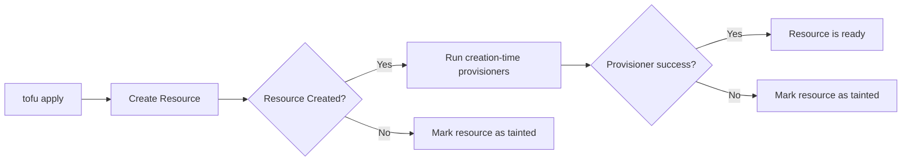

# How to Use Creation-Time Provisioners in OpenTofu

Author: [nawazdhandala](https://www.github.com/nawazdhandala)

Tags: OpenTofu, Provisioners, Creation-Time, Infrastructure as Code, Lifecycle

Description: Learn how creation-time provisioners work in OpenTofu, when they run, and how to use them effectively for post-creation configuration tasks.

## Introduction

Creation-time provisioners are the default provisioner type in OpenTofu. They run immediately after a resource is successfully created and are used for post-creation configuration tasks such as bootstrapping software, registering with external systems, or triggering downstream workflows.

## Default Behavior

By default, every provisioner in OpenTofu is a creation-time provisioner:

```hcl
resource "aws_instance" "web" {
  ami           = "ami-0abcdef1234567890"
  instance_type = "t3.micro"

  connection {
    type        = "ssh"
    user        = "ubuntu"
    private_key = tls_private_key.deploy.private_key_pem
    host        = self.public_ip
  }

  # This runs immediately after the instance is created (creation-time)
  provisioner "remote-exec" {
    inline = [
      "sudo apt-get update -y",
      "sudo apt-get install -y htop",
    ]
  }

  # This also runs at creation time (default)
  provisioner "local-exec" {
    command = "echo 'Instance ${self.id} created' >> /tmp/deployment.log"
  }
}
```

## When Creation-Time Provisioners Run

Creation-time provisioners run once, immediately after the resource create operation completes:



## Provisioner Failure Behaviour

If a creation-time provisioner fails, OpenTofu marks the resource as **tainted**. On the next `apply`, the tainted resource is destroyed and recreated, and the provisioner runs again.

```hcl
resource "aws_instance" "app" {
  ami           = data.aws_ami.ubuntu.id
  instance_type = "t3.small"

  connection {
    type        = "ssh"
    user        = "ubuntu"
    private_key = tls_private_key.deploy.private_key_pem
    host        = self.public_ip
    timeout     = "5m"
  }

  provisioner "remote-exec" {
    inline = [
      # If this command fails, the instance is tainted
      "sudo /opt/myapp/setup.sh",
    ]

    # Use 'on_failure = continue' to suppress taint on failure
    # on_failure = continue
  }
}
```

## Multiple Creation-Time Provisioners

Multiple provisioners on a resource run in the order they are declared:

```hcl
resource "aws_instance" "web" {
  # ...

  connection {
    type        = "ssh"
    user        = "ubuntu"
    private_key = tls_private_key.deploy.private_key_pem
    host        = self.public_ip
  }

  # Step 1: Upload configuration files
  provisioner "file" {
    source      = "${path.module}/configs/"
    destination = "/tmp/configs"
  }

  # Step 2: Install dependencies
  provisioner "remote-exec" {
    inline = [
      "sudo apt-get update -y",
      "sudo apt-get install -y nodejs npm",
    ]
  }

  # Step 3: Notify external systems (runs locally)
  provisioner "local-exec" {
    command = "curl -X POST ${var.webhook_url} -d '{\"instance\": \"${self.id}\"}'"
  }
}
```

## Creation-Time Provisioners Do Not Re-Run on Updates

A key limitation: creation-time provisioners only run when the resource is **created**, not when it is updated. If you modify a resource in-place, the provisioners do not execute again.

To force re-provisioning, you must either:
1. Taint the resource manually: `tofu taint aws_instance.web`
2. Change an attribute that forces resource replacement (e.g., `ami`)

## Idempotency Best Practice

Write provisioner scripts so they can be safely run multiple times. This is important because tainted resources are recreated, which reruns provisioners:

```bash
#!/usr/bin/env bash
# scripts/install-nginx.sh — idempotent installation

# Only install if not already present
if ! command -v nginx &>/dev/null; then
  apt-get update -y
  apt-get install -y nginx
fi

# Ensure nginx is enabled and running (safe to run repeatedly)
systemctl enable nginx
systemctl start nginx || systemctl restart nginx
```

## Conclusion

Creation-time provisioners are powerful hooks for post-creation configuration, but they come with limitations: they do not re-run on updates, and failures taint the resource. Use them for simple, idempotent tasks and consider cloud-native alternatives for complex configuration management.
