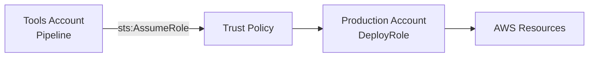

# How to Set Up Cross-Account IAM Roles with OpenTofu

Author: [nawazdhandala](https://www.github.com/nawazdhandala)

Tags: OpenTofu, AWS, IAM, Cross-Account, Security, Infrastructure as Code, Terraform

Description: Learn how to configure cross-account IAM roles in AWS using OpenTofu to enable secure access between multiple AWS accounts without sharing long-lived credentials.

---

Cross-account IAM roles are the cornerstone of multi-account AWS architectures. Instead of sharing credentials between accounts, you create a trust relationship that allows principals in one account to assume a role in another. OpenTofu makes this pattern reproducible and auditable.

## Why Cross-Account Roles Matter

In a typical AWS organization, you might have separate accounts for dev, staging, and production. A CI/CD pipeline running in the tools account needs to deploy to the production account. Rather than storing production credentials in your pipeline, you grant the tools account permission to assume a deployment role in production.



## Setting Up the Trusted Role (Production Account)

In the production account, create an IAM role with a trust policy that allows the tools account to assume it.

```hcl
# production/iam.tf

# The role that will be assumed from the tools account
resource "aws_iam_role" "cross_account_deploy" {
  name = "CrossAccountDeployRole"

  # Trust policy: who can assume this role
  assume_role_policy = jsonencode({
    Version = "2012-10-17"
    Statement = [
      {
        Effect = "Allow"
        Principal = {
          # The ARN of the tools account or specific role
          AWS = "arn:aws:iam::${var.tools_account_id}:role/CICDPipelineRole"
        }
        Action = "sts:AssumeRole"
        Condition = {
          # Require MFA or external ID for additional security
          StringEquals = {
            "sts:ExternalId" = var.external_id
          }
        }
      }
    ]
  })
}

# Attach a permissions policy to define what the role can do
resource "aws_iam_role_policy_attachment" "deploy_policy" {
  role       = aws_iam_role.cross_account_deploy.name
  policy_arn = aws_iam_policy.deploy_permissions.arn
}

resource "aws_iam_policy" "deploy_permissions" {
  name        = "DeployPermissionsPolicy"
  description = "Permissions needed for deployment pipeline"

  policy = jsonencode({
    Version = "2012-10-17"
    Statement = [
      {
        Effect = "Allow"
        Action = [
          "ec2:Describe*",
          "ecs:*",
          "ecr:GetAuthorizationToken",
          "ecr:BatchCheckLayerAvailability",
          "ecr:GetDownloadUrlForLayer",
          "ecr:BatchGetImage"
        ]
        Resource = "*"
      }
    ]
  })
}
```

## Configuring the Trusting Account (Tools Account)

In the tools account, the CI/CD role needs permission to assume the production role.

```hcl
# tools/iam.tf
# Grant the pipeline role permission to assume the production role
resource "aws_iam_role_policy" "assume_production" {
  name = "AssumeProductionDeployRole"
  role = aws_iam_role.cicd_pipeline.id

  policy = jsonencode({
    Version = "2012-10-17"
    Statement = [
      {
        Effect = "Allow"
        Action = "sts:AssumeRole"
        Resource = "arn:aws:iam::${var.production_account_id}:role/CrossAccountDeployRole"
      }
    ]
  })
}
```

## Using Multiple Provider Configurations

OpenTofu lets you configure multiple AWS providers, one per account, using assumed roles.

```hcl
# providers.tf
# Default provider for the tools account
provider "aws" {
  alias  = "tools"
  region = "us-east-1"
}

# Provider for the production account using cross-account role
provider "aws" {
  alias  = "production"
  region = "us-east-1"

  assume_role {
    role_arn     = "arn:aws:iam::${var.production_account_id}:role/CrossAccountDeployRole"
    session_name = "OpenTofuSession"
    external_id  = var.external_id
  }
}

# Deploy a resource in the production account
resource "aws_ecs_service" "app" {
  provider = aws.production
  name     = "my-app"
  # ... rest of configuration
}
```

## Variables File

```hcl
# variables.tf
variable "tools_account_id" {
  description = "AWS Account ID for the tools/CI account"
  type        = string
}

variable "production_account_id" {
  description = "AWS Account ID for the production account"
  type        = string
}

variable "external_id" {
  description = "External ID for additional security on role assumption"
  type        = string
  sensitive   = true
}
```

## Best Practices

- Always use an `external_id` when creating roles for third-party access to prevent confused deputy attacks.
- Scope permissions in the assumed role to the minimum required - never attach `AdministratorAccess`.
- Use descriptive session names to identify OpenTofu sessions in CloudTrail logs.
- Store the `external_id` in a secrets manager, not in plain-text variable files.

Cross-account roles combined with OpenTofu give you a clean, auditable way to manage multi-account AWS infrastructure without ever sharing static credentials.
