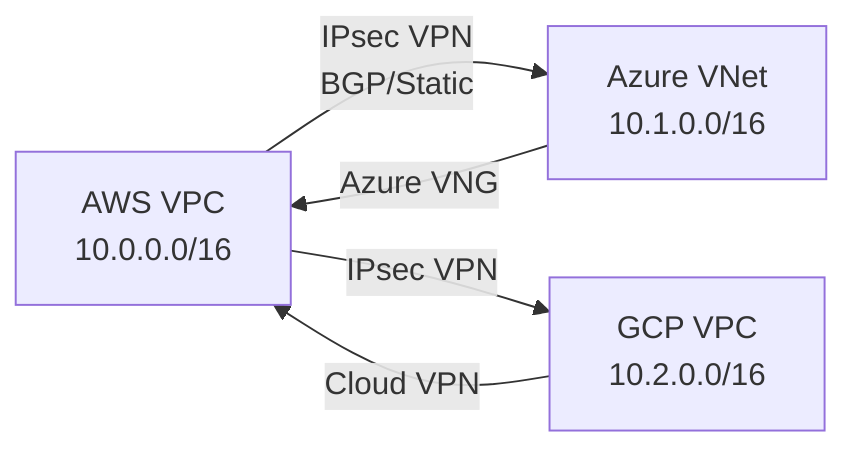

# How to Set Up Cross-Cloud Networking with OpenTofu

Author: [nawazdhandala](https://www.github.com/nawazdhandala)

Tags: OpenTofu, Multi-Cloud, Networking, VPN, AWS, Azure, GCP, Infrastructure as Code

Description: Learn how to connect AWS, Azure, and GCP networks using OpenTofu — configuring VPN gateways and IPsec tunnels for secure cross-cloud connectivity.

## Introduction

Cross-cloud networking connects VPCs, VNets, and VPCs across different cloud providers using IPsec VPN tunnels. OpenTofu manages both ends of the connection in a single plan, ensuring the tunnel configuration is consistent and reproducible.

## AWS to Azure VPN Connection

```hcl
# AWS side: Virtual Private Gateway
resource "aws_vpn_gateway" "main" {
  vpc_id = aws_vpc.main.id
  tags   = { Name = "aws-to-azure-vgw" }
}

resource "aws_customer_gateway" "azure" {
  bgp_asn    = 65515   # Azure ASN
  ip_address = azurerm_public_ip.vpn.ip_address
  type       = "ipsec.1"
  tags       = { Name = "azure-customer-gateway" }
}

resource "aws_vpn_connection" "to_azure" {
  vpn_gateway_id      = aws_vpn_gateway.main.id
  customer_gateway_id = aws_customer_gateway.azure.id
  type                = "ipsec.1"
  static_routes_only  = false   # Use BGP

  tags = { Name = "aws-azure-vpn" }
}

# Azure side: VPN Gateway
resource "azurerm_subnet" "gateway" {
  name                 = "GatewaySubnet"   # Must be exactly this name
  resource_group_name  = azurerm_resource_group.main.name
  virtual_network_name = azurerm_virtual_network.main.name
  address_prefixes     = ["10.1.255.0/27"]
}

resource "azurerm_public_ip" "vpn" {
  name                = "azure-vpn-pip"
  resource_group_name = azurerm_resource_group.main.name
  location            = azurerm_resource_group.main.location
  allocation_method   = "Static"
  sku                 = "Standard"
}

resource "azurerm_virtual_network_gateway" "vpn" {
  name                = "azure-vng"
  resource_group_name = azurerm_resource_group.main.name
  location            = azurerm_resource_group.main.location
  type                = "Vpn"
  vpn_type            = "RouteBased"
  sku                 = "VpnGw1"

  ip_configuration {
    name                          = "vnetGatewayConfig"
    public_ip_address_id          = azurerm_public_ip.vpn.id
    private_ip_address_allocation = "Dynamic"
    subnet_id                     = azurerm_subnet.gateway.id
  }
}

resource "azurerm_local_network_gateway" "aws" {
  name                = "aws-lng"
  resource_group_name = azurerm_resource_group.main.name
  location            = azurerm_resource_group.main.location
  gateway_address     = aws_vpn_connection.to_azure.tunnel1_address
  address_space       = ["10.0.0.0/16"]   # AWS VPC CIDR
}

resource "azurerm_virtual_network_gateway_connection" "to_aws" {
  name                = "azure-to-aws"
  resource_group_name = azurerm_resource_group.main.name
  location            = azurerm_resource_group.main.location
  type                = "IPsec"

  virtual_network_gateway_id = azurerm_virtual_network_gateway.vpn.id
  local_network_gateway_id   = azurerm_local_network_gateway.aws.id

  shared_key = random_password.vpn_psk.result
}
```

## AWS to GCP VPN Connection

```hcl
# GCP side: Cloud VPN Gateway
resource "google_compute_vpn_gateway" "main" {
  name    = "gcp-vpn-gateway"
  network = google_compute_network.main.id
  region  = var.gcp_region
}

resource "google_compute_address" "vpn" {
  name   = "gcp-vpn-ip"
  region = var.gcp_region
}

resource "google_compute_forwarding_rule" "esp" {
  name        = "gcp-vpn-esp"
  ip_protocol = "ESP"
  ip_address  = google_compute_address.vpn.address
  target      = google_compute_vpn_gateway.main.id
  region      = var.gcp_region
}

resource "google_compute_forwarding_rule" "udp500" {
  name        = "gcp-vpn-udp500"
  ip_protocol = "UDP"
  port_range  = "500"
  ip_address  = google_compute_address.vpn.address
  target      = google_compute_vpn_gateway.main.id
  region      = var.gcp_region
}

resource "google_compute_vpn_tunnel" "to_aws" {
  name          = "gcp-to-aws-tunnel"
  peer_ip       = aws_vpn_connection.to_gcp.tunnel1_address
  shared_secret = random_password.vpn_psk.result
  target_vpn_gateway = google_compute_vpn_gateway.main.id

  remote_traffic_selector = ["10.0.0.0/16"]   # AWS VPC CIDR
  local_traffic_selector  = ["10.2.0.0/16"]   # GCP VPC CIDR

  depends_on = [
    google_compute_forwarding_rule.esp,
    google_compute_forwarding_rule.udp500,
  ]
}

# GCP: Static route to AWS
resource "google_compute_route" "to_aws" {
  name                = "route-to-aws"
  network             = google_compute_network.main.id
  dest_range          = "10.0.0.0/16"   # AWS CIDR
  next_hop_vpn_tunnel = google_compute_vpn_tunnel.to_aws.id
  priority            = 1000
}
```

## Shared PSK with Random Generation

```hcl
# Generate a secure pre-shared key
resource "random_password" "vpn_psk" {
  length  = 32
  special = false   # VPN PSKs typically alphanumeric only
}

# Store in AWS Secrets Manager
resource "aws_secretsmanager_secret" "vpn_psk" {
  name = "cross-cloud-vpn-psk"
}

resource "aws_secretsmanager_secret_version" "vpn_psk" {
  secret_id     = aws_secretsmanager_secret.vpn_psk.id
  secret_string = random_password.vpn_psk.result
}
```

## Architecture Overview



## Conclusion

Cross-cloud networking with OpenTofu requires configuring both ends of each VPN connection in the same plan. For AWS-Azure connections, configure `aws_vpn_gateway` + `azurerm_virtual_network_gateway`. For AWS-GCP, use `aws_customer_gateway` + `google_compute_vpn_gateway`. Generate PSKs with `random_password` and store them in a secrets manager. With both ends in the same OpenTofu config, the tunnel configuration stays synchronized.
