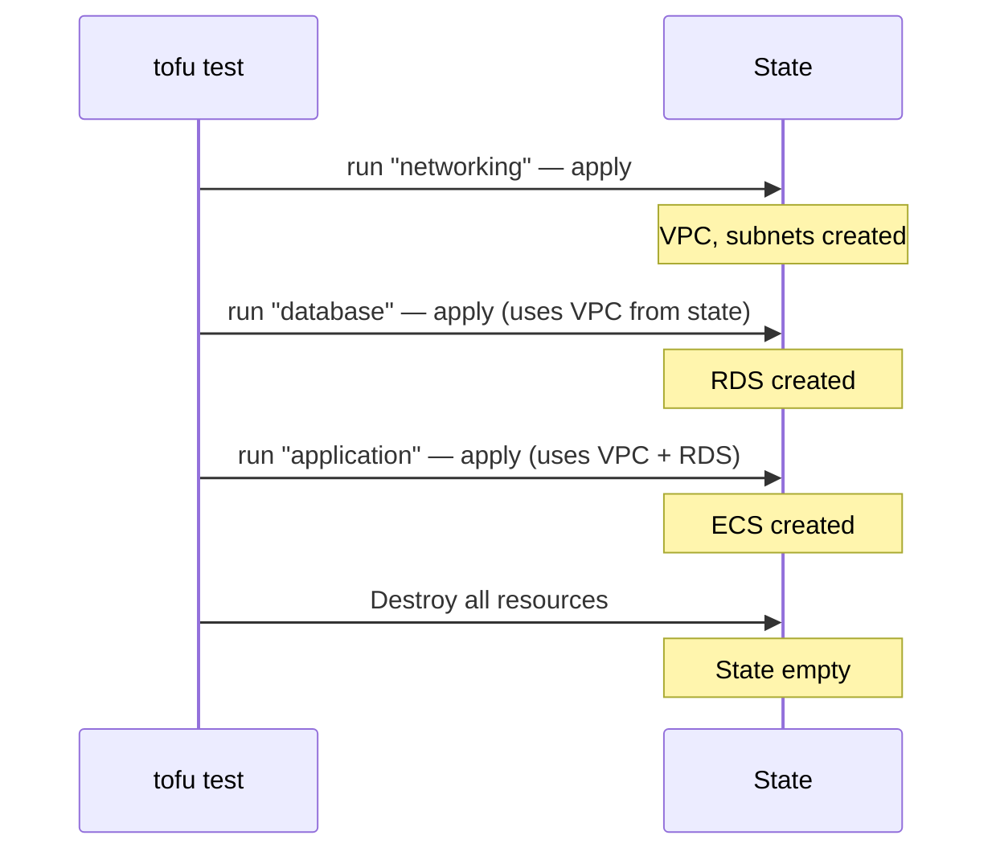

# How to Use Cross-Run Variable References in OpenTofu Tests

Author: [nawazdhandala](https://www.github.com/nawazdhandala)

Tags: OpenTofu, Testing, Cross-Run Variables, State, Infrastructure as Code

Description: Learn how to pass values between sequential run blocks in OpenTofu tests using cross-run variable references to build multi-step integration test scenarios.

## Introduction

OpenTofu tests execute `run` blocks sequentially within a single file. After each `run` block completes an `apply`, the state persists for subsequent runs. Cross-run variable references let you read output values from a previous run and use them as inputs to the next, enabling you to build realistic multi-step test workflows.

## Basic Cross-Run Reference Syntax

Reference a previous run's output using `run.<run_name>.<output_name>`:

```hcl
# tests/multi_step.tftest.hcl

run "create_vpc" {
  module {
    source = "./modules/networking"
  }

  variables {
    name       = "test-vpc"
    cidr_block = "10.0.0.0/16"
  }
}

run "create_ec2_in_vpc" {
  # Reference the VPC ID output from the previous run
  variables {
    vpc_id        = run.create_vpc.vpc_id
    subnet_id     = run.create_vpc.private_subnet_ids[0]
    instance_type = "t3.micro"
  }

  assert {
    condition     = aws_instance.web.subnet_id == run.create_vpc.private_subnet_ids[0]
    error_message = "Instance should be in the subnet created in the previous run"
  }
}
```

## Multi-Step Integration Test Example

Build a full application stack test where each layer depends on the previous:

```hcl
# tests/full_stack_integration.tftest.hcl

# Step 1: Create the networking layer
run "networking" {
  module {
    source = "./modules/networking"
  }

  variables {
    vpc_cidr    = "10.0.0.0/16"
    environment = "test"
    region      = "us-east-1"
  }
}

# Step 2: Create the database using the VPC from step 1
run "database" {
  module {
    source = "./modules/rds"
  }

  variables {
    vpc_id     = run.networking.vpc_id
    subnet_ids = run.networking.private_subnet_ids
    db_name    = "appdb"
    db_user    = "appuser"
  }
}

# Step 3: Deploy the application using networking and database outputs
run "application" {
  module {
    source = "./modules/ecs_service"
  }

  variables {
    vpc_id          = run.networking.vpc_id
    public_subnets  = run.networking.public_subnet_ids
    private_subnets = run.networking.private_subnet_ids
    db_endpoint     = run.database.endpoint
    db_port         = run.database.port
  }

  assert {
    condition     = aws_ecs_service.app.desired_count > 0
    error_message = "Application service should have at least one desired task"
  }
}

# Step 4: Verify the full stack produces a working DNS name
run "verify_dns" {
  module {
    source = "./modules/route53"
  }

  variables {
    alb_dns_name = run.application.alb_dns_name
    zone_name    = "test.example.com"
    record_name  = "app"
  }

  assert {
    condition     = output.fqdn == "app.test.example.com"
    error_message = "FQDN should be app.test.example.com"
  }
}
```

## Referencing Outputs vs Attributes

You can reference both `output` values and plan-time resource attributes:

```hcl
run "create_bucket" {
  variables {
    bucket_name = "test-data-bucket"
  }
}

run "configure_replication" {
  variables {
    # Reference a module output from the previous run
    source_bucket_id  = run.create_bucket.bucket_id

    # Reference a module output that itself references a resource attribute
    source_bucket_arn = run.create_bucket.bucket_arn
  }
}
```

## State Persistence Between Runs

Each run block in a test file operates on the same state. Resources created in earlier runs are visible to later runs. After all runs complete, OpenTofu destroys everything in a single cleanup pass.



## Limitations

- Cross-run references only work for outputs declared in the module being tested; you cannot reference arbitrary resource attributes from other runs directly.
- If an earlier run fails, subsequent runs that depend on its outputs will also fail.

## Conclusion

Cross-run variable references transform OpenTofu tests from isolated single-resource checks into realistic end-to-end integration tests. Use them to validate the interfaces between your modules—the most common source of real-world infrastructure bugs.
